# EndStone 安装教程

## 前提要求

你需要在电脑上准备：

Windows环境下：

- [VSCode](https://code.visualstudio.com/)编辑器
- 可选：最新版[Python 3.12+ 环境](https://python.org)

Linux环境下：

- 最新版[Python 3.12+ 环境](https://python.org) 或者 最新版[Docker 环境](https://hub.docker.com/r/endstone/endstone/)

## 方法一：直接下载启动

当前教程使用操作环境：Windows Server 2022

适用环境：Windows

### 一、下载EndStone本体

前往EndStone开源仓库：[Github](https://github.com/EndstoneMC/endstone)，找到 Releases ，打开后下载压缩包

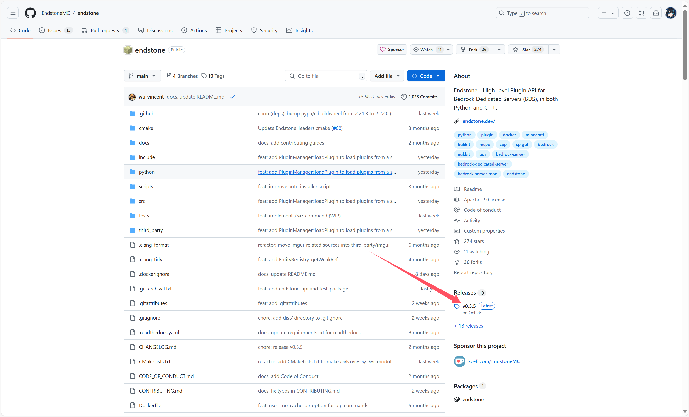

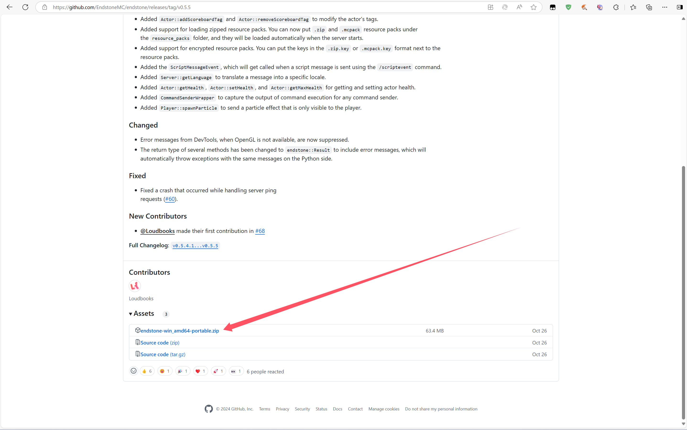

将下载好的压缩包放到新建的文件夹内，或者上传到服务器上的新建好的文件夹内

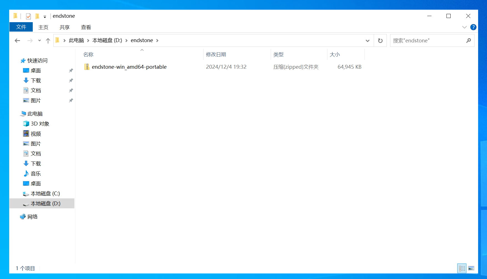

解压后获得EndStone本体


### 二、下载BDS服务端

启动 start.bat ，获得该版本的EndStone支持的BDS服务端版本

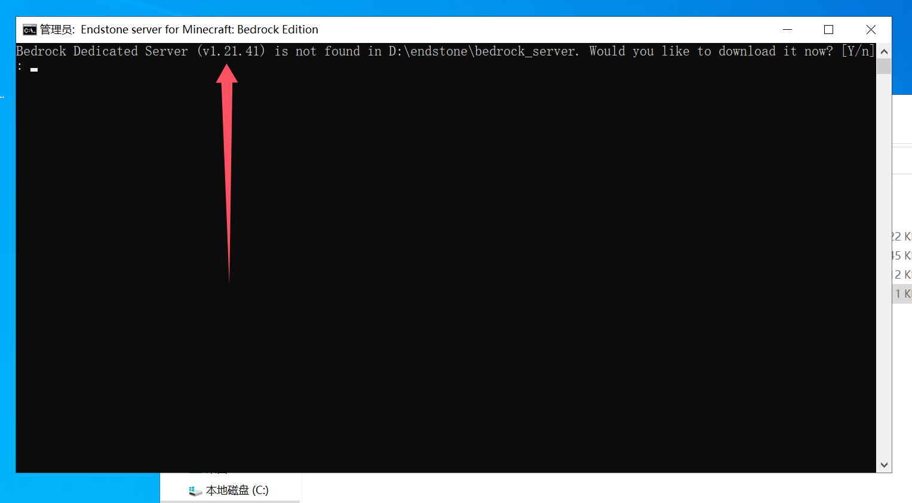

目前已知该版本的EndStone支持对接1.21.41版本

关闭界面，前往 [EndStone-Github-API](https://raw.githubusercontent.com/EndstoneMC/bedrock-server-data/main/bedrock_server_data.json) 找到相应版本的下载地址

复制相应的url后的下载链接，直接粘贴到新窗口的web地址栏回车进行下载

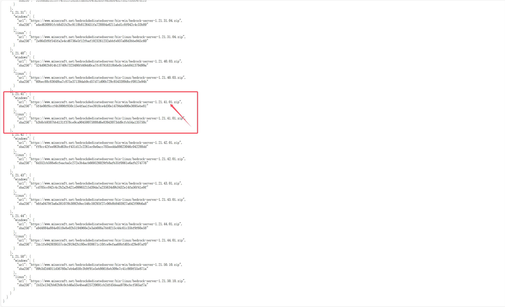

将下载后的服务端zip压缩包放入EndStone文件夹内

### 三、准备服务端

创建 bedrock_server 文件夹

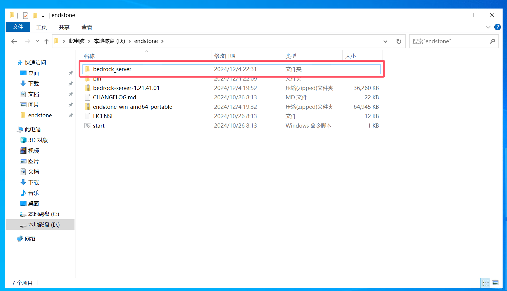

将BDS服务端zip压缩包解压到 bedrock_server 文件夹

然后，创建 `version.txt` 文件，打开并编辑以下内容，编辑完毕后保存

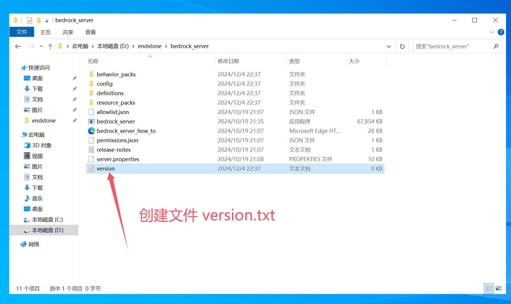


### 四、启动服务器

回到EndStone文件夹，启动 start.bat

启动成功后会显示下面内容

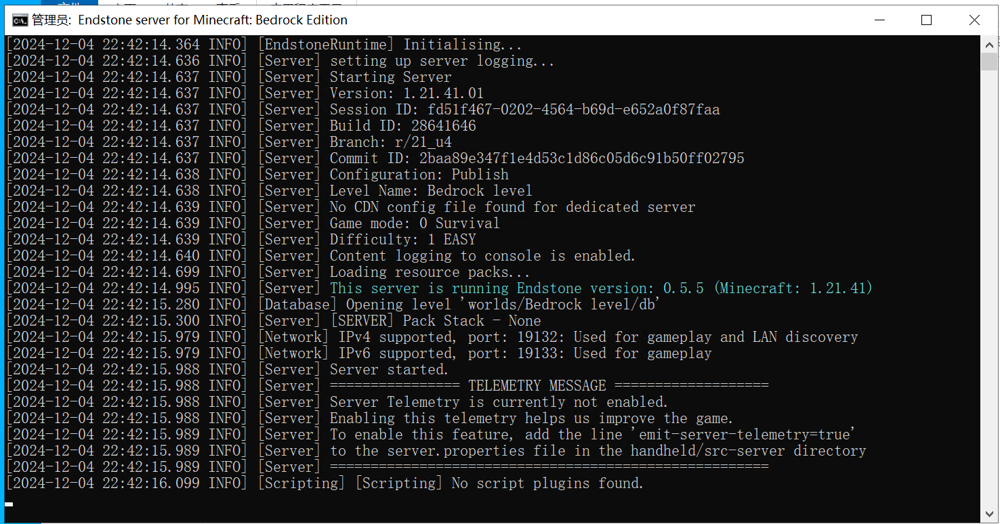

**恭喜你！你已经成功开启了可以支持插件的基岩版服务器！**

## 方法二：使用 Python pip 运行

当前教程使用操作环境：Windows Server 2022

适用环境：Windows、Linux

### 一、安装Python环境

前往 [Python官网](https://python.org) 下载Python官网

运行Python安装包城西进行安装：

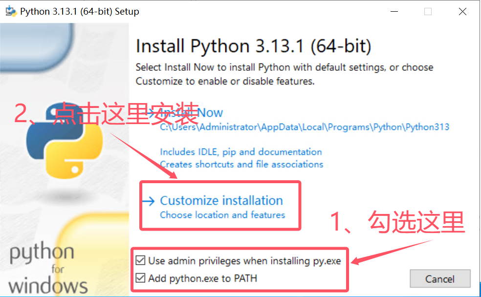

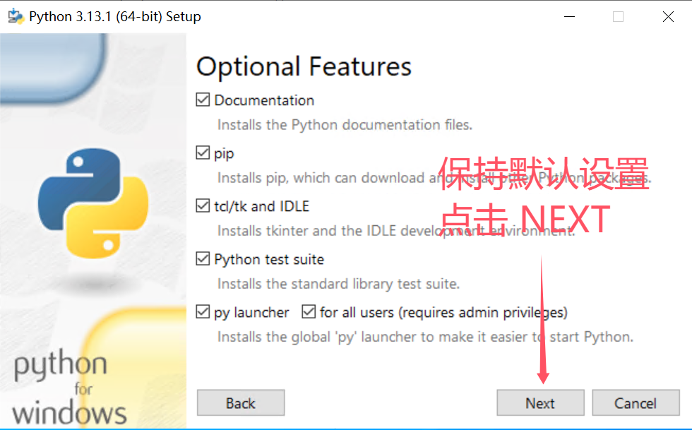

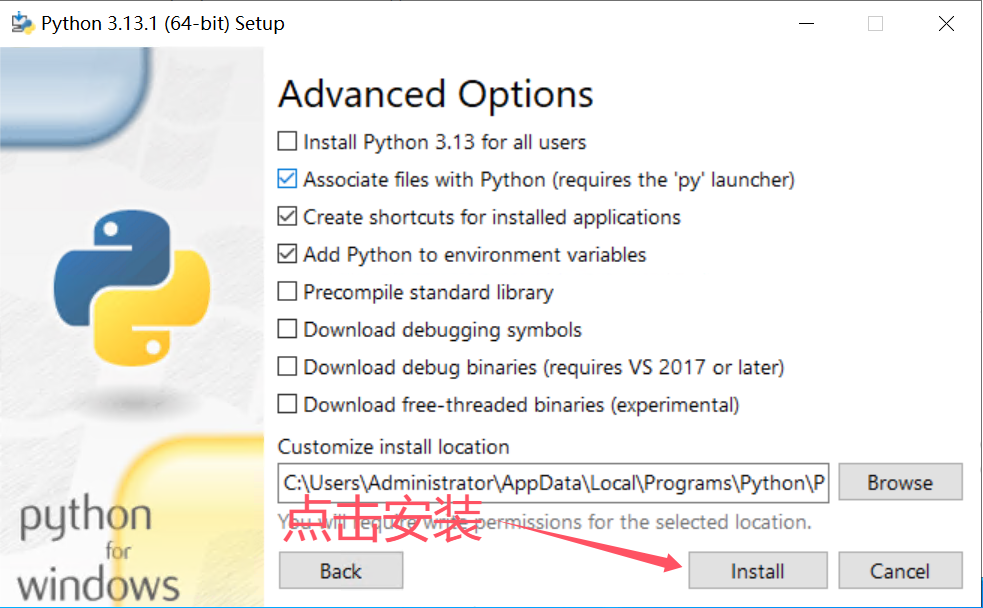

安装完成后，打开CMD，按住 `WIN + R` 打开后输入 `cmd` 回车，输入以下指令检测python是否正常安装

```cmd
python
```

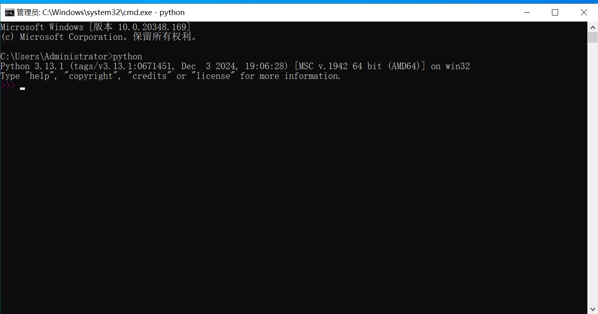

### 二、安装 EndStone 本体

重新打开CMD，使用以下指令转到你已经创建好的新文件夹


:::danger
如果在C盘，请输入 `cd 替换具体文件夹路径` （**不建议将服务端放在C盘！**）

如果在D盘，请按照下图操作进行(**Linux一类系统可直接使用 `cd 文件夹路径` 进入相应目录**)
:::

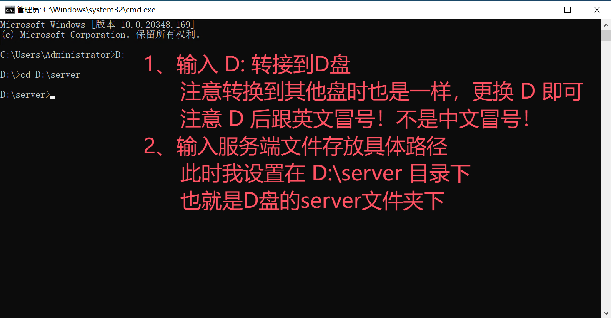

输入下面指令安装 EndStone 本体(Python默认的下载会比较慢，如果想加快下载速度推荐必应搜索 **Python换国内下载源** 配置，本教程不再过多阐述)

```cmd
pip install endstone
```

下载完后应该是这样的

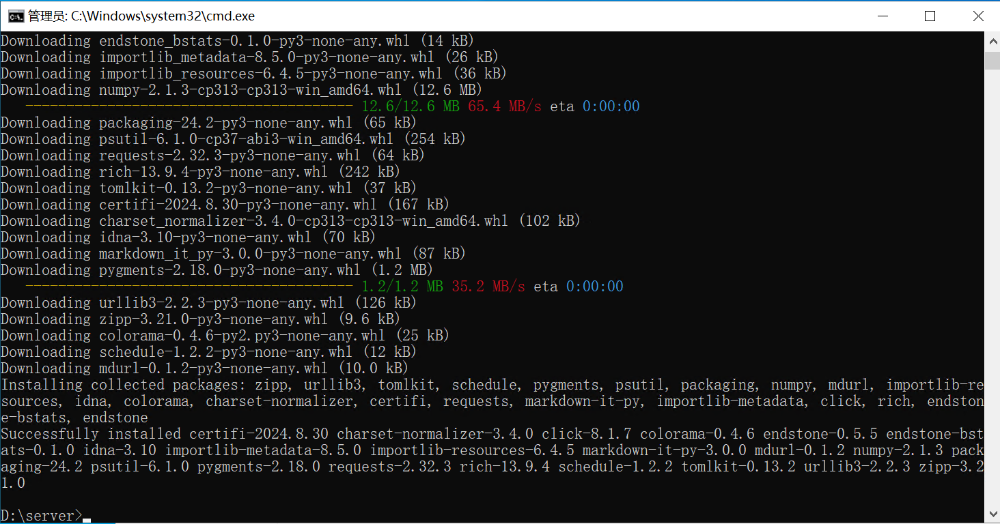

### 三、安装 VC 运行库

前往 [Microsoft VC运行库下载地址](https://www.microsoft.com/zh-CN/download/details.aspx?id=48145) 下载并安装 **VC运行库**

:::tip
你可能注意到了，直接运行版本是可以直接运行的，貌似这一步被省略过去了

实际上并不是，只是直接运行版本自带了python环境和VC运行库，一般情况下运行EndStone的 start.bat 是不会出现任何问题（**除非你作死把那个删了**）
:::

### 四、下载BDS服务端

CMD控制台输入 `endstone` ，获得该版本的EndStone支持的BDS服务端版本

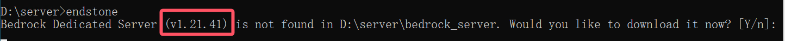

通过上图可知，目前该版本的EndStone支持对接1.21.41版本

关闭界面，前往 [EndStone Github API](https://raw.githubusercontent.com/EndstoneMC/bedrock-server-data/main/bedrock_server_data.json) 找到相应版本的下载地址，
复制url后的下载链接，直接粘贴到新窗口的web地址栏回车进行下载


将下载后的服务端zip压缩包放入EndStone文件夹内

### 五、准备服务端

创建 bedrock_server 文件夹

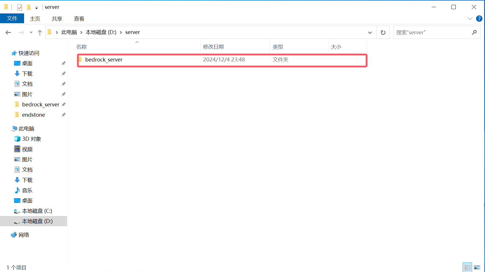

将BDS服务端zip压缩包解压到 bedrock_server 文件夹

然后，创建 `version.txt` 文件，打开并编辑以下内容，编辑完毕后保存


### 六、启动服务器

回到CMD，输入 `endstone` 开始运行服务器。

启动成功后会显示下面内容

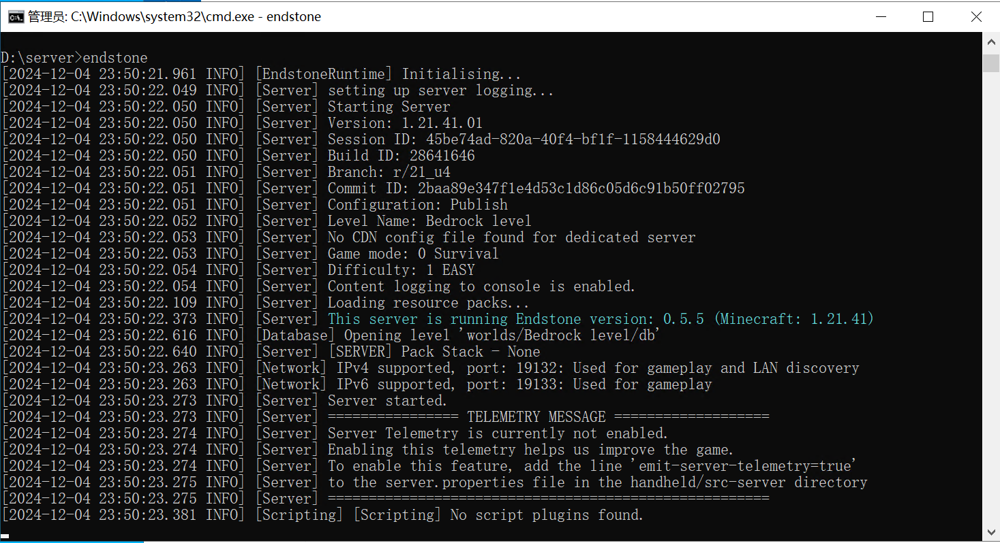

**恭喜你！你已经成功开启了可以支持插件的基岩版服务器！赶紧体验一下吧~**

## 方法三、使用Docker安装并运行 EndStone （目前不推荐）

:::danger
该方案教程大部分未知，外加Docker官方源因DNS污染被国内防火墙拦截，故不推荐

但后面会及时更新，请等待
:::

适用系统：Linux

### 一、安装 Docker

### 二、更改国内源

### 三、拉取镜像源

### 四、运行服务器
