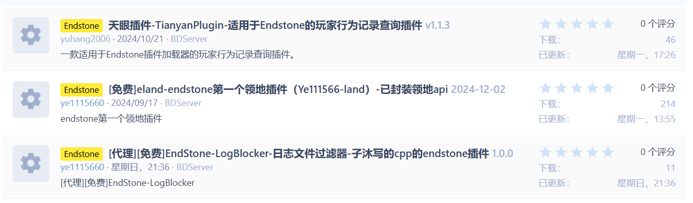
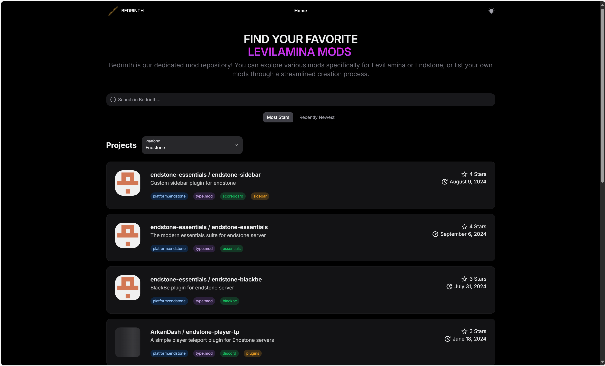
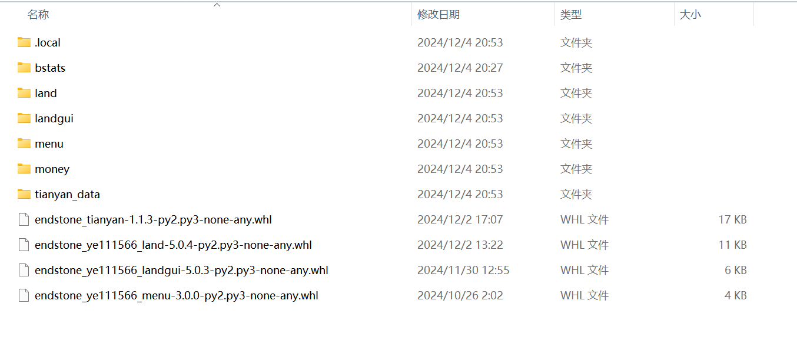
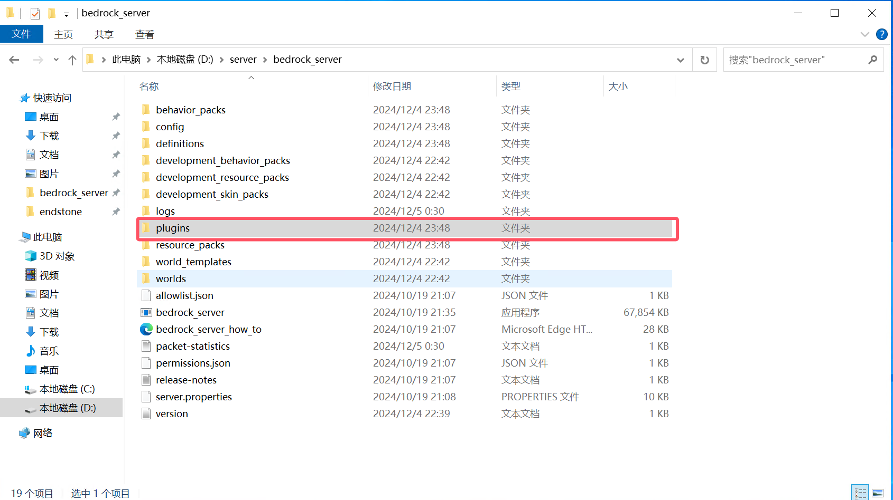
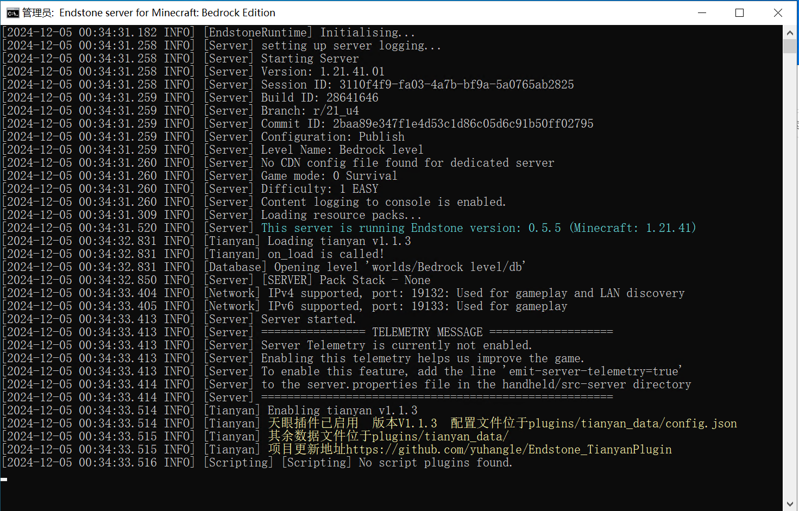
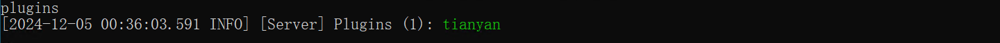
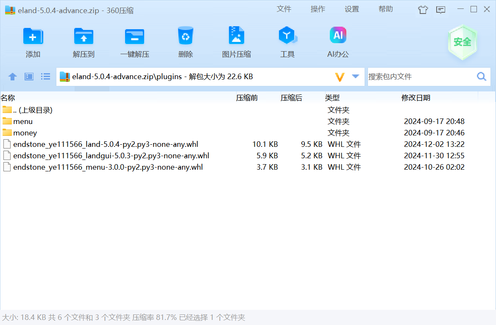
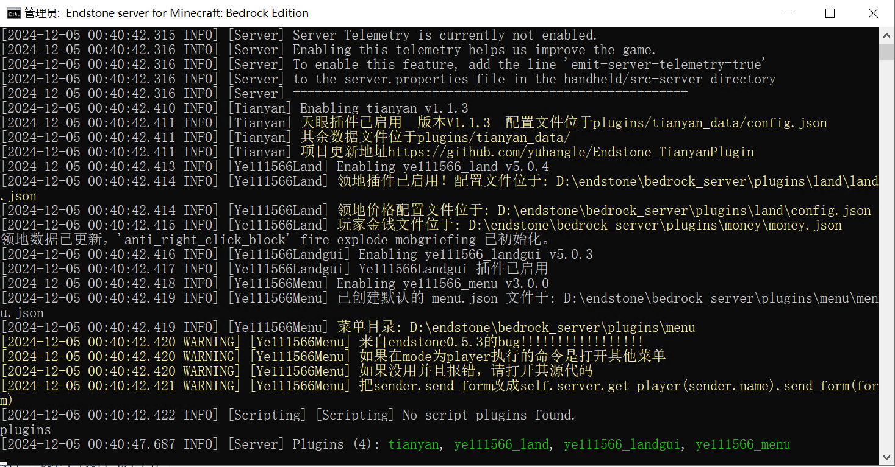
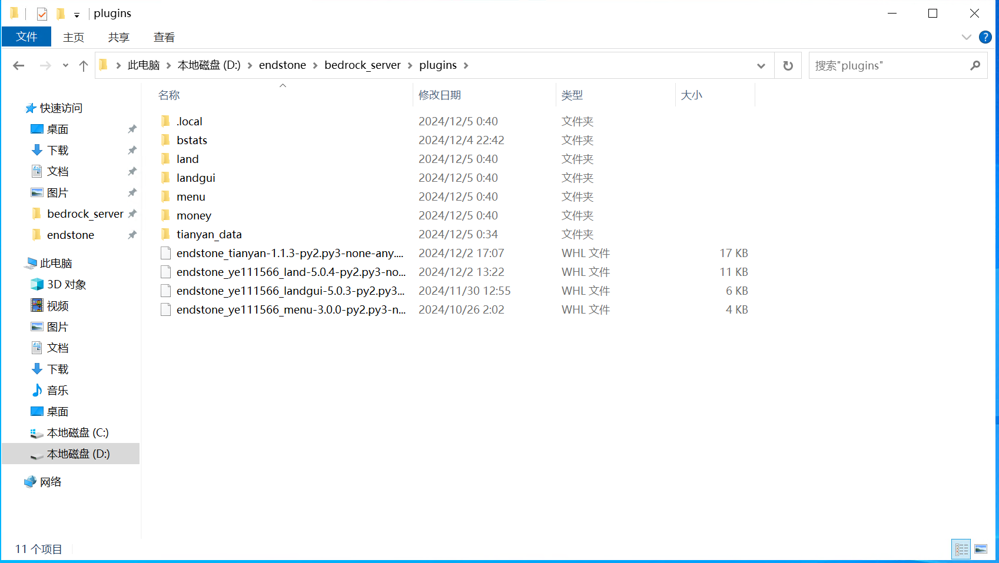
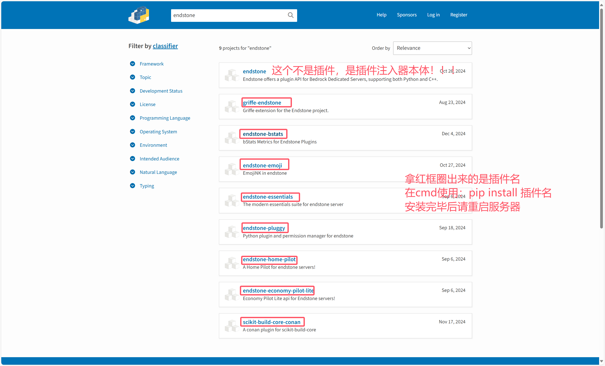

## 第一步、EndStone插件来源

目前插件来源：

### [MineBBS论坛](https://www.minebbs.com/resources/categories/bdserver.38/)（发展国内基岩版社区的你敢说没有？）



### [pip源](https://pypi.org/search/?q=endstone) （EndStone绝大多数插件都在这里发布了）


### [Bedrinth下载站](https://bedrinth.com/?platform=endstone) （除了pip外另一个比较知名的的国际下载源）


## 第二步、如何安装？

### 单文件安装

如果你在 MineBBS 上下载，或者其他人给你的一个ENdStone插件，请看这里

:::tip
EndStone的插件一般文件是以 .whl 或者 .dll 为后缀的文件，有的可能会为了易于分发或者安装会将上述内容弄成压缩文件
:::

:::info
附带：什么是whl文件：

whl格式本质上是一个压缩包，里面包含了py文件，以及经过编译的pyd文件。

可以在不具备编译环境的情况下，选择合适自己的Python环境进行安装。

说白了，.whl就是python的压缩包。

常玩Java版的话，你可以理解为它是python版的 .jar 文件，只是运行环境由Java改为python（可以这么想吧）
:::



#### 第一步、下载插件

在MineBBS以及其他论坛或者QQ群等渠道下载的文件，你可能会获得 
- whl 文件
- 或者 zip一类 压缩包

压缩包请使用常用压缩软件 “BandiZIP、360压缩、7z或者WinRAR等打开备用”

#### 第二步、安装插件

关闭服务器（**别告诉我你不会，小心我【语言激动，已省略】**）

##### 如果是 whl 文件
1. 打开 bedrock_server 文件夹，你会惊奇的发现：什么时候多了个plugins文件夹？！！



2. 打开 plugins 文件夹，将下载的 whl 插件文件拽入该文件夹中
3. 启动！当CMD显示插件名称时说明插件已加载成功！



4. 如果你真不知道如何辨别插件是否加载，请在后台输入 `plugins` 指令



##### 如果是压缩包文件

比如下面这个赖皮家伙（不是）



教你三招：
1. 按下 CTRL + A 全选，并复制
2. 打开 bedrock_server\plugins 后，粘贴
3. 启动！享受插件！



##### 插件配置

有的会在下载的压缩文件中提前准备好


有的会在启动一次服务器后自动生成



编辑他们很简单，打开相应插件的文件夹，然后使用 VSCode 或者 Nodepad-- 一类编辑器对插件进行配置

:::danger
请注意插件配置的文件格式，并按照他们的规则去写！
:::

### pip安装

在上面给的 pip渠道 上找到心仪的插件后，使用下面指令完成下载：

```cmd
pip install 插件名
```



然后重启服务器，插件会自动安装完毕啦~
