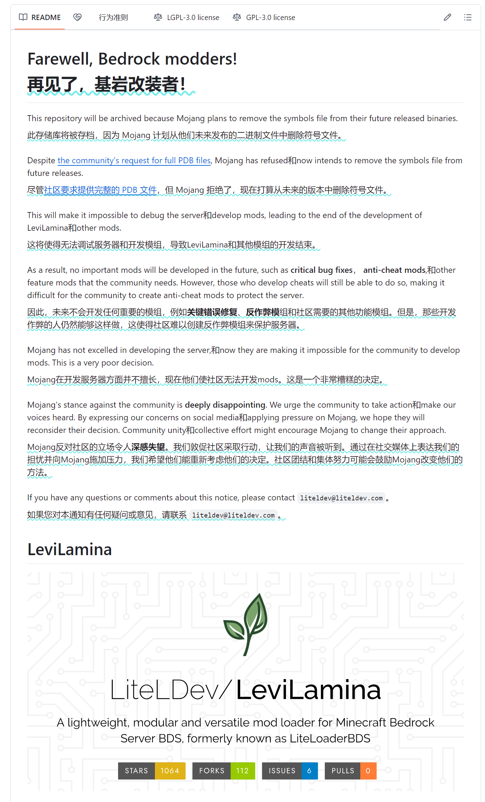
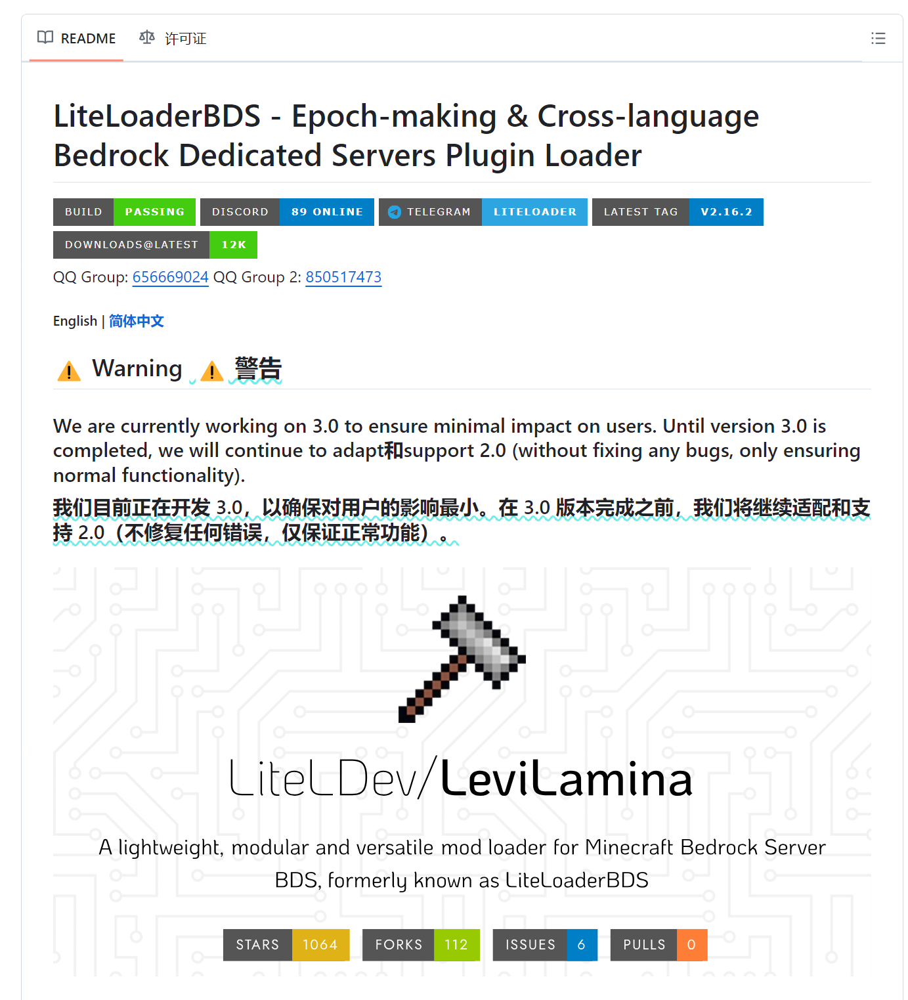

:::tip
本篇文档已完成编写！ 
支持后续 PR

# Biggest SUCCESS!!!

作者：[梦涵LOVE](https://github.com/MengHanLOVE1027)
:::

# BDS 社区开发者编写的插件加载器
import Tabs from '@theme/Tabs';
import TabItem from '@theme/TabItem';

## 热门加载器

<Tabs queryString="plugins-loader">
<TabItem value="levilamina" label="LeviLamina">
| 插件加载器 | 别名：LLL，LLv3 |
| --- | --- |
| 名称 | [LeviLamina](https://levilamina.liteldev.com/zh) |
| 作者 | [LiteLDev](https://github.com/LiteLDev) |
| 介绍 | 轻量级、模块化和多功能的 Minecraft Bedrock Server BDS 插件加载器，曾被称为 LiteLoaderBDS |
| 推荐与否 | 非常推荐 |
| 理由 | 插件生态不错，跟 [LiteLoader](#寿终正寝の加载器) 时代一样巅峰 |
| 下载 | [GitHub 下载](https://github.com/LiteLDev/LeviLamina/releases) |
| 支持的 MC 版本 | 1.20.61-1.21.3（目前保持更新） |
</TabItem>
<TabItem value="endstone" label="EndStone">
| 插件加载器 | |
| --- | --- |
| 名称 | [EndStone](https://github.com/EndstoneMC/endstone) |
| 作者 | [EndStoneMC](https://github.com/EndstoneMC) |
| 介绍 | 提供类似 Bukkit 插件开发者的友好 API，简化了低层系统 API 和挂钩的处理。可以使用 C++ 或 Python 编写插件 |
| 推荐与否 | 比较慢推荐 |
| 理由 | 虽然几乎没有插件生态，仅社区有 **极少** 的插件，但最近形势较好，社区内有参与开发的声音，后续可能会追平 LeviLamina |
| 下载 | [Github 下载](https://github.com/EndstoneMC/endstone/releases) |
| 支持的 MC 版本 | 1.20.71 - 1.21.2（目前保持更新） |
</TabItem>
<TabItem value="bdsx" label="BDSX">
| 插件加载器 | 别名：BDSX |
| --- | --- |
| 名称 | [bdsx](https://github.com/bdsx/bdsx) |
| 作者 | [bdsx](https://github.com/bdsx) |
| 介绍 | BDSX 是一个支持 node.js 的 Minecraft 基岩版专用服务器（BDS）修改版本。基于官方 BDS 实现，包含了原版 Minecraft 的所有特性，并支持 Hook 函数与网络数据包以添加或修改服务器的功能与表现。 |
| 推荐与否 | 较为推荐 |
| 理由 | 国内插件虽然少，但还是有很多的人去使用它，作者也从19年一直维护到现在 |
| 下载 | [克隆源代码下载](https://github.com/bdsx/bdsx) |
| 插件下载 | [npm源](https://www.npmjs.com/search?q=%40bdsx%2F) [Github](https://github.com/topics/bdsx-plugins) |
| 支持的 MC 版本 | 1.12 - 最新（目前保持更新） |
</TabItem>
</Tabs>

## 冷门加载器
<Tabs queryString="plugins-loader">
<TabItem value="bds-script-api" label="BDS Script API（官方）">
| 插件加载器 | 别名：SAPI |
| --- | --- |
| 名称 | [原生 BDS Script API](https://wiki.mcbe-dev.net/-/6424) |
| 作者 | [Mojang Studio](https://github.com/Mojang) |
| 介绍 | 随着 BDS 服务端的发展，官方已推出并逐渐完善基于 Javascript 语言的脚本 API，受到官方的支持与维护，可帮助创作者完成复杂的逻辑  （其加载器直接内置于 BDS 核心包内，不用腐竹手动下载，这里仅提供 BDS 核心下载方式） |
| 推荐与否 | 非常不推荐 |
| 理由 | 几乎没有插件生态，仅社区有 **极少** 的插件 |
| 下载 | [官网下载](https://www.minecraft.net/zh-hans/download/server/bedrock) [原子云下载](https://res.nullatom.com/Minecraft/Server/BDS) |
| 支持的 MC 版本 | 1.16.210 - 最新（稳定更新） |
</TabItem>
</Tabs>

## 寿终正寝の加载器
<Tabs queryString="plugins-loader">
<TabItem value="liteloader" label="LiteLoader">
| 插件加载器 | 别名：LL，LLv2（[详情点我](#litexloader-合并至-liteloader2022年2月12日)） |
| --- | --- |
| 名称 | [LiteLoaderBDS](https://github.com/LiteLDev/LiteLoaderBDSv2/) |
| 作者 | [LiteLDev](https://github.com/LiteLDev) |
| 介绍 | LiteLoaderBDSv2 是一款专为 BDS 编写的插件加载器，旨在弥补官方行为包开发接口的不足。LiteLoaderBDSv2 支持多种编程语言编写插件，并保证了插件开发与维护的便利性 |
| 推荐与否 | 非常不推荐 |
| 理由 | 插件生态无可厚非，没人会否定它的巅峰时代，可惜岁月不饶人啊...如果你服务器愿意在此版本区间便罢了，因为不好找插件了（[详情点我](#liteloader-宣布停更2023年10月份)） |
| 下载 | [GitHub 下载](https://github.com/LiteLDev/LeviLamina/releases) |
| 支持的 MC 版本 | 1.16.210-1.20.31.01（已存档）[^Archived] |
</TabItem>
<TabItem value="litexloader" label="LiteXLoader">
| 插件加载器 | 别名：LXL |
| --- | --- |
| 名称 | [LiteXLoader](https://www.minebbs.com/threads/litexloader-x-bds.7439/) |
| 作者 | [LiteDev](https://github.com/LiteLDev) |
| 介绍 | LiteXLoader 是一款专为 LiteLoader 编写的拓展类插件加载器，旨在弥补 LiteLoader 可开发语言的不足。LiteXLoader 支持多种编程语言编写插件，并保证了插件开发与维护的便利性，例如拓展支持 Node-Js、Python、Qucik-Js 的开发 |
| 推荐与否 | 非常不推荐 |
| 理由 | 后续合并到 LiteLoader 中。[详情点我](#litexloader-合并至-liteloader2022年2月12日) |
| 下载 | [Github 下载](https://github.com/EndstoneMC/endstone/releases) |
| 支持的 MC 版本 | 1.20.71 - 1.21.2（已存档）[^Archived] |
</TabItem>
</Tabs>

## 相关历史

### PDB 事件（2024年6月6日）

此文段部分引用自 B站 Dofes 与 MRUIAW 的合作视频，稍作了修改。
[Mojang删除了对基岩版最重要的东西...](https://www.bilibili.com/video/BV1GS421o7Dz/)

2024 年 6 月 6 日 凌晨，在发布的 1.21.10.22 Preview 版本的 BDS 中，LiteDev 开发成员注意到 PDB 文件被移除，紧接着社区开发者传来消息，称官方曾召开过会讨论 BDS 的 PDB 文件的去向。结果显然是 **决定移除**。如果将来都是如此的话，那么我们将会在高版本迎来首个没有 PDB 的版本。

官方声称他们知道此次行为会激怒社区开发者，并且是完全故意的。他们认为 MOD 存在所谓的 **“行业标准形式”**，使用调试符号和钩子（Hook）不是 MOD 的 “行业标准形式”。也就是说，他们认为他们提供的 **附加组件** 才是 MOD 的 “行业标准形式”，即宣布当前的所有 MOD 为 **非法**。

他们还认为，服务端符合文件只适用于制作客户端的作弊软件，而不适用于制作服务端的反作弊系统。这说法就好比说菜刀可以用来杀人，所以禁止出售菜刀（？）。
但事实上客户端外挂并不使用 PDB 来查找函数地址，而是用签名来查找所需函数或变量的地址，但事实是服务端的反作弊 **极其依赖** PDB 符号文件。
他们甚至可能还不知道特们的合作服务器使用的都是自己开发的服务端，而不是 BDS，重新写一个服务端不叫修改。

开 BDS 的目的是为了生存玩法，而第三方服务端缺少原生特性，顶多开小游戏服。但 MOD BDS 的存在，就是为了在拥有原生特性的服务器上支持一些原生插件。因此，我们有理由相信这只是一个借口，而真正的原因我们还不得而知。我个人猜测，这可能与 Minecraft 的商业化有关。毕竟 Minecraft 是一个商业游戏，而 MOD BDS 可能被视为对其商业模式的一种威胁。社区对这种不顺应社区需求的行为表示了不满，有人已经提出了抵制的声音，目前相关的请求帖子，已经获得了超过1000个赞同。

我们也了解到官方相关负责人正在讨论此事。

我们呼吁大家积极参与讨论，让官方了解我们的诉求！Partner 项目总监和工作室里的人讨论过，反正他们的观点是力推CRIPT的API，这将势不可挡，未来是 [All in JavaScript（即 SAPI）](#冷门加载器) 的时代，只要社区的需求大且合理，他们就会添加对应的接口。在PDB方面，他们认为这是 **非行业化的**，他们不认为这是合适且合法的 MOD 的行为，并 **《希望》** 社区给出一定要 PDB 才能实现的功能。

此后，著名插件加载器 LeviLamina 刚出生不久就胎死腹中了...

总之，在这场 PDB 事件风波不久后，很多基岩版腐竹都转移到 Java版服务端，以求后路。

不过，[EndStone](./plugins-loader-choose.md?plugins-loader=endstone#热门加载器) 的出现貌似给基岩版服务端带来了希望。

### LiteLoader 宣布停更（2023年10月份）
LiteLoaderBDS 最初是基于 BedrockX 开发的，在 2.0 版本进行了完全重写。它一直处于存档状态，是以前最流行的 BDS 插件加载器之一。最后的版本是 2.16.2，发布于 2023 年 10 月 9 日，支持 BDS 1.20.32 版本。

一代骄子难道就此陨落了？

不，LiteDev 在后续发布了此文

所以并不是 LiteDev 扔下史山跑路了（这是官方原话自嘲），而是着手重构 LiteLoader，预计在未来发布 LiteLoaderBDSV3，即 LeviLamina。

### LiteXLoader 合并至 LiteLoader（2022年2月12日）
LiteXLoader 于 2022 年 2 月 12 日 合并至 LiteLoader 项目，LXL成为LL的一个子模块。 LiteLoaderBDS将继续更新，作为C++、Go、Js、Lua和其他语言的通用加载器。所有以前的LXL插件将继续在新的LL版本下正常运行，所有现有的API将保持不变。

[^Archived]: 已存档（Archived）：这意味着该项目已经不再活跃或不再被维护。当一个项目被标记为 "Archived" 时，它通常表示项目已经完成或不再进行更新。这可能是由于多种原因，比如项目已经达到其目标，或者开发者已经停止了项目的开发。
