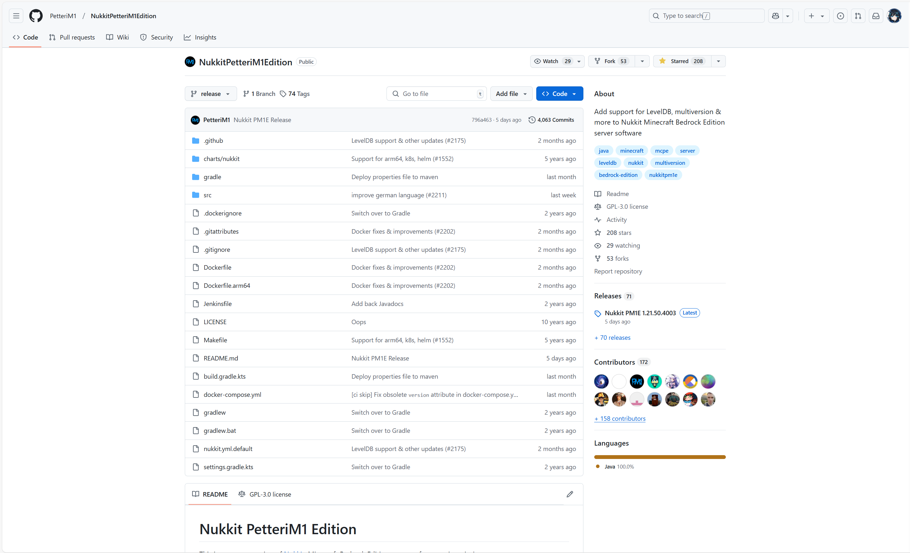

:::warning
Nukkit PetteriM1 Edition是一个独立开发的开源项目，由PetteriM1及其团队负责维护和更新。
该项目任何争议事件与Nitwiki站点以及任何文档维护者没有任何关联，
Nitwiki仅提供关于Nukkit PetteriM1 Edition的信息和教程，但不对该项目的开发、维护或任何相关争议负责。
所有关于Nukkit PetteriM1 Edition的开发、更新和维护均由PetteriM1及其团队独立完成，与Nitwiki站点和文档维护者无关。
:::

:::tip
本事件自己去看，我们不会录入：刀哥《[为什么你不应该使用PM1ENK - 细说PM1ENK的罪状](https://www.minebbs.com/threads/pm1enk-pm1enk.16912/)》

还有：NukkitPetteriM1Edition不知道啥时候开始老老实实把源代码推回来了：

:::

大致事件如下：

**2022年11月15日，PetteriM1删除了PM1E仓库下的所有代码，并表示接下来只会发布混淆过的jar文件供使用。
此举引起了社区的强烈不满，据知情人士透露，这么做的原因是为了防止“别人抄袭他的代码”。
而在闭源后，PM1ENK又被指控在接下来的更新中存在对PowerNukkitX的抄袭。
在此期间，一位名为sora-kawaii的Github用户成功反混淆了PM1ENK并公布了源码，公开的代码显示了PM1ENK对开源项目的抄袭。
2023年1月18日，PM1ENK发布了更新，此次更新被认为使用了业内最贵的付费混淆器ZKM以加强混淆效果，
这一违背开源协议的行为立刻掀起了社区中抵制PM1ENK的浪潮，随后社区推出了基于PM1ENK最后一个开源版本开发的Nukkit-MOT核心。**
