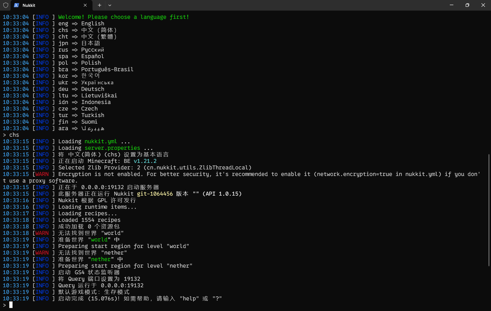

:::warning
本篇文档持续更新中... 
支持后续 PR

# Biggest TODO...

作者：梦涵LOVE
:::

# 服务器核心选择

## Bedrock Dedicated Server(BDS)（基岩版专用服务器）

:::warning
至本篇文档开始，**`BDS`** 一致指 **`Bedrock Dedicated Server`**，而不是指 **`Beidou Navigation Satellite System`**（北斗卫星导航系统）
:::

此服务器核心允许 _Minecraft 腐竹_ 在家里使用安装有 **Windows** 或 **Linux** 的设备或使用 **云服务托管**（云服务器）来搭建属于自己的 BDS 服务器。
这是坐落于 **Minecraft 官网** 的服务端（与 Java 的 Vanilla 服务端在一个页面）。作为官方服务端，它有着极其完善的 Minecraft 特性和流畅的游戏体验，几乎和单人一模一样，说是生存服首当之选也不为过。

**优点**：

- 拥有 **原生特性**。
- 跨平台支持：可以在搭载 **Windows / Linux** 的设备中运行。
- 由 **Mojang Studio**（官方）开发，持续更新。
- 社区插件内容庞大，基本满足腐竹的日常需求（虽然原版服务端无法加载插件，但可以通过 [社区开发的加载器](/docs-bedrock/bds-core/process/plugins/plugins-loader.md#bds-社区开发的加载器) 解决这一问题）。

**缺点**:

- 它的生物运算运行在一个线程上。意味着你的服务器的流畅度主要取决于 **CPU 的单核性能**。这使得地图越大，服务器就越[卡顿](https://yizhan.wiki/NitWikit/start/basic/what-is-caton)，不如 Java 版服务端流畅，因为 Java 版服务端**支持多核运行**。
- 内存占用会*缓慢*增加，严重的还会导致**内存泄漏**。如果强行进行 **内存清理** 的话，会导致玩家在进入 **装有 材质包 / Addon 的服务器** 时 **该玩家客户端无法下载对应内容**，致使下载进度条卡条，只能让腐竹重启服务器解决。

## Nukkit(NK)

:::warning
至本篇文档开始，**`NK`** 一致指 **`Nukkit`**，但考虑到全称不长，因此二者都会出现在本文档中
:::

它的名字，很像 Java 版服务端的 Bukkit。没错，它就是*意图*创作出来类似 Bukkit 的基岩版服务端，编写语言正是 **Java**。

**优点**：

- 可以在搭载 **Windows / Linux** 的 设备中运行（只要能使用 Java 的都可以）
- 与 **BDS** 核心相比，Nukkit 通常 **需要的资源更少**，适合在 **资源有限的环境** 下运行。
- 安装和配置过程 **相对简单**，它的开服过程 **类似于** Java 版开服过程，适合*初学者*和*非技术用户*。对于开过 Java 服务器的人，可以很好地熟悉并适应。
- 可以安装由 Java 编写的插件

**缺点**：

- **缺少大部分原版特性**，没有生物（但是有生物插件），没有地狱（但是有地狱插件），没有...(但是有...插件)。
- Nukkit 目前的性能可能 **甚至不如** Java 版的服务端，特别是在处理大量玩家或复杂插件时。
- 虽然社区活跃，但与 Java 版的 Minecraft 相比，Nukkit 的 **资源较少**。

## PowerNukkitX(PNX)

:::warning
至本篇文档开始，**`PNX`** 一致指 **`PowerNukkitX`**
:::