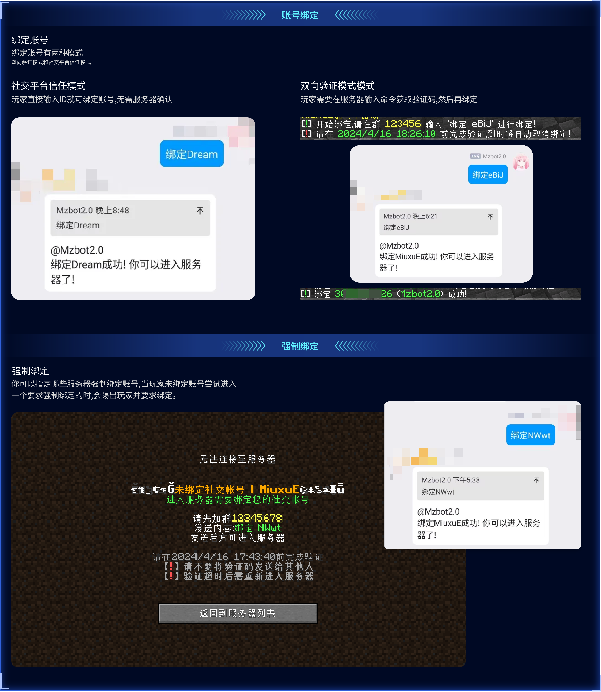
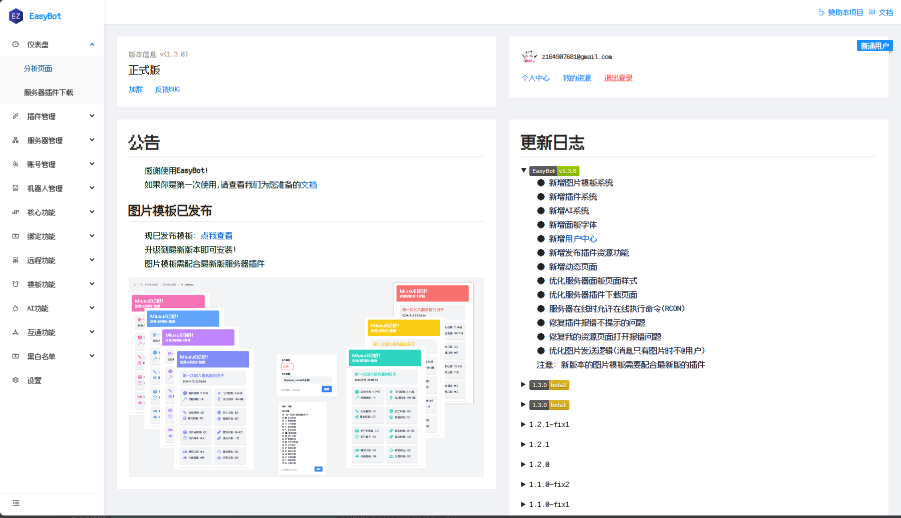
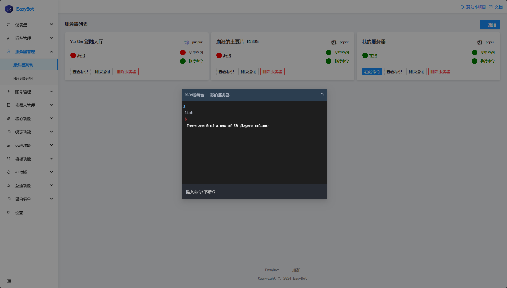
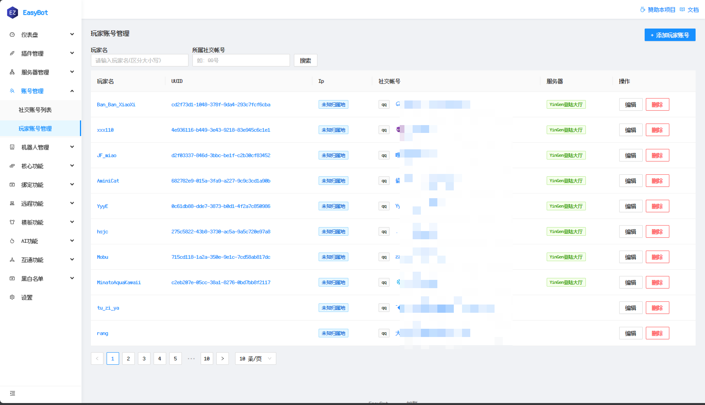

# 机器人搭建

## QQ 机器人

<!--## 使用已存在的机器人插件方案

:::info

一般而言，已经存在的机器人方案实现起来相对容易且功能多。

如果你不是专业开发者，非常推荐直接使用已存在的机器人插件实现。

:::-->

目前比较推荐的方案：

### [EasyBot](https://www.minebbs.com/resources/easyBot-minecraft.7918/)

> EasyBot 是一个基于 Blazor 开发的跨平台群服互通框架,旨在优化您的游戏社区体验。  
> 它不仅提供了消息同步功能，还具备自定义命令、绑定管理、高级权限控制以及群组互动等多种实用特性。

- [文档](https://docs.hualib.com/) - 主页

- [自定义命令教程](https://docs.hualib.com/%E5%91%BD%E4%BB%A4%E5%88%97%E8%A1%A8.html) - 简单地通过自定义命令实现查看服务器 TPS，玩家数据等。

- [消息同步](https://docs.hualib.com/%E6%B6%88%E6%81%AF%E5%90%8C%E6%AD%A5.html) - 教程

- [图片模板](https://docs.hualib.com/market/template.html) - 概念

优点：配置简单，网页编辑器方便新手，轻量。

  
一些EasyBot功能的截图

#### 宣传图

#### 主页

#### 服务器管理

#### 玩家管理

### [XinxinBot 系列](https://www.minebbs.com/threads/xinxinBotapi-qq-1-8-x-1-20-x.24540/)

<!--[XinxinBotAPI MineBBS 链接](https://www.minebbs.com/threads/xinxinBotapi-qq-1-8-x-1-20-x.24540/) -->

[账号绑定](http://wiki.mcxin.cn/zh/%E6%96%B0%E9%91%AB%E6%9C%BA%E5%99%A8%E4%BA%BA%E9%99%84%E5%B1%9E%E6%95%99%E7%A8%8B/XinxinBetterBind)

[消息同步](http://wiki.mcxin.cn/zh/%E6%96%B0%E9%91%AB%E6%9C%BA%E5%99%A8%E4%BA%BA%E9%99%84%E5%B1%9E%E6%95%99%E7%A8%8B/XinxinChatSync)

优点：使用附属插件，功能更多。

缺点：配置稍复杂。

<!--### 其他方案的注意事项

如果某个方案基于 MiraiMC，请参见下文。-->

### [MiraiMC](https://github.com/DreamVoid/MiraiMC)

MiraiMC 是一款能够作为服务器插件加载的机器人框架。它非常适合仅有一个服务端，尤其是使用面板开服的 **小型服务器** 使用。
MiraiMC 的大多数排障方法和特性都与 Mirai 相同，遇到问题时你可以参考 [Mirai](../../advance/bot/framework#mirai) 框架的使用文档。

MiraiMC 已添加了 [对 Overflow 的支持附属插件](https://github.com/DreamVoid/MiraiMC/issues/510)，因此你可以使用 Overflow 协助登录。
这也帮助了许多停更的基于 MiraiMC 的老机器人插件。
