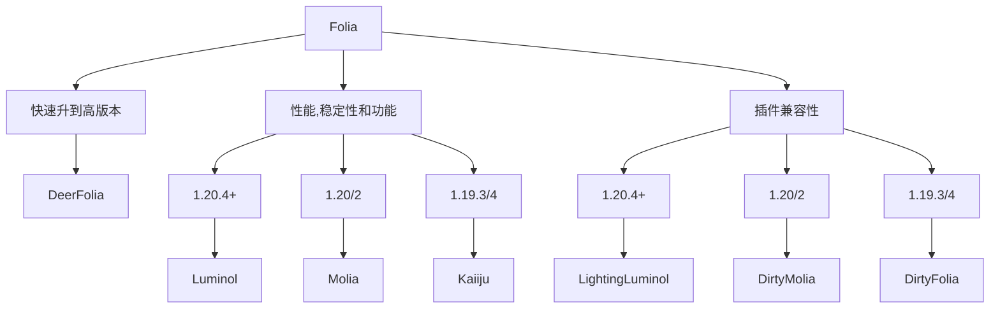

# Folia

Folia 是 Paper 的一个分支，由 Minecraft 优化 BOSS Spottedleaf 开发。

## 简介

### 好处

Folia 与 Vanilla 最大的不同在于 Tick 不再有主线程，而是将区块进行分组，每个独立的区域都有自己的 Tick Loop

如果你无法理解这段话，你可以看这样子做的好处:

现在有一个地图，有四个区块，分别是A，B，C，D

小明在A处建造了一个卡服机，能把服务器TPS干到10一下的那种

如果是Paper(或者Purpur及其分支)，那么A，B，C，D四处的TPS都会掉到10以下，但如果我们用Folia(假设ABCD分在不同的Region)，那么只有A处的TPS会掉到10以下，B，C，D的TPS仍然不受影响

并且Folia可以更好的利用CPU多核

### 坏处

Folia 完全破坏了 Bukkit 插件的兼容性，每个 Bukkit 插件都必须为 Folia 做兼容(有专门的 Fork 为 Folia 做 Bukkit 插件兼容，后面会讲)，所以，Folia 目前只支持很少插件

## 要求

Folia这么好，但并不是每个服务器都可以体验的，你需要确保你的服务器符合以下条件，这样才可以从Folia中受益

* 16个**物理**CPU核心
* 玩家较为分散(生存多人游戏、无政府、空岛或一些迷你游戏服务器)
* 你需要的插件支持 Folia

如果你不符合，去用Leaf吧，符合的话继续看下去!

## 选择

Folia 有许多分支,你可能不知道怎么选,有个简单的办法:

根据这张图表选好后去下载就可以了