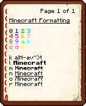

# 格式化代码

**格式化代码（Formatting code）**，又称**颜色代码（Color code）**，能使在游戏中加入含颜色和格式信息。

在 Minecraft 中，可以以分节符号（`§`）产生带色文字。





你也可以用 [颜色代码生成器](https://mcg.tuanzi.ink/) 来生成它。

:::note

通常在游戏客户端中，你不能打出 `§` 这个符号。需要使用 `\u00A7` 或者 `\u00a7`

在配置文件中，你可以直接复制粘贴这个符号而不用自己输入。

:::

:::tip

为了方便，多数插件的配置中支持使用 `&` 来代表 `§` 。

比如下面这个 TrMenu 菜单例子：

```
Icons:
  test:
    display:
      material: stone
      lore:
        - '&11 &22 &33'
        - '&aa &bb &cc'
```


:::

如果你想要更绚丽的颜色和更丰富的功能（比如点击文本执行命令）。

可以去看 [MiniMessage](MiniMessage.md) 部分。

# 参考

- https://zh.minecraft.wiki/w/%E6%A0%BC%E5%BC%8F%E5%8C%96%E4%BB%A3%E7%A0%81
