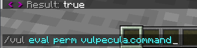
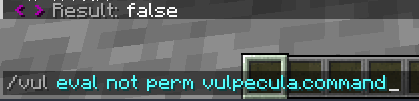
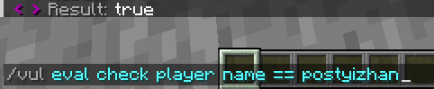
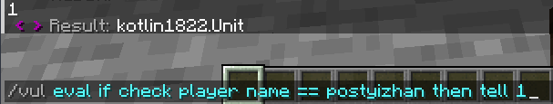
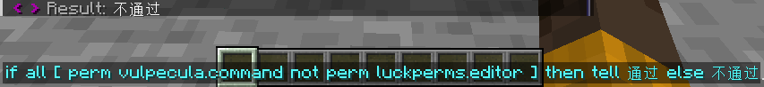
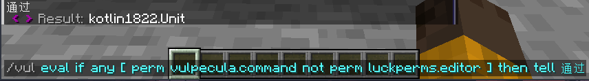

<!--markdownlint-disable no-duplicate-heading-->

# 逻辑判断

## 布尔值(boolean)

它只有两个取值，即 **真(true)** 和 **假(false)**

或者说，**是(true)** 和 **否(false)**

## 权限判断(Permission)

> https://kether.tabooproject.org/list.html#Permission

判断玩家是否拥有某权限，如果是，则返回 **true** ，否，则返回 **false**



我是op，所以我拥有此权限，返回了 true

同 [PlaceholderAPI](basic.md#变量placeholderapi) 一样，**Permission** 也有一个简写 **perm**

## 判断为否(Not)

上面是判断拥有此权限，那么我如何判断不拥有此权限呢？


咳咳，开玩笑的，驿站怎么可能用过这么傻逼的写法呢


> https://kether.tabooproject.org/list.html#Not
> 判断动作的返回值是否为否，即否定动作的结果。



因为我拥有此权限，所以 perm 判断是 true

接着因为 not，最后的结果是 false

perm -> not

## 判断(Check)

> https://kether.tabooproject.org/list.html#Check

```kether
check 动作1 {symbol} 动作2
```

判断 动作1 与 动作2 的关系

具体判断关系由中间的符号参数 Symbol 决定

1. 等于(==、is)：指两个值字面意思上相同。
2. 不等于(!=、not)：指两个值字面意思上不同。
3. 相似等于(=?、is?)：指两个值字面意思上忽略大小写的条件下相同。
4. 绝对等于(=!、is!)：指两个值内存路径上相同。
5. 大于(>、gt)：指第一个值大于第二个值。
6. 大于等于(>=)：指第一个值大于或等于第二个值。
7. 小于(\<、lt)：指第一个值小于第二个值。
8. 小于等于(\<=)：指第一个值小于或等于第二个值。
9. 右含左(in)：左侧 action A 的返回值是否属于右侧 action B 返回值的内容之一
10. 左含右(has)：左侧 action A 是否含有右侧 action B 内容



## 分支判断(if esle)

> https://kether.tabooproject.org/list.html#If_&_Else

### 单分支

```text
/vul eval if 条件 then 执行的动作
```

条件判断为 **true** 则执行 then 后面的动作

注：这里的条件也是指动作，即 动作的返回值为 **true** 则执行 then 后面的动作



上面只是执行单个动作，那么，如何让他判断 **true** 后执行多行动作？

```text
if 条件 then {
    语句1
    语句2
    语句3
}
```

### 双分支

```text
/vul eval if 条件 then true执行的动作 else false执行的动作
```

- 条件为 true 执行 then 后面的动作
- 条件为 false 执行 else 后面的动作

执行多行动作

```text
if 条件 then {
    语句1
    语句2
} else {
    语句3
    语句4
}
```

### 多分支

if动作的连续使用

```text
/vul evel if 条件1 then 动作1 else if 条件2 then 动作2 else if 条件3 then 动作3
```

多行语句

```text
if 条件1 then {
    动作1
    动作2
} else if 条件2 then {
    动作3
    动作4
} else if 条件3 then {
    动作5
    动作6
}
```

## 多分支(Case & When)

> https://kether.tabooproject.org/list.html#Case_&_When

### 单动作

```kether
if check player name == postyizhan then tell "是驿站！"
else if check player name == lilingfeng then tell "是驿站的黑奴"
else if check player name == MC_jiaolong then tell "这也是黑奴"
else tell"这谁啊"
```

上面的改成 Case & When 就是

```kether
case player name [
  when postyizhan -> tell "是驿站！"
  when lilingfeng -> tell "是驿站的黑奴"
  when MC_jiaolong -> tell "这也是黑奴"
  else tell "这谁啊"
]
```

### 多动作

当然他也可以写多行动作

```kether
case player name [
  when postyizhan -> {
    tell "是驿站！"
    tell "驿站请和我结婚"
  }
  when lilingfeng -> tell "是驿站的黑奴"
  when MC_jiaolong -> tell "这也是黑奴"
  else tell "这谁啊"
]
```

### 逻辑判断

他还可以进行逻辑判断！

单动作和多动作放一起展示了

```kether
case 1 [
    when < 10 -> {
        tell "这个数比10小"
    }
    when > 10 -> log "这个数比10大"
    else log "一样大"
]
```

## 多条件判断

### 全部满足(All)

> https://kether.tabooproject.org/list.html#All
> 判断动作列表的所有返回值是否均为是。

```kether
all [ 动作1 动作2 动作3 更多 ]
```

例如：

```text
/vul eval if all [ perm vulpecula.command not perm luckperms.editor ] then tell 通过 else 不通过
```

玩家拥有权限 vulpecula.command 没有权限 luckperms.editor 则通过，否则不通过



### 一个满足(Any)

> https://kether.tabooproject.org/list.html#Any
> 判断动作列表的所有返回值是否含有是。

```kether
any [ 动作1 动作2 动作3 更多 ]
```

例如：

```text
/vul eval if any [ perm vulpecula.command not perm luckperms.editor ] then tell 通过 else 不通过
```

*玩家拥有权限 vulpecula.command* 和 *没有权限 luckperms.editor* 满足其中一个或多个就通过



### 妙妙写法

#### all_any多行

```kether
all [ 条件1 条件2 ]
any [ 条件1 条件2]
### 等价于
all [
    条件1
    条件2
]
any [
    条件1
    条件2
]
```

#### 判断null字符串

如果一个动作，变量，或者其他什么东西会有输出null的情况，而你想判断这个情况

但是 `null` 是一个已有的动作：https://kether.tabooproject.org/list.html#Null

> 返回一个空值。

可是我想判断的是 `null` 这四个字母！这咋办？

还记得之前学的 [literal](basic.md#actiontoken和literal) 吗？

```yaml
check 你要判断的东西 == literal null
```

告诉kether我要的null是个字符串而不是使用 null动作

#### 判断空值

https://kether.tabooproject.org/list.html#Pass

> 返回一个空字符串。

```yaml
check 你要判断的东西 == pass
```
