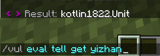
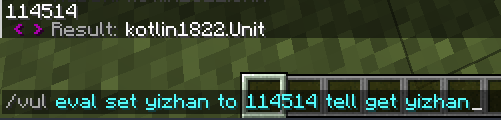

<!--markdownlint-disable no-duplicate-heading-->

# 数据相关

## 数据类型

<details>
  <summary>点击展开</summary>

不会讲

</details>

### 类型转换(Type)

> https://kether.tabooproject.org/list.html#Type

```kether
type {token} | type {type} {action}
```


### 自动类型转换

TODO

## 变量(Variable)

在这里想一个非常巧妙的比喻

思考ing...

## kether

此处讲解 kether 自己的变量，此变量特点是 kether 环境摧毁就消失

比如：TrMenu 关闭菜单，Vulpecula 的命令执行完成

### 基础

#### 设置

> https://kether.tabooproject.org/list.html#Variable_Set

```kether
set {token} {token} | set {token} to {action}
```

注意上面的语法，前者只能输入固定内容，后者可以把动作的返回值传入变量


接着我们获取下这个变量

#### 获取

> https://kether.tabooproject.org/list.html#Variable_Get

```kether
get {token} | &{token}
```



啪！空的！

我擦嘞，这是咋回事？

还记得我说过的吗

> 此变量特点是 kether 环境摧毁就消失

是的，当你执行完 `/vul eval set yizhan to 114514` 之后，kether环境已经被摧毁了，所以这个变量就消失了

正确做法：

```text
/vul eval set yizhan to 114514 tell get yizhan
```



成功得到了变量里的内容！

对于获取变量，我们有个更简单的办法 `&{token}`


看到这里，你就应该知道，为什么前面讲 [彩色(color Text)](basic.md#彩色color-text) 动作的时候会说

> 这里要用 `" "` 把要打印的信息包裹起来
> 否则他会把这个当成变量，具体的会在后面讲到

### array

#### 基础

> https://kether.tabooproject.org/list.html#Array

这也是一个动作，作用是

> 将动作列表的所有返回值作为集合返回。

语法：

```kether
array [ 动作1 动作2 动作3 更多 ]
```

我们搓一个出来玩玩


在这个集合中，数据被英文 `，` 分割开来，我们称为 **元素**

比如在上面共有三个元素：`HelloWord!` `postyizhan` `0.0`

接下来，我们把数组存进变量里

```kether
set yizhan to array [ HelloWord! player name 0.0 ]
```

#### 获取指定元素

如果我们只需要获取某数组中其中一个元素的值该怎么办？

我们给每个元素都标上号，然后获取指定号数的就好啦！`&变量名[标号]`


注意！标号是从 **0** 开始的

#### element

> https://kether.tabooproject.org/list.html#Element
> 将动作的返回值作为列表获取指定元素。

除了上面的 `&变量名[标号]`

我们还有一种办法获取到指定元素的值，那就是 `element` 动作


## TrMenu

## Invero

## Chemdah

## Vulpecula

## 案例

### 每日刷新

TODO
