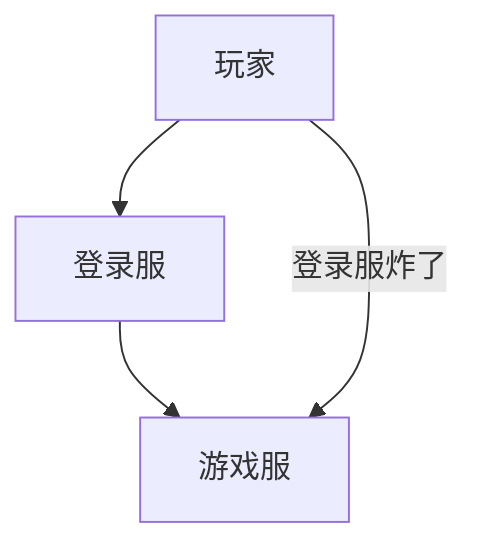

# 登录/大厅服

在你的服务器配置登录服或大厅服。

登录服和大厅服在原理上一样，所以这里只讲解登录服。

在 config.yml 中找到：

```TOML
# 当玩家登录或从服务器被踢出时，我们应该尝试让他进入哪个服务器？
try = [
    "lobby"
]
```

在这里只配置你的登录服，不要将游戏服写在这里！

否则当你的登录服因为某些原因崩溃时，玩家可以随意登录其他人账号，绕过登录直接加入游戏服。



- **在你的登录服安装 [登录插件](/docs-java/process/plugin/other/Login/Login.md)**

提供登录验证。

如果你使用 AuthMe，建议在 Velocity 安装 [AuthMeVelocity](https://modrinth.com/plugin/authmevelocity)。

- **在你的登录服安装 [大厅插件](/docs-java/process/plugin/WorldManagement/lobby/lobby.md)**

提供各种大厅常用的功能如：

- 世界保护
- 关闭雨雪
- 关闭伤害
- 二段跳
- 物品栏菜单
- 掉虚空返回
- 阻止丢出物品

当然你也可以不用大厅插件，用别的插件来补全这些功能。

- **在你的登录服安装提供跨服传送的插件**

使用这些插件将你的玩家从登录服传送到其他子服，可参考 [加入服务器](../../join-server.md)。
