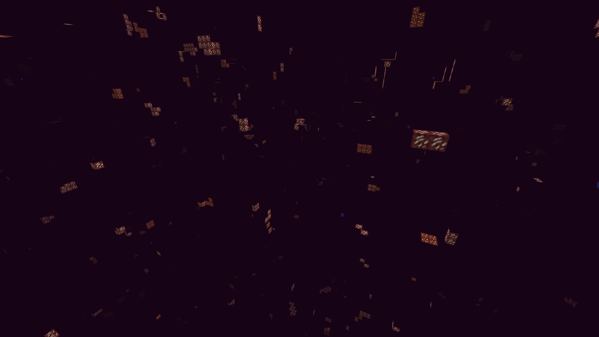

<!--markdownlint-disable no-duplicate-heading-->

# 其他作弊类型

为什么常规的反作弊插件不会包括部分作弊类型？

* 矿物透视与种子破解其实是很难从服务器所收到的玩家行为包分析得到的。
* 插件往往术语有专攻，一个过于齐全的插件会像 ESS / CMI 一样累赘。
* 插件对于"种子"这种相当底层的特征的修改并不如核心稳定高效。

## 矿物透视与种子破解

矿物透视是作弊客户端通过材质包、透明渲染非矿物方块等方式实现的对服务器矿物的快速搜索。

而 Minecraft 的结构和矿物等的生成均由种子决定，因此也可以进行种子反推了解服务器结构位置。

矿物透视和种子破解会导致玩家在非常短的时间内获取大量物资，这会影响大多数服务器的平衡和经济。

### 延长种子反推

#### 自动版

请使用[笨蛋脚本](https://dl.yizhan.wiki/windows-latest/auto-antiseedcracker.exe)，在服务器根目录执行即可自动配置!!

#### 特征使用随机种子

修改每种结构和矿物分别对应的种子能推迟或防止玩家推算出结构或矿物所在位置。

应该如何操作？首先找到 `/config/paper-world-defaults.yml` 文件。调整以下参数：

```yaml
feature-seeds:
  generate-random-seeds-for-all: true
```

> 这是对每个建筑使用随机种子，防止你的世界种子轻易的被破解
> 如果发现你的 `spigot.yml` 中出现了类似以下的配置配置就成功了，你可以修改其中的种子。(但其实不改也完全没问题)

```yaml
    seed-village: 10387312
    seed-desert: 14357617
    seed-igloo: 14357618
    seed-jungle: 14357619
    seed-swamp: 14357620
    seed-monument: 10387313
    seed-shipwreck: 165745295
    seed-ocean: 14357621
    seed-outpost: 165745296
    seed-endcity: 10387313
    seed-slime: 987234911
    seed-nether: 30084232
    seed-mansion: 10387319
    seed-fossil: 14357921
    seed-portal: 34222645
    seed-ancientcity: 20083232
    seed-trailruins: 83469867
    seed-trialchambers: 94251327
    seed-buriedtreasure: 10387320
    seed-mineshaft: default
    seed-stronghold: default

```

#### Matter 安全种子

如果你使用包含 Matter 安全种子补丁的分支(目前仅存在 Leaf)，那么恭喜你，你可以体验到安全功能种子，

地形和生物群落的生成保持不变，但所有矿石和结构都是用 1024 位种子生成的，而不是通常的 64 位种子。

这种种子几乎不可能破解，因为所需的破解时间和资源极长无比，如果你正在使用，那么你基本不用担心种子破解。

:::danger[特别注意]

开启 Leaf 安全种子之前，你要明白这玩意儿是**不能关闭的**，也就是说，你开启后，除非你删档重开，不然必须使用安全种子

:::

使用方法：将 `leaf.yml` 中的 `secure-seed` 设置为 `true`

#### 插件

使用插件 [AntiSeedCracker](https://www.spigotmc.org/resources/antiseedcracker-1-20-4.81495/) ，这个插件会发送一个虚假的种子到客户端，客户端仍然可以通过分析地形来破解，但难度会大大增强

#### 重置资源世界

如果你还是害怕长期推演导致的种子反推。你可以在使用以上一种或多种方法的前提下重置世界，但是这往往只适用于资源世界等。

### 设置假矿

使用 Paper 自带的 Anti-Xray 即可拦截大量矿透。我们只需要进行一些简单的设置。

#### 自动版

使用[笨蛋脚本](https://dl.yizhan.wiki/windows-latest/auto_antixray.exe)，在服务器根目录执行脚本即可自动配置!!

⚠警告：`engine-mode: 3` 在 `paper 1.19.3` 往后的版本才添加⚠

> 主世界推荐配置

:::tip[说明]

如果使用了 RayTraceAntiXray 请务必使用配置 Ⅲ 。

如果你需要使用权限来配置绕过，可以将 `use-permission` 项设置为 `true` (权限节点: `paper.antixray.bypass`)，该项需要你有一个现代的权限管理插件(如 LuckPerms)，否则检查权限时性能开销会非常大。

:::

<details>
  <summary>配置 Ⅰ - *带宽消耗较大，效果非常好*</summary>

```yaml
anticheat:
  anti-xray:
    enabled: true
    engine-mode: 2
    hidden-blocks:
    - copper_ore
    - deepslate_copper_ore
    - raw_copper_block
    - gold_ore
    - deepslate_gold_ore
    - iron_ore
    - deepslate_iron_ore
    - raw_iron_block
    - coal_ore
    - deepslate_coal_ore
    - lapis_ore
    - deepslate_lapis_ore
    - mossy_cobblestone
    - obsidian
    - chest
    - diamond_ore
    - deepslate_diamond_ore
    - redstone_ore
    - deepslate_redstone_ore
    - clay
    - emerald_ore
    - deepslate_emerald_ore
    - ender_chest
    lava-obscures: false
    max-block-height: 128
    replacement-blocks:
    - amethyst_block
    - andesite
    - budding_amethyst
    - calcite
    - coal_ore
    - deepslate_coal_ore
    - deepslate
    - diorite
    - dirt
    - emerald_ore
    - deepslate_emerald_ore
    - granite
    - gravel
    - oak_planks
    - smooth_basalt
    - stone
    - tuff
    update-radius: 2
    use-permission: false
```


</details>

<details>
  <summary>配置Ⅱ - *带宽消耗中等，效果中等</summary>

```yaml
anticheat:
  anti-xray:
    enabled: true
    engine-mode: 3
    hidden-blocks:
    - copper_ore
    - deepslate_copper_ore
    - raw_copper_block
    - gold_ore
    - deepslate_gold_ore
    - iron_ore
    - deepslate_iron_ore
    - raw_iron_block
    - coal_ore
    - deepslate_coal_ore
    - lapis_ore
    - deepslate_lapis_ore
    - mossy_cobblestone
    - obsidian
    - chest
    - diamond_ore
    - deepslate_diamond_ore
    - redstone_ore
    - deepslate_redstone_ore
    - clay
    - emerald_ore
    - deepslate_emerald_ore
    - ender_chest
    lava-obscures: false
    max-block-height: 128
    replacement-blocks:
    - amethyst_block
    - andesite
    - budding_amethyst
    - calcite
    - coal_ore
    - deepslate_coal_ore
    - deepslate
    - diorite
    - dirt
    - emerald_ore
    - deepslate_emerald_ore
    - granite
    - gravel
    - oak_planks
    - smooth_basalt
    - stone
    - tuff
    update-radius: 2
    use-permission: false
```


</details>

<details>
  <summary>配置Ⅲ - *降低带宽消耗，效果较差*</summary>

```yaml
anticheat:
  anti-xray:
    enabled: true
    engine-mode: 1
    hidden-blocks:
    - chest
    - coal_ore
    - deepslate_coal_ore
    - copper_ore
    - deepslate_copper_ore
    - raw_copper_block
    - diamond_ore
    - deepslate_diamond_ore
    - emerald_ore
    - deepslate_emerald_ore
    - gold_ore
    - deepslate_gold_ore
    - iron_ore
    - deepslate_iron_ore
    - raw_iron_block
    - lapis_ore
    - deepslate_lapis_ore
    - redstone_ore
    - deepslate_redstone_ore
    lava-obscures: false
    max-block-height: 64
    replacement-blocks: []
    update-radius: 2
    use-permission: false

```


</details>

---

如何在下界使用其他的 Anti-Xray 配置呢？找到 `/world_nether/paper-world.yml`

将下列你喜欢的配置进行复制粘贴即可

<details>
  <summary>下界配置 Ⅰ - *带宽压力翻倍，效果好，客户端 FPS 可能下降*</summary>

```yaml
anticheat:
  anti-xray:
    enabled: true
    engine-mode: 2
    hidden-blocks:
    # See note about air and possible client performance issues above.
    - ancient_debris
    - bone_block
    - glowstone
    - magma_block
    - nether_bricks
    - nether_gold_ore
    - nether_quartz_ore
    - polished_blackstone_bricks
    lava-obscures: false
    max-block-height: 128
    replacement-blocks:
    - basalt
    - blackstone
    - gravel
    - netherrack
    - soul_sand
    - soul_soil
    update-radius: 2
    use-permission: false
```


</details>

<details>
  <summary>下界配置 Ⅱ - *带宽占用略微降低，效果一般(但下届合金一定会被隐藏)*</summary>

```yaml
anticheat:
  anti-xray:
    enabled: true
    engine-mode: 1
    hidden-blocks:
    - ancient_debris
    - nether_gold_ore
    - nether_quartz_ore
    lava-obscures: false
    max-block-height: 128
    # The replacement-blocks list is not used in engine-mode: 1. Changing this will have no effect.
    replacement-blocks: []
    update-radius: 2
    use-permission: false
```



</details>

<details>
  <summary>下界配置 Ⅲ - *带宽占用较大提升，效果较好*</summary>

```yaml
anticheat:
  anti-xray:
    enabled: true
    engine-mode: 3
    hidden-blocks:
    - ancient_debris
    - bone_block
    - glowstone
    - magma_block
    - nether_bricks
    - nether_gold_ore
    - nether_quartz_ore
    - polished_blackstone_bricks
    lava-obscures: false
    max-block-height: 128
    replacement-blocks:
    - basalt
    - blackstone
    - gravel
    - netherrack
    - soul_sand
    - soul_soil
    update-radius: 2
    use-permission: false
```


</details>

在末地由于没有矿物，我们推荐将 `world_the_end/paper.world.yml` 进行以下配置即可。

```yaml
anticheat:
  anti-xray:
    enabled: false
```

注意，如果你需要隐藏暴露在空气中的方块，需要将 `air` 添加到 `hidden-blocks` 和 `replacement-blocks` ，但这非常影响性能，不推荐。

:::info

将配置文件复制到对应 `.yml` 文件中时，如果已经存在，请相应的进行覆盖而不是简单复制到最后。

如果并不存在类似的文本，那么请直接复制到对应世界 `.yml` 中。

:::

### Anti-xray 插件

#### RayTraceAntiXray

[RayTraceAntiXray](https://builtbybit.com/resources/raytraceantixray.24914/)，
[开源](https://github.com/stonar96/RayTraceAntiXray)付费且仅售 7 美元。

是一款用于隐藏 paper 服务器中使用 `engine-mode: 1` 时暴露在空气中的未隐藏方块的插件。

其使用了异步多线程光线追踪，判断玩家是否能看到目标方块，从而在玩家能够看到目标方块时发送真实方块信息。

可以优化自带的 Anti-Xray ，减小服务器的带宽开销(甚至比不使用Anti-Xray的宽带占用还低!)，如需构建请自行构建。

:::warning

在使用 Paper 及其 Fork 时。请停止使用 [Orebfuscator](https://modrinth.com/plugin/orebfuscator) 等假矿插件。换用 Paper 自带的 Anti-Xray。

:::
