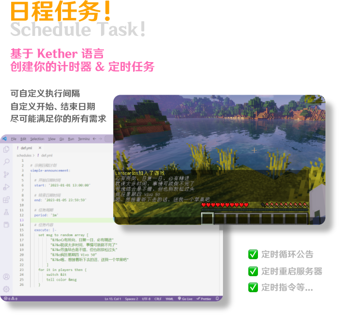
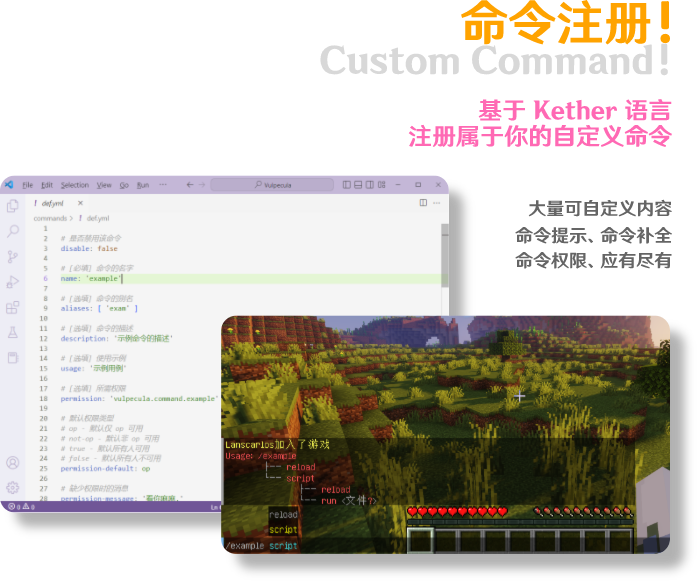
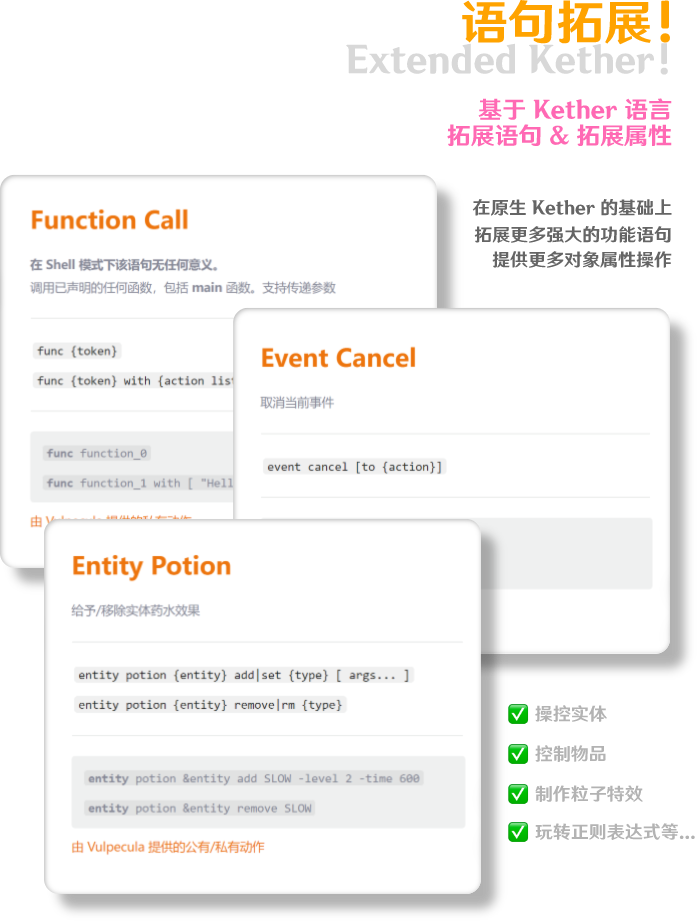

# Vulpecula

## 

## 链接

<!--markdownlint-disable line-length-->

:::info

`MineBBS` https://www.minebbs.com/resources/.9584

`GitHub` https://github.com/Lanscarlos/Vulpecula

`文档(中文)` https://www.yuque.com/lanscarlos/vulpecula-doc

:::

## Bstats

