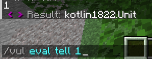
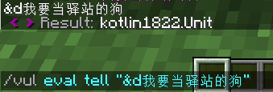
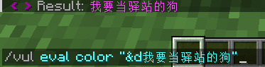
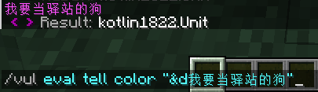
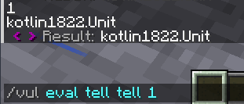
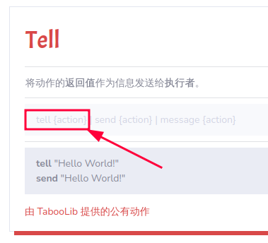
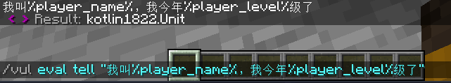
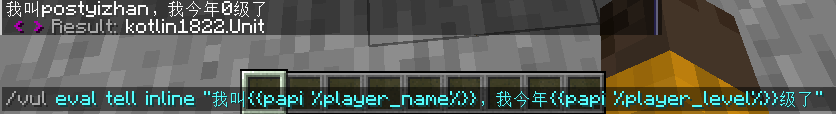
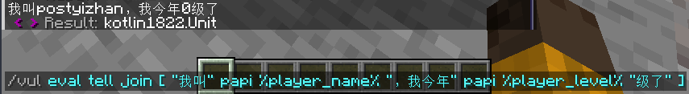
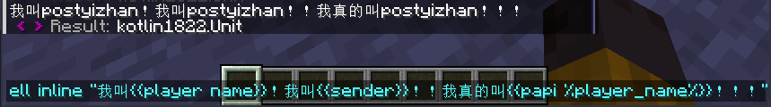

# 基础

> 动作，又称语句，每个动作都功能明确，如：Tell(输出文本)

在这一节中，我将告诉你在 kether 中的一些基本概念

我们先了解几个简单的动作

## 输出文本(Tell)

> https://kether.tabooproject.org/list.html#Tell



这个动作的作用是给玩家发送一条信息(图中的 1 )

下面的 `< > Result:` 是动作的返回值(下面会讲)

:::note

非调试(/vul evel)是不会看到这个的


也就是说你的玩家在用你写好的配置时是不会看到这个信息的

:::

然而，他不能搞颜色



我们可以用下面的 `color Text` 动作来搞颜色

## 彩色(color Text)

> https://kether.tabooproject.org/list.html#Color_Text



这里要用 `" "` 把要打印的信息包裹起来

否则他会把这个当成变量，具体的会在后面讲到

:::note

值得一提的是，Invero插件会自动翻译tell中的颜色，内联，papi

:::

## 语句的连用



我们同时使用了 tell 和 color 两个语句，打印了带颜色的信息给玩家看

## 语句的返回值


在使用 `/vul evel` 时，语句的返回值会在 `< > Result:` 显示

于是我们可以知道，`color` 动作先翻译了颜色，然后把翻译好的交给了 `Tell` 动作

所以动作的执行顺序为：color -> tell

**番外：**那么如果我们把 `tell` 的返回值打印呢




## \{action\}，\{token\}和Literal

查阅 https://kether.tabooproject.org/list.html 我们可以发现

它给出的示例中经常出现 `{action}` 和 `{token}`

比如 `Tell` 动作的：



用我浅显的理解：

- `{action}` 这里要写一个语句
- `{token}`  写固定不变的内容

所以在 [语句的连用](#语句的连用) 那里，我们可以在 `tell` 后面接一个 `color` 动作

那么问题来了，为什么在 [Tell](#输出文本tell) 那里可以接一句话(此处写了个1)？


因为在这个示例中，kether找不到名为 `1` 的动作，所以用了 `Literal` 动作将他转为字符串

> https://kether.tabooproject.org/list.html#Literal

它给出的使用方式：`literal {token} | {token}`

两种使用方式，特别是后一种，你随便写点啥，只要不是已有的动作，它最后就会被转为字符串

## 变量(PlaceholderAPI)

> https://kether.tabooproject.org/list.html#PlaceholderAPI

翻译一个papi变量(如图)


```kether
papi {action} | placeholder {action}
```

两种用法，papi是简写

## inline和join



假如你用的那个插件不会给你自动翻译动作中的papi，阁下又当如何应对？

> https://kether.tabooproject.org/list.html#Inline

`内联(inline)` 动作！在一段文本中插入 kether ！

用法为：

```kether
inline "阿巴阿巴{{你要用的kether}}qwq"
```

比如上面的案例中，可以这样做

```text
/vul eval tell inline "我叫{{papi %player_name%}}，我今年{{papi %player_level%}}级了"
```



> https://kether.tabooproject.org/list.html#Join

而 `join` 则是可以把多个动作拼接在一起，很多时候 `inline` 和 `join` 可以互相替代

用法为：

```kether
join [ 动作1 动作2 动作3 更多 ]
```

动作之间要空格

在上面的案例中，可以这样做

```text
/vul eval tell join [ "我叫" papi %player_name% "，我今年" papi %player_level% "级了" ]
```



## 玩家名称

### Name

> https://kether.tabooproject.org/list.html#Name

```kether
player [(display|list) ] name
```

### Sender

> 该语句没有在官方文档中给出
> 它的作用是获取脚本执行者的名字。跟 player name 作用类似，它也能用来获取玩家的名字，并且都没有参数。
> 除此之外，当控制台作为脚本执行者时，它还能获取控制台的名字：console，只不过这并没有什么用而已。
> 但它的优点在于不依赖玩家执行，相对来说会比 player name 更安全保守一些。
> 摘自 https://www.yuque.com/sacredcraft/kether/action-start#su0PY

### papi %player_name%

你已经见过了

### 使用案例

```text
/vul eval tell inline "我叫{{player name}}！我叫{{sender}}！！我真的叫{{papi %player_name%}}！！！"
```


