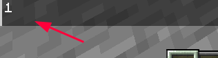

## 命名空间

建议阅读：https://www.yuque.com/sacredcraft/kether/namespace

## inline

inline是在一段文本中插入语句，实际上会创造一个新的 kether 环境

例如这个 TrMenu 例子中：

```yaml
  'A':
    display:
      material: stone
    actions:
      - meta set a to 1
      - tell &a
      - tell inline {{&a}}
```

第一个 tell 打印了 1

而第二个 tell 打印了空值

因为第二个 tell 后面是一个新的 kether 环境，里面没有原 kether 环境里的变量

同时，你也不能使用原插件提供的 kether 私有语句，不过你可以尝试 [导入语句](https://www.yuque.com/sacredcraft/kether/namespace#zVbkg)



## join

join 是拼接多个语句，不会像 inline 那样创造新的环境，所以没有上述特性，join 里的语句会使用原 kether 环境

## 行内复合文本

> https://plugins.ptms.ink/function/components/basic

TabooLib Components 行内复合文本

像 [MiniMessage](/docs-java/process/plugin/more/color-message.md#minimessage) 一样的东西？

Invero 最新版已经不支持 MiniMessage 而是使用行内复合文本了
