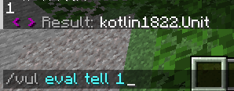

# 安装教学插件

在本篇教程中，我将使用 [Vulpecula](https://www.yuque.com/lanscarlos/vulpecula-wiki-v2)

你可以点击 [此处](https://github.com/Lanscarlos/Vulpecula) 跳转到 GitHub ，从 Actions 中下载

或者加入他的 QQ交流群 759705478 从群文件下载

:::info

我们不学习此插件的更多使用方式

你只需要知道他可以 `/vul eval` 来执行 kether 和用他来注册命令

:::

:::info

**别的插件执行kether？**

好吧，如果你已经安装了其他可以用命令调试kether的插件......

**TrMenu v3**

> /trm action 玩家ID 要执行的语句

**Invero**

> /i dev runKether 要执行的语句

**chemdah**

> /chs invoke tell 1

**其他插件**

> /and more......

:::
