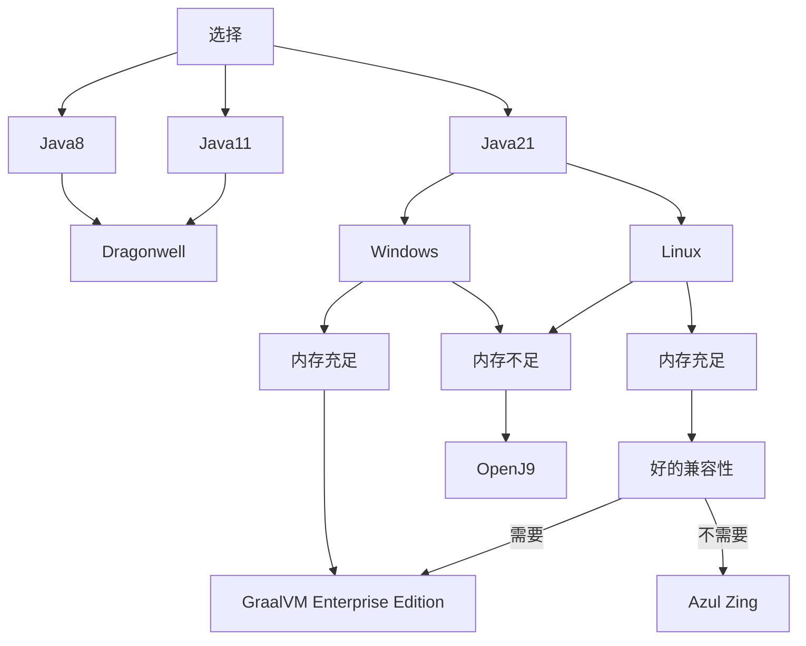
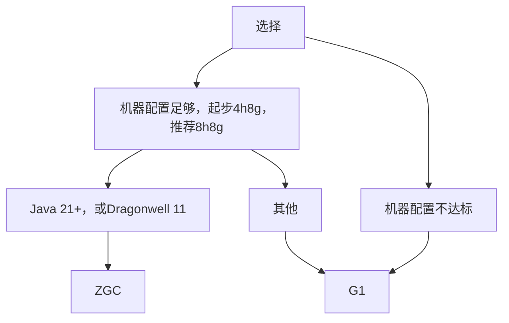

# JVM 优化

这篇文章可以说是整个笨蛋文档中编写历时最久的()，为了确保正确性，我们在Windows和Linux 上进行了大量性能测试，结果可以说是十分出人意料

这场测试的细节和日志，报告，Spark，GCLog等可以在[Test - Java](https://github.com/lilingfengdev/Test-Java)找到

## Java 选择

:::tip Zulu的性能

根据官方对 Zulu 的定位，Zulu 的重点是**安全性和稳定性**，而非性能

大部分人对`Zulu 性能好`这一错误看法主要是来源于同一公司 Azul 旗下的另一款产品 Zing

该产品(Zing)的主要侧重点是性能，但是，如果你不想折腾，想拥有一个超高稳定性的环境，Zulu 仍然是你的最佳选择

:::

:::tip 兼容性

根据我们的测试,GraalVM,Dragonwell,Zulu 目前都没有被报告过不兼容

Zing 与 LuckPerms 以及一些特殊插件会有一点不兼容

OpenJ9 虽然内存占用很低，但是性能很差，并且与很多插件有不兼容(比如 Spark)

GraalVM 在 22.3.0 修复了所有已知的 Minecraft 错误

:::

### 下载

import Tabs from '@theme/Tabs';
import TabItem from '@theme/TabItem';

<Tabs queryString="jvm-download">
<TabItem value="dragonwell" label="Dragonwell">

Dragonwell 分为  Standard Edition 和 Extended Edition，推荐下载 Extended Edition

- [官网](https://dragonwell-jdk.io/) 下载区域选择`China Mainland`
- [Dragonwell 8 预览](https://github.com/dragonwell-project/dragonwell8/releases)
- [Dragonwell 11 预览](https://github.com/dragonwell-project/dragonwell11/releases)

</TabItem>
<TabItem value="graalvm" label="GraalVM">

GraalVM 分为 Community Edition(CE) 和 Enterprise Edition(EE)，除非你服务器大到会被 Oracle 找上门，不然请选择 Enterprise Edition

- [下载 EE](https://www.graalvm.org/downloads/)
- [下载 CE](https://github.com/graalvm/graalvm-ce-builds/releases/)
- [下载镜像](https://d.injdk.cn/download/graalvm)

:::tip

Oracle 官网同样提供 GraalVM,但是上面的 GraalVM EE 包含了企业版套件,这些MC根本用不到,只需要企业版编译器就可以了

:::

</TabItem>
<TabItem value="zing" label="Azul Zing">

Azul Zing 不能直接被下载，需要填写试用申请表，但我们通过神秘手段搞到了安装包

JDK 21:

- [RPM](https://cdn.azul.com/zing-zvm/ZVM24.10.0.0/zing24.10.0.0-4-jdk21.0.4.0.101-linux.x86_64.rpm)
- [TAR.GZ](https://cdn.azul.com/zing-zvm/ZVM24.10.0.0/zing24.10.0.0-4-jdk21.0.4.0.101-linux_x64.tar.gz)
- [DEB](https://cdn.azul.com/zing-zvm/ZVM24.10.0.0/zing24.10.0.0-4-jdk21.0.4.0.101-linux_amd64.deb)

JDK 17:

- [RPM](https://cdn.azul.com/zing-zvm/ZVM24.10.0.0/zing24.10.0.0-4-jdk17.0.12.0.101-linux.x86_64.rpm)
- [TAR.GZ](https://cdn.azul.com/zing-zvm/ZVM24.10.0.0/zing24.10.0.0-4-jdk17.0.12.0.101-linux_x64.tar.gz)
- [DEB](https://cdn.azul.com/zing-zvm/ZVM24.10.0.0/zing24.10.0.0-4-jdk17.0.12.0.101-linux_amd64.deb)

JDK 8:

- [RPM](https://cdn.azul.com/zing-zvm/ZVM24.10.0.0/zing24.10.0.0-4-jdk8.0.431-linux.x86_64.rpm)
- [TAR.GZ](https://cdn.azul.com/zing-zvm/ZVM24.10.0.0/zing24.10.0.0-4-jdk8.0.431-linux_x64.tar.gz)
- [DEB](https://cdn.azul.com/zing-zvm/ZVM24.10.0.0/zing24.10.0.0-4-jdk8.0.431-linux_amd64.deb)

[官网](https://www.azul.com/downloads/#prime)

</TabItem>
<TabItem value="zulu" label="Azul Zulu">

Azul Zulu 支持 Java 8 以上，Java 7 和 6 需要成为客户才能下载

- [官网](https://www.azul.com/downloads/?package=jdk&show-old-builds=true#zulu)
- [下载镜像](https://d.injdk.cn/download/zulu)

</TabItem>
<TabItem value="openj9" label="OpenJ9">

OpenJ9 有认证版和非认证版，主要是因为和 OpenJ9 的关系和操作系统的关系而使用不同的许可证罢了，本质代码是一样的，直接下`IBM Semeru Runtime Open Edition`就行

- [官网](https://developer.ibm.com/languages/java/semeru-runtimes/downloads/)
- [下载镜像](https://d.injdk.cn/download/ibm)

</TabItem>
</Tabs>

## 垃圾回收器

经过我们的多次测试，G1GC和ZGC 最适合MC服务器(还有一个 Zing C4)

选择！

ZGC 的无停顿可以给玩家带来更好的体验，并且更充分的利用多核。

:::warning

虽然ZGC在高版本上 Java 表现良好，但是某些 Java 上会造成反效果（如 GraalVM），参见各个 Java 的具体配置介绍。

:::

对于 GC 细节性的优化请阅读每个Java的优化指南
