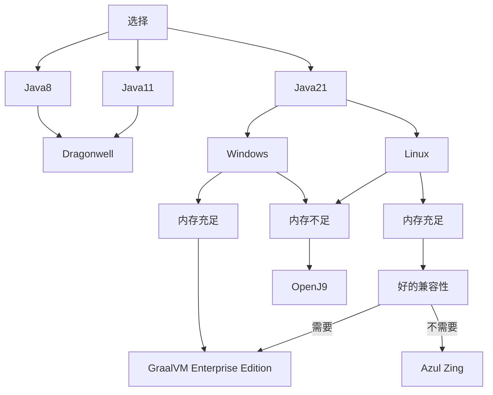
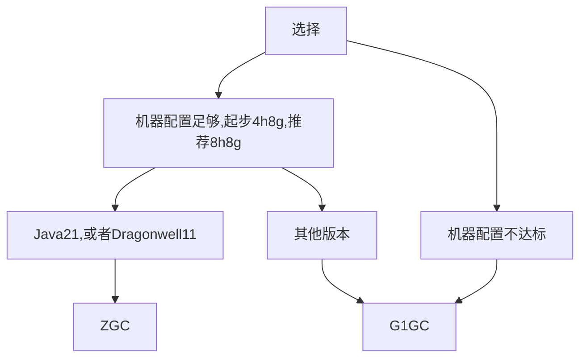

# JVM 优化

这篇文章可以说是整个笨蛋文档中编写历时最久的(),为了确保正确性,我们在Windows和Linux 上进行了大量性能测试,结果可以说是十分出人意料

这场测试的细节和日志,报告,Spark,GCLog等可以在[Test - Java](https://github.com/lilingfengdev/Test-Java)找到

## Java 选择

这可能与你想的不太一样

Zulu 被淘汰了，这是事实

## 垃圾回收器

经过我们的多次测试，G1GC和ZGC 最适合MC服务器(还有一个 Zing C4)

选择！

ZGC 的无停顿可以给玩家带来更好的体验,并且更充分的利用多核

对于 GC 细节性的优化请阅读每个Java的优化指南