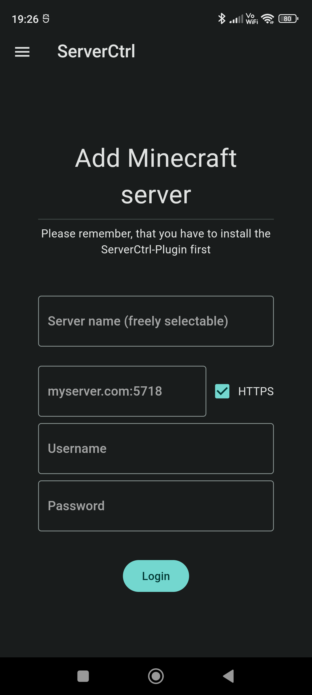
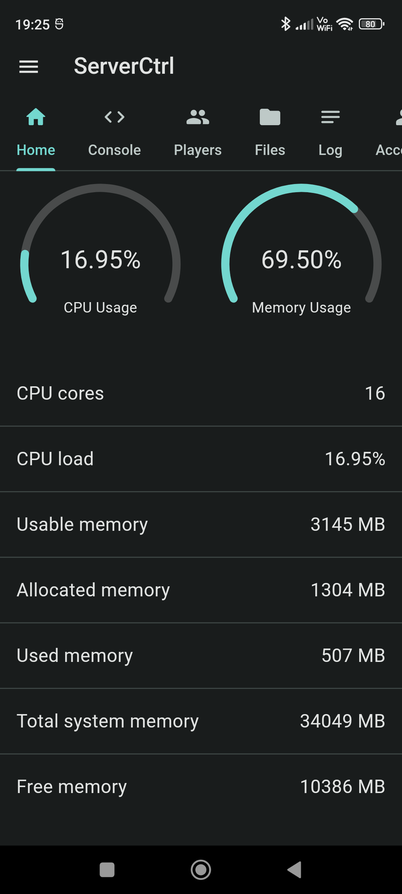
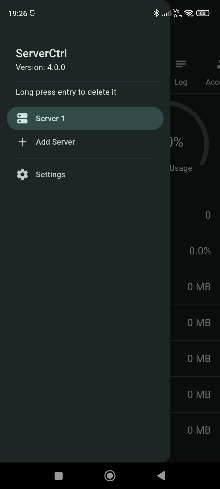
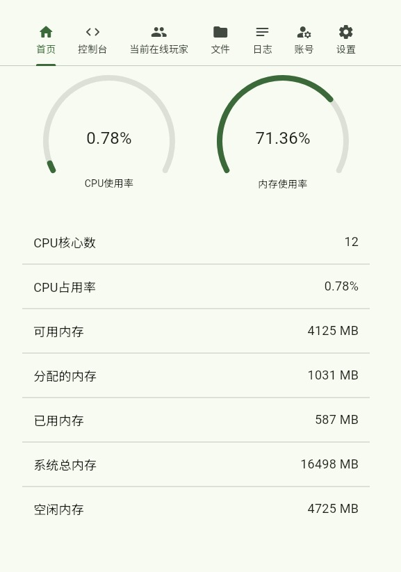

# 远程管理

远程管理工具可以很方便的管理服务器，群组下优势会更加明显

## 面板

查看[通用 | 面板搭建](https://yizhan.wiki/NitWikit/process/dashboard)

## ServerCtrl

ServerCtrl 是一个非常好用的远程管理工具，支持 Windows，Linux，**Android App**，Web 四种管理方式，只需要将插件安装到服务端

像这样(可以切换中文)

   

[在此](https://github.com/blitzdose/ServerCtrl/releases) 下载

`ServerCtrl.apk` 是安卓客户端

`ServerCtrl-Linux.zip` 是Linux 客户端

`ServerCtrl-Windows.zip` 是 Windows 客户端

`ServerCtrl_*.*.*.jar` 是服务端插件，需要安装到服务端

把插件安装到服务端并启动，首先你会看到

```
[ServerCtrl] Admin account created. Username: admin Password: TEkL341LPMPU
```

这里的`admin`是用户名，`TEkL341LPMPU`是初始密码，你可以后续进行更改，接下来你会看到

```
[ServerCtrl] Webserver started on Port: 5718
```

这时候远程管理服务器就启动好了，`5718`是默认的远程管理端口

此时你就可以打开浏览器，输入`你的IP:5718`在Web 远程管理，你就会看到


登录后，你就可以愉快的管理了



### 配置文件

打开`ServerCtrl/config.yml`

```yaml
Update-Check: true # 检查更新
Logging-types: # 日志需要记录的事件
- LOGIN_SUCCESS
- LOGIN_FAIL
- COMMAND_SEND
- DOWNLOADED_FILES
- UPLOADED_FILES
- PLAYER_JOINED
- PLAYER_QUIT
Webserver:
  https: false # HTTPS
  frontend: true # 前端（Web页面）
  servername: Server Remote # 默认的服务器名称
  port: 5718 # 服务端口
  editable-files: # 可以直接远程编辑的文件
  - txt
  - yml
  - json
  - properties
  - log
  users: # 别直接动
    admin: tYFYi7geqDucViXmVocOgFMotpIkGu34qw3bsYmFEkY=
  permissions:
    admin:
    - KICK
    - BAN
    - OP
    - CONSOLE
    - PLUGINSETTINGS
    - SERVERSETTINGS
    - LOG
    - FILES
    - ADMIN

```

根据需要进行配置就ok了