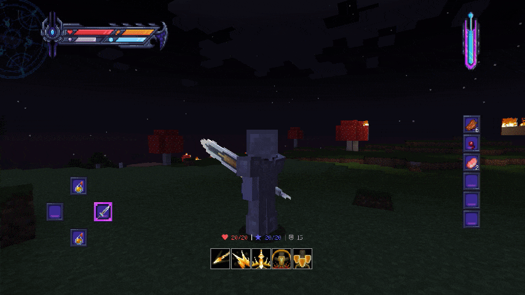
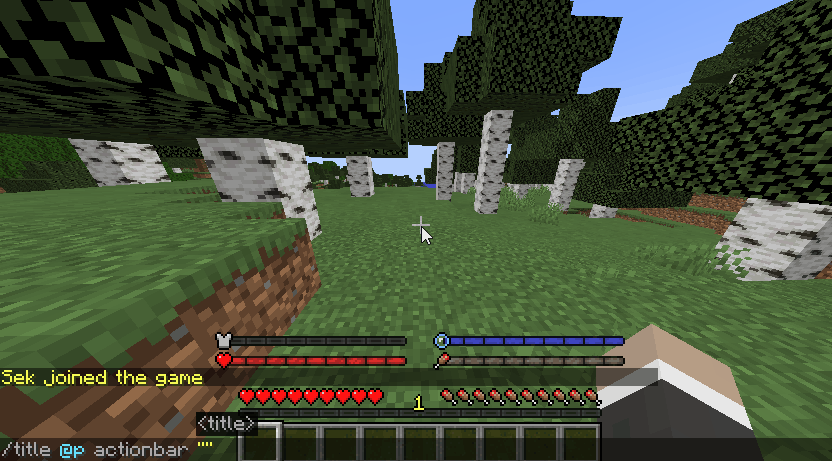

# HUD

import Tabs from '@theme/Tabs';
import TabItem from '@theme/TabItem';

<Tabs queryString="hud">
<TabItem value="BetterHud" label="BetterHud">

:::info

`SpigotMC` https://www.spigotmc.org/resources/115559/

`GitHub` https://github.com/toxicity188/BetterHud

`文档(英文)` https://github.com/toxicity188/BetterHud/wiki

`文档(中文)` https://plugins.8aka.org/BetterHud/intro

:::

免费的 HUD 插件,Wiki 写的非常好,支持的版本为`1.18-1.21`

</TabItem>
<TabItem value="MythicHUD" label="MythicHUD">

:::info

`SpigotMC` https://www.spigotmc.org/resources/96299/

`文档(英文)` https://git.mythiccraft.io/mythiccraft/mythichud/-/wikis/home

:::

付费的 HUD 的插件,以前的名字为 HappyHUD,支持的版本为`1.19-1.21`,非常不推荐的插件:

* Wiki 写的非常糟糕,完全不如 BetterHud
* HappyHUD 改个名后要求全部重新付费
* 更新缓慢

</TabItem>
</Tabs>
