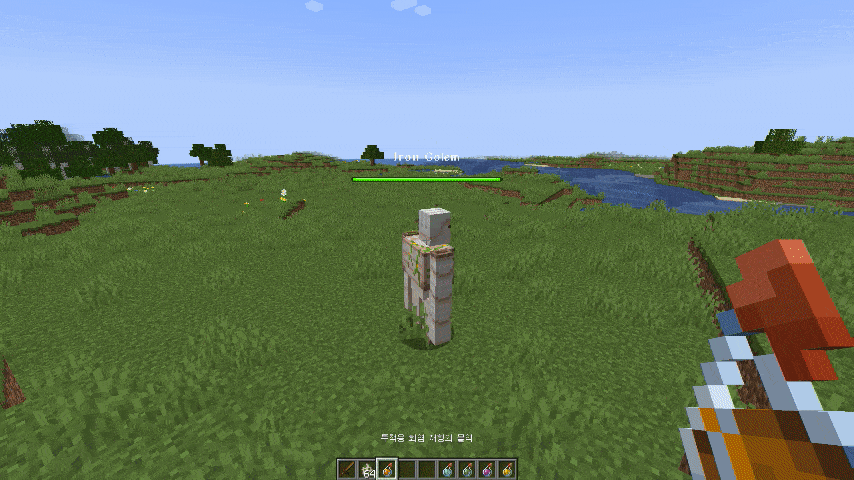
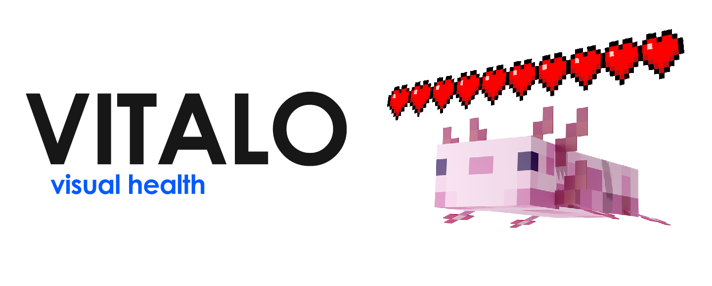
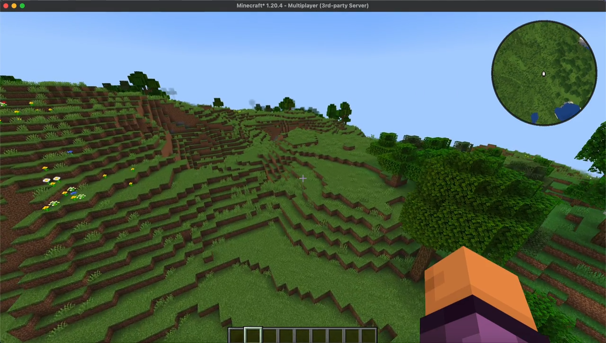
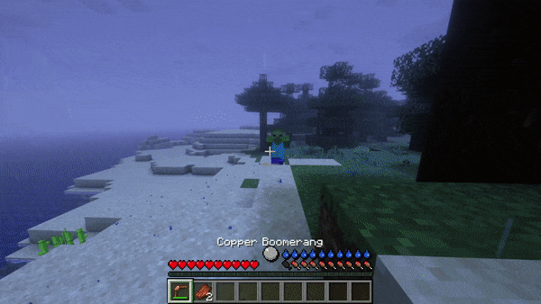

# 其他

## 生命指示

import Tabs from '@theme/Tabs';
import TabItem from '@theme/TabItem';

<Tabs queryString="health">
<TabItem value="bh" label="BodyHealth(免费)">

:::info

`SpigotMC` https://www.spigotmc.org/resources/119966/

`Github` https://github.com/Mitality/BodyHealth

:::

一个指示自身生命值和盔甲值的插件，支持版本为 1.21

</TabItem>
<TabItem value="health" label="BetterHealthBar(付费)">

:::info

`SpigotMC` https://www.spigotmc.org/resources/116619/

`Github` https://github.com/toxicity188/BetterHealthBar3

`文档(英文)` https://github.com/toxicity188/BetterHealthBar3/wiki

`文档(中文)` https://plugins.8aka.org/ShortDoc/BetterHealthBar3/

:::

一个非常棒的生命指示插件,还支持药水效果显示

</TabItem>
<TabItem value="vitalo" label="Vitalo(付费)">

:::info

`SpigotMC` https://www.spigotmc.org/resources/114680/

:::

一个生命指示插件,支持版本为 1.20 - 1.20.6

</TabItem>
</Tabs>

## 小地图

:::info

`SpigotMC` https://www.spigotmc.org/resources/114756/

`Github` https://github.com/JNNGL/VanillaMinimaps

`Modrinth` https://modrinth.com/plugin/vanillaminimaps

:::

一个超级棒的小地图插件，支持版本为 1.21

## 生存增强

:::info

`SpigotMC` https://www.spigotmc.org/resources/93795/

`Github` https://github.com/ValMobile/RealisticSurvival

`文档(英文)` https://github.com/ValMobile/RealisticSurvival/wiki

:::

该插件增强了原版的生存体验,加入了口渴值,温度系统等,推荐与 BodyHealth 一起使用

