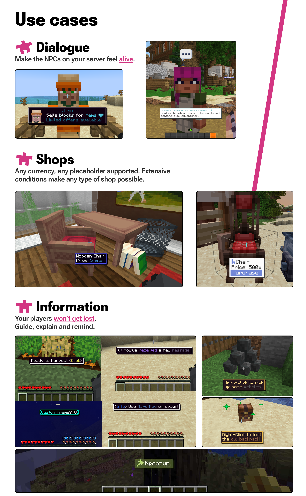

# Tooltips

:::info

`SpigotMC` https://www.spigotmc.org/resources/.109912/

`GitHub` https://github.com/Septicuss/tooltips

`文档(英文)` https://tooltips.gitbook.io/tooltips/

:::

一个提示/对话制作插件,可以实现非常酷的功能,相较于其他插件较为简单

