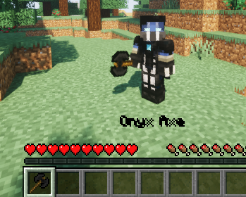
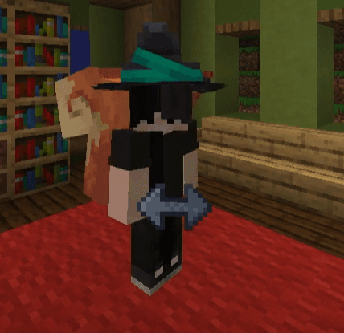

# 资源包

:::tip

这一部分的教程不是教你如何**制作**资源包,而是教你如何**托管/压缩/混淆**资源包!!

:::

现在，资源包(或者说材质包)能做的事越来越多，在高版本已经有了一个新的服务器类别。

很多人用 **IA 服** 来代指这一类服务器。

:::note

因为 ItemsAdder(ia)太有名于是所有类似服务器都被称为 ia 服了

:::

在这类服务器中，你可以用原版客户端只安装服务器发来的资源包而看到：

  
点击展开

全新的武器装备：

独特的装扮：

新的 GUI 界面：

称号或表情包：

家具或装饰：

新的生物或 boss：

以及更多你想不到的内容...

社区都发展成这样了，某些人还以为资源包 “必须修改原版物品” “生存一得到原版东西就露馅”

还有不少半吊子都不如的人以为做到折叠中的效果必须要 ia 或某某特定插件。

这都是原版资源包能做到的东西，ia 只是一个打包器，你有能力甚至可以自己手搓材质包。

## 注意

JAVA 版的资源包分发与基岩版不同，它是云分发的，提供给客户端的应该是一个**直链**，而不是资源包本身

不管你用什么方式，都必须是直链才可正常使用！

**什么是直链？**

> 直接从服务器下载数据

不需要登陆账号，不需要点击链接打开网页才下载

import DocCardList from '@theme/DocCardList';

<DocCardList />
