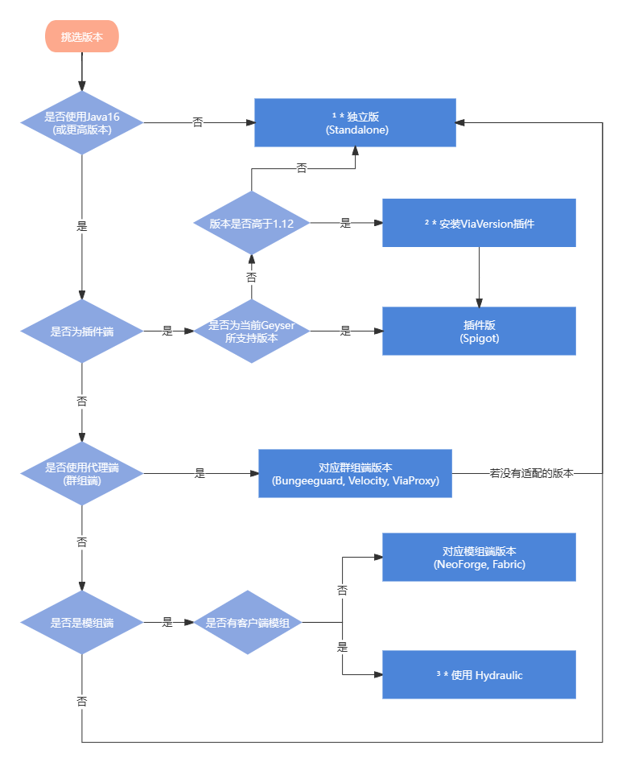

# 安装

## 版本
Geyser有以下版本类型:
* Spigot
* Bungeecord
* Velocity
* Fabric
* NeoForge
* Standalone
* ViaProxy

其中:

Spigot版本 可以作为插件安装在以Spigot及其分叉(如Paper)为核心的服务端上

Bungeecord，Velocity和ViaProxy版本 可以作为插件安装在这些代理端上

Fabric和NeoForge版本 可以作为模组安装在这些模组端上

Standalone版本 可以作为一个独立的代理端启动

## 挑选版本
在安装前，你需要找到合适的Geyser版本，你可以参考下图:



* 1、运行独立版**仍需要Java16**及以上环境，只不过你可以将其和目标服务器所处的Java环境隔开 此外**在任何情况下**，你都可使用独立版，甚至独立版可以和其目标不在同一服务器上
* 2、你可以通过ViaVersion插件来适配版本，这会允许不同版本的玩家进入服务器，不过问题不大
* 3、[Hydraulic](https://github.com/GeyserMC/Hydraulic) 可以允许你加入带客户端模组的服务器，但是项目处于**早期开发阶段**，你可以做个尝试，但是请不要在实际情况下使用

## 下载

你可以在此处下载 [Geyser](https://geysermc.org/download#geyser) 的对应版本

## 安装
### 其他版本
作为插件或模组安装到对应文件夹即可
### 独立版
独立版作为一个单独的服务端，你可以参考 [此处](/docs-java/start/launch-server.md) 的开启方法

## 配置

找到配置文件夹下的config.yml

(什么，你连配置文件夹都找不到? 那你真是连笨蛋都不如，配置文件在对应版本Geyser名称的文件夹下，一般开启服务器后都会生成)

:::danger

作为一个新手，在本教程未提及前，请不要随意更改任何配置项

:::

第一眼你可能会被全是英文的配置文件镇住,别急，善用翻译来理解配置文件中的注释，**在完成本教程的基础配置配置后，若需进阶，请参考 [此处](https://docs.superiormc.cn/v/geyser-wiki/user-guide/li-jie-pei-zhi) 的配置参考**

接下来，回到配置，映入你眼帘的应该是bedrock和remote两个大项:

bedrock所代表的是你所开放的端口，也是基岩版玩家看到的那个，remote是连接的目标服务器，若不使用独立版此选项无效，请不要随意更改

```yaml
bedrock:
  port: 19132
  clone-remote-port: false
  motd1: "Geyser"
  motd2: "Another Geyser server."
  server-name: "Geyser"
  compression-level: 6
  enable-proxy-protocol: false
  #proxy-protocol-whitelisted-ips: [ "127.0.0.1"，"172.18.0.0/16" ]

```
```yaml
remote:
  address: auto
  port: 25565
  auth-type: online
  allow-password-authentication: true
  use-proxy-protocol: false
  forward-hostname: false
```
### Bedrock项
**`port`**: 其代表你向基岩版玩家所开放的端口，在设置端口时请不要低于10000

**`motd1`** 和 **`motd2`**: 其代表向基岩版玩家所显示的MOTD，可根据你的喜好配置，仅支持最基础的颜色符号

**`server-name`**: 基岩版所看到的服务器名称，在暂停菜单和设置中可见

### Remote项

**`address`**: 其代表目标服务器的地址，若目标服务器和Geyser处于同一服务器下请不要更改

**`port`**:(重要选项) 请和目标服务器(插件版必须与`server-port`一致）一致对外开放的端口一致

**`auth-type`**: 有offline，online和floodgate模式，offline和online分别对应离线和正版，你目标服务器用的什么就选什么，floodgate会在后续教程中解释

### 其他项
再往下翻你会注意到不少其他乱七八糟的项

这里挑几个重点

```yaml
passthrough-motd: true
passthrough-player-counts: true

# 请注意：如果启用了冷却时间，某些用户可能会在冷却过程中看到一个黑框，
# 可以通过进入辅助功能选项卡下的基岩设置并将“文本背景不透明度”设置为 0 来禁用此功能
show-cooldown: title

show-coordinates: true
above-bedrock-nether-building: false
```

**`passthrough-motd`**: 把Java版本的MOTD发送给基岩版

**`passthrough-player-counts`**: 将玩家数量和最大玩家数量发给基岩玩家

**`show-cooldown`**: 由于基岩版没有战斗冷却，此功能会模拟一个冷却提示器，你可以设置为title(小标题)，actionbar(物品栏上方的标题) 或 false(关闭)

**`show-coordinates`**: 是否向玩家显示坐标

**`above-bedrock-nether-building`**: 开启后你将被允许在下届高度127以上建造，缺点是整个下界中雾的颜色不再可变，将一直是红色(GeyserExtras可以解决这个问题)

:::warning

若你在使用模组端Geyser，那接下来的教程就和你无关了(包括进阶)，因为模组端geyser根本不能实现这些功能

:::

## Floodagte
为进一步兼容，你需要安装 [floodgate](https://geysermc.org/download#floodgate)
floodgate可作为一个插件安装到Spigot及其分支的核心上或BungeeCord，Velocity之类的代理上
群组服/独立版Geyser 的Floodgate安装需要进行一些额外步骤，请跟随教程完成

Floodgate是一个允许 **Minecraft 基岩版** 帐号加入 **Minecraft Java版** 正版服务器而无需其**正版账号**的混合模式插件

但**不止于此**

它还允许:
* 让Java版玩家看到基岩版玩家的皮肤
* 向基岩版玩家发送BE Form UI (基岩版独有的一种菜单格式)
* 允许基岩版玩家与Java版玩家进行账号数据间的连接
* 提供一个通用的API，使更多插件可以兼容基岩版玩家
* 以基岩版XUID作为UUID储存数据，使在基岩版玩家改名后不丢失数据

所以就算**非正版服务器**，也有**必要**安装此插件来获取更强大的兼容性

此外，Floodgate有个小缺点，在安装之后你无法直接使基岩版玩家和Java版玩家数据互通，这将在进阶教程中给出两个可行的解决办法

### 基础配置
:::warning

由于Floodgate在设计时并未考虑离线服务器

接下来的教程中将告诉你如何进行调整以更好的适配离线服

:::

:::warning

若你在使用独立版Geyser或群组服，请翻到下方跟随对应教程完成安装

:::

安装Floodgate后，打开配置文件，注意到以下项

```yaml
username-prefix: "."
```

这是Floodgate为了区分基岩版玩家和Java版玩家，而在基岩版玩家名称前添加的前缀

为什么?

因为在安装Floodgate后，基岩版玩家的UUID将会和Java版玩家有很大不同，若是遇到重名，则会出现一个ID拥有两个完全不同的UUID，这可能会发生一些无法预知的错误，而使用"."前缀是因为Java正版玩家名中不可使用"."

**但是**
这在离线服中，有几个问题:
* 离线服玩家名是可以任意修改的，所以Java玩家一样可以使用相同前缀进入服务器
* 部分登录插件会禁止诸如带有"."玩家名的玩家进入服务器，这会导致基岩版玩家无法进入服务器

接下来我们来解决这些问题

要解决第一个问题，由于离线服务器玩家可以使用任何名称进入服务器，我们可以选择禁止所有使用基岩版玩家名前缀的Java玩家进入服务器

**此部分未完工，咕咕咕！**

在第一个问题解决后，我们可以使用任意前缀作为基岩版玩家的区分
于是将前缀修改为诸如"BE_"这类的合法字符即可解决第二个问题

```yaml
username-prefix: "BE_"
```

### 独立版Geyser配置
首先，按照基础配置在目标服务器安装Floodgate，然后注意到Floodgate配置文件夹下，理应会生成一个叫key.pem的文件，将其复制到独立版Geyser配置文件夹下

然后来到Geyser配置文件

找到Remote项中的 **`auth-type`**，并将其改为 **`floodgate`**

```yaml
remote:
auth-type: floodgate
```
若Geyser已开启，则重启Geyser即可完成配置

### 群组服配置
首先，在群组端安装Floodgate，并按照基础配置完成安装

:::warning

不要将子服中的Floodgate配置直接复制到群组服，会缺少某个重要项

:::

接下来来到群组服的Floodgate配置，找到 **`send-floodgate-data`** 这一项，将其修改为true

```yaml
send-floodgate-data: true
```

这样子服就可以接收到来自群组服的基岩版玩家数据了，请注意在开启此项后，若子服不安装Floodgate则基岩版玩家则无法进入子服，但是此项很重要，若不开启，则在子服中Floodgate不起效果

接下来，在子服一一安装Floodgate并确保和群组服的Floodgate配置一致，然后注意到群组端Floodgate配置文件夹下，理应会生成一个叫key.pem的文件，用群组服的key.pem将子服中的key.pem覆盖，确保key.pem完全相同

即可完成群组端配置

## 笨蛋脚本

下载[脚本](https://github.com/lilingfengdev/NitWiki-Script/releases/download/windows-latest/geyser-egg.exe),为你自动生成Geyser环境,免于配置

即使不用配置,你仍然需要看完wiki,**明白你在做什么**


## 结尾

恭喜你，配置完毕!!，开始和你的好友一起玩吧
