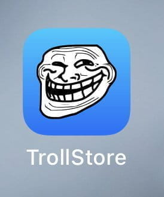
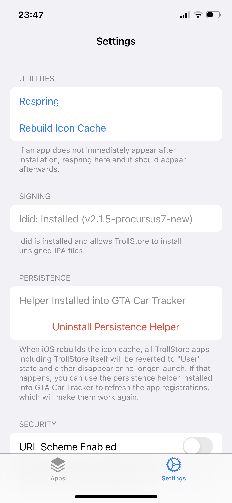
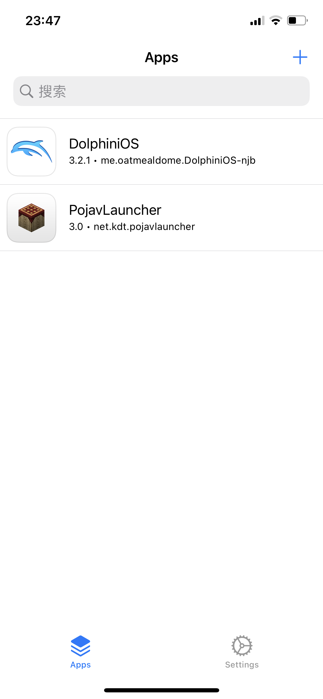

# 在 iOS 上安装 PojavLauncher

免越狱安装 PojavLauncher_iOS

~~(当然如果下面几个方法都不成功那恭喜你只能去越狱了)~~

## 方法一: 使用牛蛙助手

### 安装 PojavLauncher

在电脑打开此 [链接](https://ios222.com/) 下载牛蛙助手

使用数据线连接手机与电脑，按照提示安装

从此 [链接](https://github.com/PojavLauncherTeam/PojavLauncher_iOS/releases) 下载 Pojav 的 ipa 安装包

在手机上的牛蛙助手中导入 ipa 文件

点击签名进行自签(刚开始用自签会被封号，不会很严重修改密码就好了，自签只有一周的使用时间，过了时间要重新签名)

点击进行安装

### 启动 PojavLauncher

打开牛蛙助手，点击 JIT，使用 JIT 启动 PojavLauncher

### 补充

安装完之后若点击程序出现未受信任的提示

请打开设置 → 通用 → VPN 与设备管理，
点击对应的配置描述文件信任它

若牛蛙提示下图，就按它说的打开牛蛙的 VPN

## 方法二: 使用 TrollStore

:::warning

由于苹果公司修复了 iOS 系统中的相关漏洞，巨魔商店不再支持 iOS16.7 和 iOS17.1 及以上系统。

:::

点击查看 [TrollStore 的安装流程](https://ios.cfw.guide/installing-trollstore/)

~~我手机安装不了巨魔，接下来怎么做等待有缘人~~
(有缘人：我 tm 来啦)

  
各苹果机型对应的 TrollStore 安装方法

安装 TrollStore 的方法因设备而异，这里简单分类了 TrollStore 的辅助工具。(iOS 版本号和 iPadOS 版本号按照相同版本号计算)

如果你是：

- iOS14-beta2～iOS14.8.1 的系统(A8～A11 处理器)
- iOS15.5 系统(A9～A11 处理器)
- iOS15.6 beta4～iOS15.6.1(A9～A11 处理器)
- iOS15.7～iOS15.8.2(A9～A17，M1～M2 处理器)
- iOS16 beta1～beta3(A9～A11 处理器)
- iOS16 beta4～iOS16.6.1(A9 以上，M1～M2 处理器)
- iOS17 beta1～beta4(A9～A11 处理器)

那么 [点此查看](https://ios.cfw.guide/installing-trollstore-trollinstallerx/) TrollInstallerX 的安装方法。**(非常之复杂，怕麻烦的，没电脑的，没有苹果官方 Type C 转 Lighting 或者 C2C 的线的，但是又只能用这个方法安装 TrollStore 的劝退)**

如果你是：

- iOS14-beta2～iOS14.8.1的系统(A12 以上，M1～M2处理器)
- iOS15～iOS15.5 beta4(A8 以上，M1～M2 处理器)
- iOS15.5 系统(A12 以上，M1～M2 处理器)
- iOS15.6 beta4～iOS15.6.1(A12 以上，M1～M2 处理器)
- iOS16 beta1～beta3(A12 以上，M1～M2 处理器)

那么复制此链接到你的 Safari 浏览器地址栏
`itms-services://?action=download-manifest&url=https://jailbreaks.app/cdn/plists/TrollHelper.plist`
以此安装 TrollHelperOTA，然后**按顺序**点击 Register Persistence Helper 和 Install TrollStore 即可安装。**(期间可能黑屏或重启。)**

如果你是：

- iOS16.7RC(A9～A11 处理器)
- iOS17 beta5～iOS17.0(A9～A11 处理器)

那么你需要一个**已经越狱了**的苹果设备按照 [这个教程](https://ios.cfw.guide/installing-trollstore-trollhelper/) 使用 TrollHelper 安装 TrollStore。~~(你手机都越狱了还用 TrollStore 干嘛，直接用其他 ipa/dpkg 包管理安装 Pojav~~

如果你是：

- iOS15.5(A8 处理器)
- iOS15.6 beta4～iOS15.6.1(A8 处理器)

那么 [点此查看](https://ios.cfw.guide/installing-trollstore-trollinstallermdc/) TrollInstallerMDC 的安装方法。**(较复杂，怕麻烦的，没电脑的，没有苹果官方 Type C 转Lighting 或者 C2C 的线的，但是又只能用这个方法安装 TrollStore 的劝退)**

如果你是：

- iOS15.7.2～iOS15.8.2(A8处理器)

那么 [点此查看](https://ios.cfw.guide/installing-trollstore-trollmisaka) TrollMisaka 的安装方法。**(也挺复杂，怕麻烦的，没电脑的，没有苹果官方 Type C 转 Lighting 或者 C2C 的线的，但是又只能用这个方法安装 TrollStore 的劝退)**

总之，当你~~终于~~历经千辛万苦安装完 TrollStore 之后，你的内心可能痛苦，可能舒畅；但不管怎么样，最痛苦的过程结束了，后面的 Pojav 安装将会异常轻松。

现在你应该能看见这个图标了。

现在，你需要从 [此链接](https://github.com/PojavLauncherTeam/PojavLauncher_iOS/actions) 下载 PojavLauncher 的 ipa 安装包。

下载的时候有**两个注意事项**：
1.你需要一个 GitHub 账号，不然你没法在 Actions 里面下载东西。
2.你使用的是 TrollStore 方案，那么就下载 `net.kdt.pojavlauncher-ios-trollstore.tipa`，~~别告诉我你用的是 TVOS~~。

下载完 Pojav 安装包后，我们来到 TrollStore 里面。

咱们要打开 ldid，以确保能正常安装没有签名的安装包。

然后回到主界面，点击右上角加号，选择你刚刚下载的 tipa 文件，点击，然后就会安装，安装完之后差不多是这样的。

~~(你不用管 DolphiniOS 干什么的，这是用来玩老游戏的模拟器)~~

然后点击 PojavLauncher，选择 Open with JIT，打开 Pojav 后就能正常使用了。

## 方法三：使用 AltStore

后面即将补充
