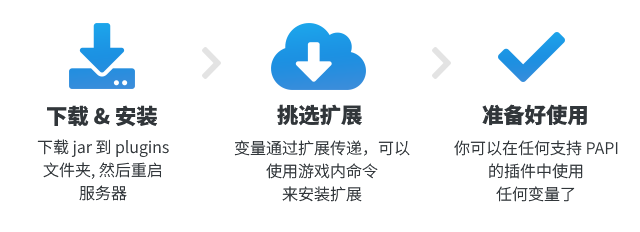

<!--markdownlint-disable line-length-->

# PlaceHolderAPI


<div align="center">


[](https://snowcutieowo.github.io/PlaceholderAPI)
[](https://snowcutieowo.github.io/PlaceholderAPI/user-guides.placeholder-list.html)
[](https://api.extendedclip.com/home)

</div>

## 介绍


PlaceholderAPI 是适用于 Spigot 及其衍生服务端的插件，它允许服务器管理者以固定的格式替换占位符 (俗称变量) 为各种插件的信息。

也可以做到一些你以为它不能做的事，比如 Math(数学运算) Checkitem(操作玩家物品) JavaScript(执行js) Progress(制作进度条)。

对于插件的变量支持，通常由插件自己提供，或者安装变量扩展来提供变量。变量扩展可以在游戏内通过 PAPI eCloud 下载安装。现有超过 230 个扩展可下载，可支持非常多的插件，比如 Essentials、Factions、LuckPerms、Vault 等。如果你是开发者，并且希望为你的插件添加 PlaceholderAPI 支持，请参阅 [API 使用文档](https://github.com/PlaceholderAPI/PlaceholderAPI/wiki/Hook-into-PlaceholderAPI)。

PlaceholderAPI 已破 170 万下载量，同时使用本插件的服务器数已超过 4.5 万，成为了各规模各类型服务器的必需品。

## 安装




## 在其他插件使用


默认你已安装 player 变量扩展。

变量使用格式：`%变量扩展名_变量参数%`

比如：

`%player_name%` 中，`player` 是变量扩展名，`name` 是变量参数，即获取玩家名。

通常来说，变量扩展有哪些变量会在其介绍页面会说明。

你可以使用 `/papi parse me <内容>` 来测试变量解析的结果。
比如我是 `player_A`，执行命令 `/papi parse me %player_name%`，则会在聊天栏返回一个 `player_A` 作为结果。

如果你需要变量嵌套，把一个变量的解析结果套到另一个变量的参数中，使用 `{}` 来代替 `%%` 即可。

示例如下，将 `%player_health%` 的结果添加到 `%math_2_%` 中 (需要安装 math 扩展)，实现血量保留2位小数显示。

`%math_2_{player_health}%`

## 配置文件


配置文件 `config.yml` 有核心插件的个性化设置，也有专门为扩展预留的设置选项。

如果变量扩展允许你修改某些参数，那么这些参数将会被添加到 `config.yml` 里面。

<details>
  <summary>点击展开</summary>

```YAML
# PlaceholderAPI
# 版本: 2.11.4
# 作者: extended_clip
# 贡献者: https://github.com/PlaceholderAPI/PlaceholderAPI/graphs/contributors
# 问题反馈: https://github.com/PlaceholderAPI/PlaceholderAPI/issues
# 变量扩展中心: https://api.extendedclip.com/all/
# 文档: https://wiki.placeholderapi.com/
# Discord: https://helpch.at/discord
# 插件默认不提供任何变量.
# 请用这个命令下载变量: /papi ecloud
check_updates: true
cloud_enabled: true
cloud_sorting: "name"
cloud_allow_unverified_expansions: false
boolean:
  'true': 'yes'
  'false': 'no'
date_format: MM/dd/yy HH:mm:ss
debug: false
```

</details>

## 权限列表


<details>
  <summary>点击展开</summary>

```YAML
permissions:
  placeholderapi.*:
    description: "允许使用所有 PAPI 命令"
    children:
      placeholderapi.admin: true
      placeholderapi.ecloud.*: true
  placeholderapi.admin:
    description: "允许使用所有 PAPI 命令"
    children:
      placeholderapi.help: true
      placeholderapi.info: true
      placeholderapi.list: true
      placeholderapi.parse: true
      placeholderapi.reload: true
      placeholderapi.version: true
      placeholderapi.register: true
      placeholderapi.unregister: true
      placeholderapi.updatenotify: true
  placeholderapi.ecloud.*:
    description: "允许使用所有 PAPI eCloud 命令"
    children:
      placeholderapi.ecloud: true
      placeholderapi.ecloud.info: true
      placeholderapi.ecloud.list: true
      placeholderapi.ecloud.clear: true
      placeholderapi.ecloud.status: true
      placeholderapi.ecloud.update: true
      placeholderapi.ecloud.refresh: true
      placeholderapi.ecloud.download: true
      placeholderapi.ecloud.placeholders: true
  placeholderapi.help:
    default: "op"
    description: "允许查看 PAPI 帮助命令"
  placeholderapi.info:
    default: "op"
    description: "允许查看变量扩展信息"
  placeholderapi.list:
    default: "op"
    description: "允许查看活跃的变量扩展列表"
  placeholderapi.ecloud:
    default: "op"
    description: "允许使用 PAPI eCloud 功能"
  placeholderapi.parse:
    default: "op"
    description: "允许使用 /papi parse 命令"
  placeholderapi.reload:
    default: "op"
    description: "允许重载 PAPI 扩展以及配置文件"
  placeholderapi.version:
    default: "op"
    description: "允许查看当前安装的 PAPI 插件版本"
  placeholderapi.register:
    default: "op"
    description: "允许注册扩展"
  placeholderapi.unregister:
    default: "op"
    description: "允许卸载扩展"
  placeholderapi.updatenotify:
    default: "op"
    description: "当 PAPI 插件有更新时，接收更新信息"
  placeholderapi.ecloud.info:
    default: "op"
    description: "允许通过 eCloud 获取变量扩展信息"
  placeholderapi.ecloud.list:
    default: "op"
    description: "允许通过 eCloud 获取变量扩展列表"
  placeholderapi.ecloud.clear:
    default: "op"
    description: "允许清除 eCloud 本地缓存"
  placeholderapi.ecloud.status:
    default: "op"
    description: "允许查看 eCloud 状态"
  placeholderapi.ecloud.update:
    default: "op"
    description: "允许通过 eCloud 更新已注册的扩展"
  placeholderapi.ecloud.refresh:
    default: "op"
    description: "允许刷新 eCloud 本地缓存"
  placeholderapi.ecloud.download:
    default: "op"
    description: "允许从 eCloud 下载扩展"
  placeholderapi.ecloud.placeholders:
    default: "op"
    description: "允许查看 eCloud 扩展的变量列表"
```

</details>

## 插件命令


解析命令 (`me` 代表自己)

- `/papi bcparse <玩家|--null|me> <内容>`
- `/papi cmdparse <玩家|me> <内容>`
- `/papi parse <玩家|--null|me> <内容>`
- `/papi parserel <玩家> <玩家> <内容>`

eCloud 命令

- `/papi ecloud status`
- `/papi ecloud clear`
- `/papi ecloud download <变量扩展名称> [版本]`
- `/papi ecloud update <变量扩展名称/all>` all 代表全部
- `/papi ecloud info <变量扩展名称> [版本]`
- `/papi ecloud list <all|<作者>|installed> [页数]` all 代表全部，installed 代表已安装的扩展
- `/papi ecloud placeholders <变量扩展名称>`
- `/papi ecloud refresh`

变量扩展命令

- `/papi info <变量扩展名称>`
- `/papi list`
- `/papi register <jar文件名>` 文件位于 /plugins/PlaceholderAPI/expansions/
- `/papi unregister <变量扩展名称>`

## 链接

:::info

`SpigotMC` https://www.spigotmc.org/resources/.6245

`MineBBS` https://www.minebbs.com/resources/.8229

`GitHub` https://github.com/PlaceholderAPI/PlaceholderAPI

`文档(英文)` https://wiki.placeholderapi.com

`文档(中文)` https://snowcutieowo.github.io/PlaceholderAPI

`插件百科` https://mineplugin.org/PlaceHolderAPI

:::

本页内容~~抄袭~~借鉴自 [此处](https://www.minebbs.com/resources/.8229)

## Bstats

[](https://bstats.org/plugin/bukkit/PlaceholderAPI/438)
