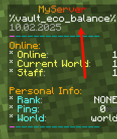
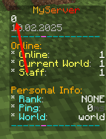
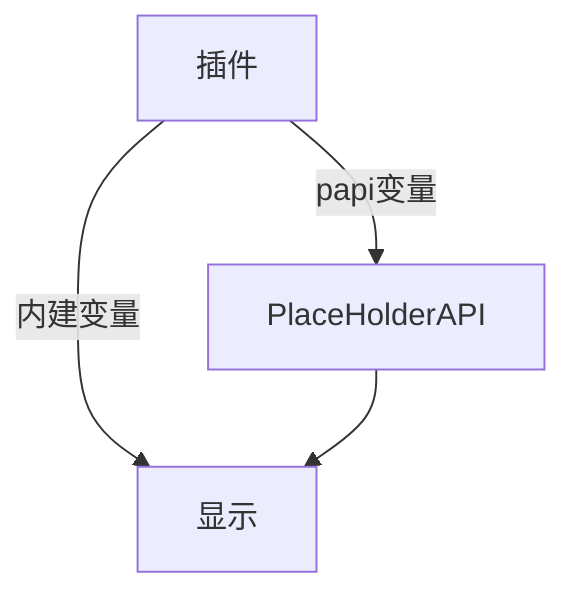

# 常见问题

## 什么是变量？

这里指的变量是形似 `%player_name%`， 即 `%xxx%` 的占位符

它们用来显示一些信息

如 `%player_name%` 是显示玩家名字

`%playerpoints_points%` 是显示 PlayerPoints 插件的玩家点券

## 变量怎么不显示



通常有以下几种情况：

1. 变量写错了
2. 没下载扩展
3. 没 `/papi reload`

这里讲解一下第二种情况：

在上方图片中，可以看到点券一行是 `%vault_eco_balance%`

你需要安装 [Vault](./../Vault/vault.md) 插件和 [经济插件](../XConomy.md)，接着使用

```
/papi ecloud download Vault
/papi reload
```

然后你就可以看到变量了。



如果下载失败，看 [变量下载失败？](#变量下载失败)

## 什么是内建变量？



`build-in placeholder`，在此处我将其翻译为 “**内建变量**”。

指的是插件没有通过 PlaceHolderAPI，而是由自己实现的一种变量。通常，这类变量只有这个插件自己可以使用。

内建变量的形式多种多样，例如：`%player%` `{player}` `$1`。

一个插件可以同时拥有内建变量和 PlaceHolderAPI 变量，也可以只取其一（或者都没有）。

## 更改 boolean

在 `plugins\PlaceholderAPI\config.yml` 中找到

```yaml
boolean:
  'true': 'yes'
  'false': 'no'
```

将yes和no改为true false

不改也没事，就是改成true false会更方便判断

## 在哪寻找我要的变量？

:::info

`Wiki` :https://wiki.placeholderapi.com/

`eCloud` :https://api.extendedclip.com/all/

`Placeholder List` :https://wiki.placeholderapi.com/users/placeholder-list/

:::

## 怎么下载变量扩展？

```text
/papi ecloud download 扩展名
```

然后执行命令 `/papi reload`

## 变量下载失败？


看起来你连不上 ecloud

手动下载吧 https://api.extendedclip.com/all

把下载的jar文件塞到 `plugins\PlaceholderAPI\expansions` 文件夹

然后执行命令 `/papi reload`
