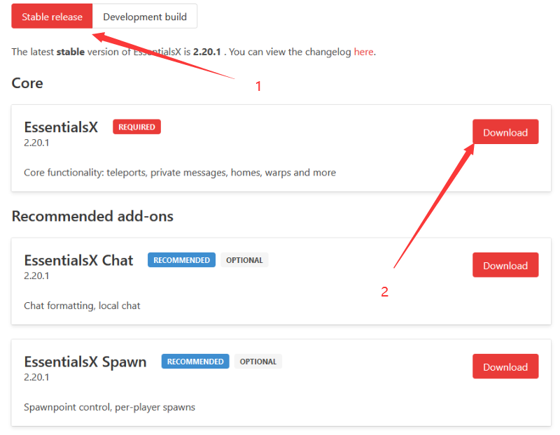

# 概览

:::info

`官网` https://essentialsx.net/

`Bukkit` https://dev.bukkit.org/projects/essentialsx

`SpigotMC` https://www.spigotmc.org/resources/.9089/

`GitHub` https://github.com/EssentialsX/Essentials

:::

## 下载

Essentials插件分为两个版本：

- essentials（早已停更）适合mc 1.7.10 [下载](https://mineplugin.org/Essentials/Downloads)
- essentialsX 适合mc 1.8+ [下载](https://essentialsx.net/downloads.html)

怎么找到官网并从官网下载essx

> 建议选择`稳定版本`
>
> Stable release 稳定版本
>
> Development build 开发版本
>
> 真的有那么多人不知道自己下的开发版。。。

## 扩展

不建议安装ess的任何扩展

| 名字 | 介绍 |
| --- | ----------- |
| EssentialsX | 包括tpa，warp，home，afk，kit等. |
| EssentialsX Chat | 聊天模块 |
| EssentialsX Spawn | 包含基本的玩家生成，还可以进服给玩家一个工具包. |
| EssentialsX Discord| 与Discord的轻量级聊天、消息传递和命令集成. |
| EssentialsX Discord Link | Discord和Minecraft之间的帐户同步. |
| EssentialsX AntiBuild | 可以设置谁可以建造，或谁可以放置/破坏哪种方块. |
| EssentialsX Geo | 地理 IP 查找功能. |
| EssentialsProtect | 是一个基本的世界保护， 可以设置世界规则. |
| EssentialsX XMPP | 轻量级聊天、消息和服务器日志与Jabber/XMPP服务集成. |

## MySQL 存储扩展

[Essentials MySQL Storage Extension](https://www.spigotmc.org/resources/.25673/)

一个付费插件，为 Essentials 的带来了 MySQL 支持
