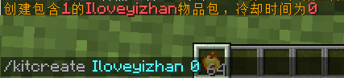
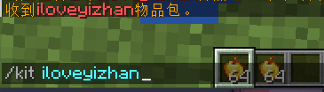
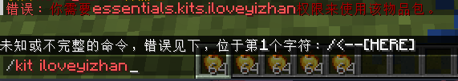
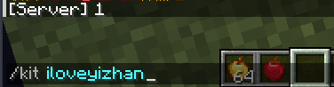

# kit 礼包

## 创建礼包

```
/kitcreate <kit名字> 冷却
```



他会将你背包中所有物品保存到这个 kit 礼包中

值得一提的是，如果冷却写 -1 ，那么这个礼包只能被领取一次

可用于制作新手礼包

## 获得礼包

```
/kit <kit名字>
```



**权限**

普通玩家需要 `essentials.kit` 才可使用礼包功能

但只给 `essentials.kit` 会提示：



是的，除了 `essentials.kit` 我们还需要给予 `essentials.kits.<kit名字>` 玩家才能领取

## 删除礼包

```
/deletekit <kit名字>
```

## 更多信息

### 保存nbt

[点击此处](ConfigTips.md#礼包工具包)

### kit 执行命令

是的，你能在里面写命令

```yaml
  iloveyizhan:
    delay: 0
    items:
    - golden_apple 64
    - /give {USERNAME} apple 1
    - /say 1
```



### 变量

[点击此处](PapiSupport.md)

```
%essentials_has_kit_<kitname>%                  - 是否有XX工具包
%essentials_kit_is_available_<kitname>%         - 是否可以获得XX工具包
%essentials_kit_time_until_available_<kitname>% - 礼包冷却时间
```
