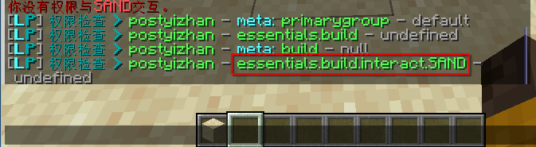
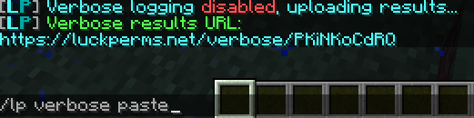
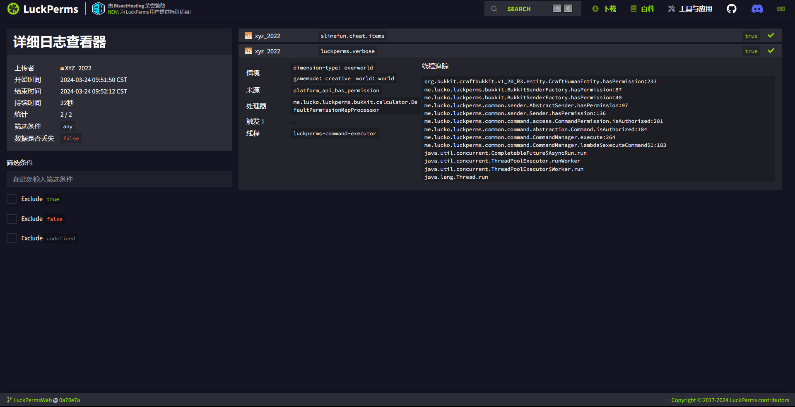

# 小妙招

## 网页版可视化编辑器

```text
lp editor
```


## 日志

可以实时打印权限检查情况，方便排查问题。

```text
lp verbose <on|record|off|upload> [filter]
```

例如：

当安装 EssentialsXAntiBuild 后，你没有权限破坏方块时。

你还不知道翻文档的情况，也不用跟个傻逼一样问群友这个


打开 Luckperms 的详细日志：

```
/lp verbose on
```

再次破坏方块时，你会看到：



### 解释

- `on` - 开启权限检查。
- `off` - 关闭权限检查。
- `record` - 记录日志。
- `paste` - 停止记录，显示日志。

### on


### 过滤器

```text
lp verbose on !Luck & !anticheat
```

- `Luck & (essentials | worldedit)` - 匹配 'essentials'和'worldedit' 开头的权限检查。
- `!Luck & !anticheat` - 匹配除了 'Luck' 和 'anticheat' 开头以外的权限检查。
- `anticheat & !anticheat.check` - 匹配以'anticheat' 开头 但不匹配 'anticheat.check' 开头的权限检查。

### paste





## 执行命令

如果你只是想知道执行一条命令所检查的权限节点，那么没必要使用 `/lp verbose on`

`/lp verbose command` 让玩家执行命令，并打印此命令的权限检查。

```text
/lp verbose command <me|player> <command>
```

例如，在下方截图中让我（“me”）执行 “sf guide” 命令并打印权限检查。

截图中的 me 可以替换为在线玩家的玩家名。


