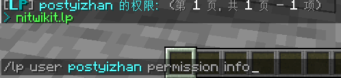
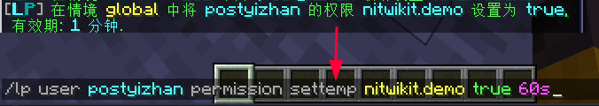
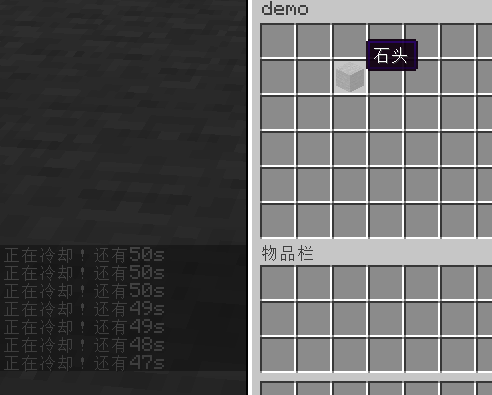
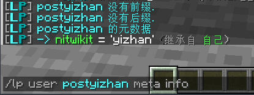

# 数据存储

这里简单介绍下 LuckPerms 一些可以用在储存数据方面的功能，以及一些简单的案例

## 权限

实际上，你可以给予用户和组 *不存在的*（没有被其他插件使用）的权限节点

这些权限有着和其他权限一样的性质

**设置权限**




### 只能按一次的按钮

子图标的 material 改成 air 就可以做点击后消失了

案例（TrMenu）：
```yaml
  'A':
    display:
      material: stone
    icons:
    - condition: 'perm *nitwikit.demo'
      actions:
        - 'tell: "你已经按过了！"'
    actions:
      - 'command inline "lp user {{player name}} permission set nitwikit.demo true" as console'
      - 'refresh: A'
```

用权限的好处是适用性广，不过对op不太方便，因为op所有权限都是true嘛

## 限时权限

过时间后权限自动消失

:::tip

这里是 **settemp** 而不是 **set**

:::



### 按钮冷却

案例（TrMenu）：



```yaml
  'A':
    update: 20
    display:
      material: stone
    icons:
    - condition: 'perm *nitwikit.demo'
      actions:
        - 'tell: "正在冷却！还有%luckperms_expiry_time_nitwikit.demo%"'
    actions:
      - 'command inline "lp user {{player name}} permission settemp nitwikit.demo true 60s" as console'
      - 'refresh'
```

:::warning

安装 LuckPerms 变量扩展才能正确显示变量

`/papi ecloud download LuckPerms`

`/papi reload`

:::

### 限时vip

除了限时权限，还有限时权限组可以使用

图中执行了三次相同的命令


:::tip

值得一提的是，如果命令中最后没有加 **accumulate** ，他会把权限时间重置到你给的数字而不是累加时间

下表来自：[此处](https://snowcutieowo.github.io/LuckPerms/#/command-usage.permission?id=lp-usergroup-lt%e7%8e%a9%e5%ae%b6%e6%9d%83%e9%99%90%e7%bb%84gt-permission-settemp-lt%e6%9d%83%e9%99%90gt-lttruefalsegt-lt%e6%97%b6%e9%97%b4gt-%e6%96%bd%e5%8a%a0%e6%a8%a1%e5%bc%8f-%e4%b8%8a%e4%b8%8b%e6%96%87)

| 模式关键词 | 描述                                         |
| ---------- | -------------------------------------------- |
| accumulate | 新加入的权限时长会叠加在已有的时长之上       |
| replace    | 保留持续时间最长的权限节点                   |
| deny       | 不接受重复的限时权限节点，若有则拒绝执行命令 |

:::

### 每日刷新

原理：假如现在是13点，那么距离今天结束就是 24h - 13h = 11h

我给玩家 11h 的限时权限，今日24点一过就是无权限状态，那些判断此权限的东西就变成每日刷新了

实现（kether）：

搓命令：
```yaml
inline "lp user {{sender}} permission settemp nitwikit.demo true {{math 24 - time as HH}}h{{math 60 - time as mm}}m{{math 60 - time as ss}}s"
```

tell搓出来的看看


执行命令：
```yaml
command inline "lp user {{sender}} permission settemp nitwikit.demo true {{math 24 - time as HH}}h{{math 60 - time as mm}}m{{math 60 - time as ss}}s" as console
```

你也可以用 papi 的 server 和 math 两个扩展来做

- `%math_0_24-{server_time_HH}%` // 时
- `%math_0_60-{server_time_mm}%` // 分
- `%math_0_60-{server_time_ss}%` // 秒

不过我不太喜欢这种做法，另一种： [案例 | 变量|每日刷新](../../../../advance/kether/variable.md#每日刷新)

### 倒计时

和上面每日刷新一个思路

## meta

你只需要知道 `键` 和 `值` 是一一对应的就好了

然后框框设♂就行




```
%luckperms_meta_键名%
```


此方法op不受影响，但适用性没权限广，因为一些插件只支持判断权限

:::warning

安装 LuckPerms 变量扩展才能正确显示变量

`/papi ecloud download LuckPerms`

`/papi reload`

:::

但是使用lp的命令设置meta要写一大串不说，还会输出log

好在 [Vulpecula](https://github.com/Lanscarlos/Vulpecula) 的 [memory](https://www.yuque.com/lanscarlos/vulpecula-wiki-v2/og93eqlegc0geyfi) 动作可以用来设置meta

```
memory 键名 to 值 using lp
```

存meta


```
memory 键名 using lp
```

取meta


### 案例

上面权限能做的meta基本都能做

### 称号系统

见 [案例 | Invero|称号系统](../../other/Menu/Invero.md#称号系统)

## 限时meta

```
/lp user postyizhan meta settemp 键 值 时间
```

### 案例

没啥要写的
