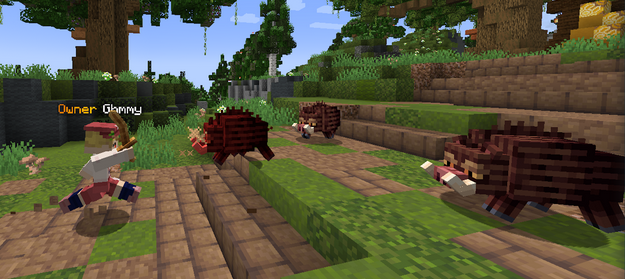
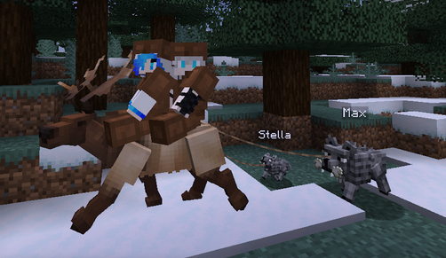
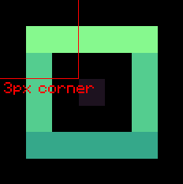
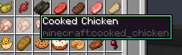
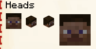

# 概览

现在，资源包（或者说材质包）能做的事越来越多，在高版本已经有了一个新的服务器类别。

很多人用 **IA 服** 来代指这一类服务器。

:::note

因为 ItemsAdder（ia）太有名于是所有类似服务器都被称为 ia 服了

:::

在这类服务器中，你可以用原版客户端只安装服务器发来的资源包而看到：

  
点击展开

**全新的武器装备**

**独特的装扮**

**新的 GUI 界面**

**称号或表情包**

**家具或装饰**

**新的生物或 boss**

**以及更多你想不到的内容**

社区都发展成这样了，某些人还以为资源包 “必须修改原版物品” “生存一得到原版东西就露馅”

还有不少半吊子都不如的人以为做到折叠中的效果必须要 ia 或某某特定插件。

这都是原版资源包能做到的东西，ia 只是一个打包器，你有能力甚至可以自己手搓材质包。

# 材质包相关工具

我发现的和材质包相关的工具

## tooltip

发现一个整 tooltip 的妙妙工具

https://github.com/Godlander/tooltip

## Minecraft Title Generator

一个用来整服务器 title 的 blockbench 插件

https://www.blockbench.net/plugins/minecraft_title_generator

## 2D head

2D的和占四格的头颅，可以使用皮肤

https://www.spigotmc.org/resources/.99121/

## emojis

驿站的表情包配置

https://www.minebbs.com/resources/emojis-itemsadder.9045/

## PackSquash

资源包压缩工具，**显著减小** 资源包的体积

https://github.com/ComunidadAylas/PackSquash
