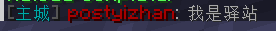
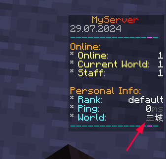

# Multiverse

:::info

`GitHub` https://github.com/Multiverse/Multiverse-Core

`SpigotMC` https://www.spigotmc.org/resources/.390/

`Bukkit` https://dev.bukkit.org/projects/multiverse-core

`modrinth` https://modrinth.com/plugin/multiverse-core

`插件百科` https://mineplugin.org/Multiverse-Core

:::

老牌多世界管理插件，可以新建，删除，导入世界（维度）等

值得一提的是，在 [GitHub releases](https://github.com/Multiverse/Multiverse-Core/releases) 上的版本比在 SpigotMC 上能下载到的版本要新

# 附属

## Multiverse-Core

[Multiverse-Core](https://github.com/Multiverse/Multiverse-Core/wiki) 是基础插件。下面的其它插件都必须需要 Core 。

本插件能够让你：

- 创建/修改/删除世界
- 传送到世界中
- 通过权限限制在世界间切换
- 查看某人在哪个世界中

## Multiverse-Portals

[Multiverse-Portals](https://github.com/Multiverse/Multiverse-Portals/wiki) 是类似于 Multiverse 1 类型的传送门。

如果你使用过它的话，你可能很想要本插件。

它们的大部分是一样的，只是有一些新特性。

本插件能够让你：

- 创建/修改/删除 Multiverse 类型的传送门
- 通过权限限制传送门的使用
- 可以步行或骑着载具在 Multiverse 世界间切换

## Multiverse-NetherPortals

[Multiverse-NetherPortals](https://github.com/Multiverse/Multiverse-NetherPortals/wiki) 起到了 Multiverse 1 插件中 splike 的作用，但改善了许多。

本插件是为了能够让你们有更加真实的体验而设计，允许玩家创建能够带他们去指定世界的地狱传送门。

所有在 X 世界的传送门都会去 Y 世界，但是这可以在游戏中配置。

本插件能够让你：

- 自定义某个世界中的地狱传送门指向哪个世界
- 自动连接有特殊命名模型的世界（如 WORLD 和 WORLD_nether）

取自 [插件百科 | Multiverse-Core#附属插件](https://mineplugin.org/Multiverse-Core#%E9%99%84%E5%B1%9E%E6%8F%92%E4%BB%B6)

# 崩服漏洞

> Fix issue where special chars cause PatternSyntaxException leading to a server crash.

Multiverse-Core [4.3.1](https://www.spigotmc.org/resources/multiverse-core.390/update?update=424085) 版本已经修复此问题，请更新到最新版

如果你因为某些原因不能更新到最新版，可以使用修复补丁

补丁（只需安装其中一个）：

- [Multiverse-Patches](https://www.spigotmc.org/resources/.96390)
- [Multiverse-Core Fix](https://www.spigotmc.org/resources/.70218)

# 常见问答（FAQ）

**此部分来自插件百科**

## 进入世界权限

https://mineplugin.org/Multiverse-Core#Multiverse_%E8%BF%9B%E5%85%A5%E4%B8%96%E7%95%8C%E6%9D%83%E9%99%90

## Multiverse-Core 插件是什么？

https://mineplugin.org/Multiverse-Core#Multiverse-Core_%E6%8F%92%E4%BB%B6%E6%98%AF%E4%BB%80%E4%B9%88%EF%BC%9F

## 为什么在插件会以“-Core”结尾？

https://mineplugin.org/Multiverse-Core#%E4%B8%BA%E4%BB%80%E4%B9%88%E5%9C%A8%E6%8F%92%E4%BB%B6%E4%BC%9A%E4%BB%A5%E2%80%9C-Core%E2%80%9D%E7%BB%93%E5%B0%BE%EF%BC%9F

## MultiVerse 剩下的部分发生了什么呢？

https://mineplugin.org/Multiverse-Core#MultiVerse_%E5%89%A9%E4%B8%8B%E7%9A%84%E9%83%A8%E5%88%86%E5%8F%91%E7%94%9F%E4%BA%86%E4%BB%80%E4%B9%88%E5%91%A2%EF%BC%9F

## 我不能读取我的空岛世界！

https://mineplugin.org/Multiverse-Core#%E6%88%91%E4%B8%8D%E8%83%BD%E8%AF%BB%E5%8F%96%E6%88%91%E7%9A%84%E7%A9%BA%E5%B2%9B%E4%B8%96%E7%95%8C%EF%BC%81

## 有能够分割不同世界物品栏的方法吗？

https://mineplugin.org/Multiverse-Core#%E6%9C%89%E8%83%BD%E5%A4%9F%E5%88%86%E5%89%B2%E4%B8%8D%E5%90%8C%E4%B8%96%E7%95%8C%E7%89%A9%E5%93%81%E6%A0%8F%E7%9A%84%E6%96%B9%E6%B3%95%E5%90%97%EF%BC%9F

## 在使用 MultiInv 后，某个玩家会在某个特殊的世界一直死亡！

https://mineplugin.org/Multiverse-Core#%E5%9C%A8%E4%BD%BF%E7%94%A8_MultiInv_%E5%90%8E%EF%BC%8C%E6%9F%90%E4%B8%AA%E7%8E%A9%E5%AE%B6%E4%BC%9A%E5%9C%A8%E6%9F%90%E4%B8%AA%E7%89%B9%E6%AE%8A%E7%9A%84%E4%B8%96%E7%95%8C%E4%B8%80%E7%9B%B4%E6%AD%BB%E4%BA%A1%EF%BC%81

## Multiverse 的消息提示因为不安全，不能带我去某个地方！我知道它是安全的！

https://mineplugin.org/Multiverse-Core#Multiverse_%E7%9A%84%E6%B6%88%E6%81%AF%E6%8F%90%E7%A4%BA%E5%9B%A0%E4%B8%BA%E4%B8%8D%E5%AE%89%E5%85%A8%EF%BC%8C%E4%B8%8D%E8%83%BD%E5%B8%A6%E6%88%91%E5%8E%BB%E6%9F%90%E4%B8%AA%E5%9C%B0%E6%96%B9%EF%BC%81%E6%88%91%E7%9F%A5%E9%81%93%E5%AE%83%E6%98%AF%E5%AE%89%E5%85%A8%E7%9A%84%EF%BC%81

## 怎么让 Multiverse 处理创造模式 ？

https://mineplugin.org/Multiverse-Core#1.8%EF%BC%9A%E6%80%8E%E4%B9%88%E8%AE%A9_Multiverse_%E5%A4%84%E7%90%86%E5%88%9B%E9%80%A0%E6%A8%A1%E5%BC%8F_%EF%BC%9F

## 为什么你不用简单些的传送权限呢？

https://mineplugin.org/Multiverse-Core#%E4%B8%BA%E4%BB%80%E4%B9%88%E4%BD%A0%E4%B8%8D%E7%94%A8%E7%AE%80%E5%8D%95%E4%BA%9B%E7%9A%84%E4%BC%A0%E9%80%81%E6%9D%83%E9%99%90%E5%91%A2%EF%BC%9F

## 当玩家首次登入时，出生点的位置不对！

https://mineplugin.org/Multiverse-Core#%E5%BD%93%E7%8E%A9%E5%AE%B6%E9%A6%96%E6%AC%A1%E7%99%BB%E5%85%A5%E6%97%B6%EF%BC%8C%E5%87%BA%E7%94%9F%E7%82%B9%E7%9A%84%E4%BD%8D%E7%BD%AE%E4%B8%8D%E5%AF%B9%EF%BC%81

## 为什么我不能读取版本比 Core 高的其他 Multiverse 插件？

https://mineplugin.org/Multiverse-Core#%E4%B8%BA%E4%BB%80%E4%B9%88%E6%88%91%E4%B8%8D%E8%83%BD%E8%AF%BB%E5%8F%96%E7%89%88%E6%9C%AC%E6%AF%94_Core_%E9%AB%98%E7%9A%84%E5%85%B6%E4%BB%96_Multiverse_%E6%8F%92%E4%BB%B6%EF%BC%9F

## 为什么所有的 Multiverse 的命令都出错了？

https://mineplugin.org/Multiverse-Core#%E4%B8%BA%E4%BB%80%E4%B9%88%E6%89%80%E6%9C%89%E7%9A%84_Multiverse_%E7%9A%84%E5%91%BD%E4%BB%A4%E9%83%BD%E5%87%BA%E9%94%99%E4%BA%86%EF%BC%9F

## 当我在调整重生点的时候 Multiverse 让我的服务器崩溃了！快停下来！

https://mineplugin.org/Multiverse-Core#%E5%BD%93%E6%88%91%E5%9C%A8%E8%B0%83%E6%95%B4%E9%87%8D%E7%94%9F%E7%82%B9%E7%9A%84%E6%97%B6%E5%80%99_Multiverse_%E8%AE%A9%E6%88%91%E7%9A%84%E6%9C%8D%E5%8A%A1%E5%99%A8%E5%B4%A9%E6%BA%83%E4%BA%86%EF%BC%81%E5%BF%AB%E5%81%9C%E4%B8%8B%E6%9D%A5%EF%BC%81

## 协管/OP/玩家在切换世界时游戏模式也切换了！

https://mineplugin.org/Multiverse-Core#%E5%8D%8F%E7%AE%A1/OP/%E7%8E%A9%E5%AE%B6%E5%9C%A8%E5%88%87%E6%8D%A2%E4%B8%96%E7%95%8C%E6%97%B6%E6%B8%B8%E6%88%8F%E6%A8%A1%E5%BC%8F%E4%B9%9F%E5%88%87%E6%8D%A2%E4%BA%86%EF%BC%81

## 你能让每个插件设置在不同世界的启用禁用或分离配置文件吗？

https://mineplugin.org/Multiverse-Core#%E4%BD%A0%E8%83%BD%E8%AE%A9%E6%AF%8F%E4%B8%AA%E6%8F%92%E4%BB%B6%E8%AE%BE%E7%BD%AE%E5%9C%A8%E4%B8%8D%E5%90%8C%E4%B8%96%E7%95%8C%E7%9A%84%E5%90%AF%E7%94%A8%E7%A6%81%E7%94%A8%E6%88%96%E5%88%86%E7%A6%BB%E9%85%8D%E7%BD%AE%E6%96%87%E4%BB%B6%E5%90%97%EF%BC%9F

# 案例

## 中文世界名





所需插件：

- Multiverse-Core
- [PlaceHolderAPI](../Front-Plugin/PlaceHolderAPI/outline.md)
- [聊天插件](../ManageTool/chat/chat.md)
- [TAB和计分板插件](../other/TAB&Scoreboard/Tab&Scoreboard.md)
- 其他你想展示中文世界名的插件

**安装papi的 Multiverse 扩展**

[点击此处](../Front-Plugin/PlaceHolderAPI/CommonUsage.md#multiverse)

**设置别名**

编辑 `plugins/Multiverse-Core/worlds.yml`

下方展示部分配置
```yaml
worlds:
  world:
    ==: MVWorld
    hidden: 'false'
    alias: ''
    # 省略部分内容
  world_nether:
    ==: MVWorld
    hidden: 'false'
    alias: ''
    # 省略部分内容
  world_the_end:
    ==: MVWorld
    hidden: 'false'
    alias: ''
    # 省略部分内容
```

解释：
- worlds        - 插件检索的YAML节点，不用管
- world         - 主世界的默认本名（可在server.properties修改）
- world_nether  - 地狱的默认本名
- world_the_end - 末地的默认本名
- alias         - 这个世界的别名

我们在 **alias: ''** 中 `''` 填入这个世界的别名

如：
```yaml
worlds:
  world:
    ==: MVWorld
    hidden: 'false'
    alias: '主城'
    # 省略部分内容
```

然后 `/mv reload`

**使用别名**

将变量 `%multiverse_world_alias%` 写到你想展示世界别名的插件配置里

当然，这个插件要支持使用papi变量

接着 **重载那个插件**
