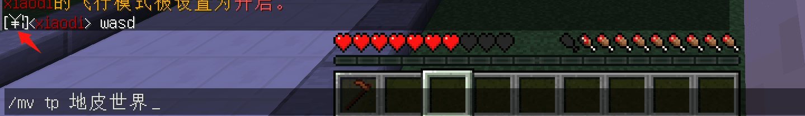

# 常见问题1

## 中文世界名乱码



不要用中文作为世界的名字，用英文。

你想让插件显示世界名时用中文的话，可以使用 [世界别名](#世界别名)。

## 世界别名


所需插件：

- Multiverse-Core
- [PlaceHolderAPI](../../Front-Plugin/PlaceHolderAPI/PlaceHolderAPI.md)
- [聊天插件](../../ManageTool/chat/chat.md)
- [TAB和计分板插件](../../other/TAB&Scoreboard/Tab&Scoreboard.md)
- 其他你想展示中文世界名的插件

安装 [papi 的 Multiverse 扩展](../../Front-Plugin/PlaceHolderAPI/CommonUsage.md#multiverse)

## 设置别名

编辑 `plugins/Multiverse-Core/worlds.yml`

下方展示部分配置

```yaml
worlds:
  world:
    ==: MVWorld
    hidden: 'false'
    alias: ''
    # 省略部分内容
  world_nether:
    ==: MVWorld
    hidden: 'false'
    alias: ''
    # 省略部分内容
  world_the_end:
    ==: MVWorld
    hidden: 'false'
    alias: ''
    # 省略部分内容
```

解释：

- worlds        - 插件检索的YAML节点，不用管
- world         - 主世界的默认本名(可在server.properties修改)
- world_nether  - 地狱的默认本名
- world_the_end - 末地的默认本名
- alias         - 这个世界的别名

我们在 **alias: ''** 中 `''` 填入这个世界的别名

如：

```yaml
worlds:
  world:
    ==: MVWorld
    hidden: 'false'
    alias: '主城'
    # 省略部分内容
```

然后 `/mv reload`

## 使用别名

将变量 `%multiverse_world_alias%` 写到你想展示世界别名的插件配置里

当然，这个插件要支持使用papi变量

接着 **重载那个插件**
