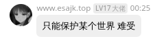
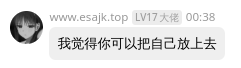

# NoBuildPlus

:::info

`SpigotMC` https://www.spigotmc.org/resources/nobuildplus.101815/

`GitHub` https://github.com/Ez4p1xEL/NoBuildPlus

:::

和下面WorldGuard相比更简单易上手的世界保护插件

# 傻逼

这插件的定位不就是世界保护？

孤独依旧稳定发挥：https://github.com/postyizhan/lezi-wiki/issues/29

