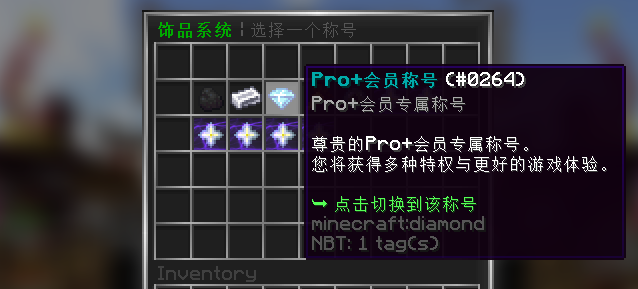

<!--markdownlint-disable line-length-->

# UserPrefix

轻便、高效、实时的用户前缀系统。

本插件基于Spigot实现，**理论上支持全版本**。

> 本插件已在 [MCBBS](https://www.mcbbs.net/forum.php?mod=viewthread&tid=1261503)
> 与 [SpigotMC](https://www.spigotmc.org/resources/userprefix-hex-color-support-all-version.96277/) 上发布。

## 照骗

## 依赖

- **[必须]** 插件本体基于 [Spigot-API](https://hub.spigotmc.org/stash/projects/SPIGOT)、[BukkitAPI](http://bukkit.org/) 实现。
- **[必须]** 数据部分基于 [LuckPerms](https://www.spigotmc.org/resources/luckperms.28140/) 实现。
- **[推荐]** 变量部分基于 [PlaceholderAPI](https://www.spigotmc.org/resources/6245/) 实现。

详细依赖列表可见 [Dependencies](https://github.com/CarmJos/UserPrefix/network/dependencies) 。

## 特性

- 理论上全版本支持！
- 游戏内重载配置文件并实时更新到玩家！
- 当玩家权限变更时会实时监测前缀，若权限不足则自动更换前缀并提示
- 可配置的声音、消息！
- 前缀图标可配置“选中”、“有权限”与“无权限”三种状态的物品
- TabList自动按照前缀的权重排序 (如有冲突可关掉)
- 玩家头顶前缀显示 (如有冲突可关掉)
- 简单的聊天变量修改功能！(不推荐使用) `[自 v2.1.0 版本起]`
- 自动排序，且可翻页的GUI！
- 支持PlaceholderAPI变量！(凡支持的都可以使用，如BungeeTabListPlus)
- 支持[Hex颜色](https://www.hexcolortool.com/)！(1.16以上版本) `[自 v1.2.3 版本起]`
    - 格式： `&(#颜色代码)`
    - 示例： LightSlateBlue `&(#8470FF)` 、 DarkSlateBlue `&(#483D8B)`
- 支持渐变色！(1.16以上版本) `[自 v1.2.3 版本起]`
    - 格式： `&<#颜色代码1>消息内容&<#颜色代码2>`
    - 示例： `&<#8470FF>Hello World!&<#483D8B>`

## 注意事项

### 1. 版本支持问题

本插件理论全版本支持，如果出现图标不加载、声音无法播放等问题请检查配置文件中物品与声音的type在当前版本是否存在。

以声音举例，村民表示可以的声音在低版本中为 “`VILLAGER_YES`”,而在高版本中则变为了“`ENTITY_VILLAGER_YES`”。

### 2. 计分板异常问题

头顶上前缀的显示与TabList的排序均使用到了计分板API。

如有冲突导致其他插件的计分板无法显示，请关掉配置文件中`functions.on-name-prefix`。

## 链接

:::info

`SpigotMC` https://www.spigotmc.org/resources/.96277

`Modrinth` https://modrinth.com/plugin/userprefix

`MineBBS` https://www.minebbs.com/resources/.9832

`GitHub` https://github.com/CarmJos/UserPrefix

:::

国人 卡姆 及 YourCraft 团队 开发和维护的一款称号插件

## 支持与捐赠

本项目由 [YourCraft(你的世界)](https://www.ycraft.cn) 团队提供长期支持与维护。

若您觉得本插件做的不错，您可以捐赠支持我！感谢您成为开源项目的支持者！

Many thanks to Jetbrains for kindly providing a license for me to work on this and other open-source projects.

## 开源协议

本项目源码采用 [GNU General Public License v3.0](https://opensource.org/licenses/GPL-3.0) 开源协议。

  
关于 GPL 协议

> GNU General Public Licence (GPL) 有可能是开源界最常用的许可模式。GPL 保证了所有开发者的权利，同时为使用者提供了足够的复制，分发，修改的权利：
>
> ### 可自由复制
> 你可以将软件复制到你的电脑，你客户的电脑，或者任何地方。复制份数没有任何限制。
> ### 可自由分发
> 在你的网站提供下载，拷贝到U盘送人，或者将源代码打印出来从窗户扔出去（环保起见，请别这样做）。
> ### 可以用来盈利
> 你可以在分发软件的时候收费，但你必须在收费前向你的客户提供该软件的 GNU GPL 许可协议，以便让他们知道，他们可以从别的渠道免费得到这份软件，以及你收费的理由。
> ### 可自由修改
> 如果你想添加或删除某个功能，没问题，如果你想在别的项目中使用部分代码，也没问题，唯一的要求是，使用了这段代码的项目也必须使用 GPL 协议。
>
> 需要注意的是，分发的时候，需要明确提供源代码和二进制文件，另外，用于某些程序的某些协议有一些问题和限制，你可以看一下 @PierreJoye 写的 Practical Guide to GPL Compliance 一文。使用 GPL
> 协议，你必须在源代码代码中包含相应信息，以及协议本身。
>
> *以上文字来自 [五种开源协议GPL,LGPL,BSD,MIT,Apache](https://www.oschina.net/question/54100_9455) 。*

## bStats

<!--markdownlint-disable line-length-->
