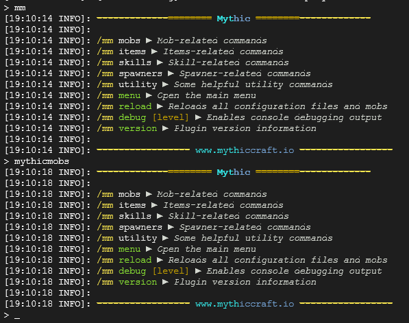

# 插件缩写

***请不要随便使用不知名插件的缩写！***

## 缩写从何而来？

通常是插件作者自己注册的缩写命令，如：

`mythicmobs` == `mm`

## 目录

### A

| 全名                 | 作者 | 缩写 |
| -------------------- | ---- | ---- |
| AttributePlus        | 楠木 | AP   |
| Adyeshach            | 坏黑 | ady  |
| AdvancedEnchantments | GC. | ae   |
| AdvancedAntiCheat    | LearXD | aac  |

### B

| 全名                 | 作者 | 缩写 |
| -------------------- | ---- | ---- |
| BetonQuest          | Wolf2323 | bq   |
| BungeeTablistPlus    | CodeCrafter47 | btlp |

### C

| 全名                 | 作者 | 缩写 |
| -------------------- | ---- | ---- |
| ClearScreen          | fromgate | cls  |

### D

| 全名                 | 作者 | 缩写 |
| -------------------- | ---- | ---- |
| DragonCore           | 空白格 | 龙核 |
| DungeonPlus          | 楠木 | dp   |
| DecentHolograms      | D0bby_ | dh   |
| DeluxeMenus          | HelpChat | dm   |

### E

| 全名                 | 作者 | 缩写 |
| -------------------- | ---- | ---- |
| Essentials           | khobbits | ess  |
| EssentialsX          | md678685 | essx |
| EliteMobs            | MagmaGuy | em |

### F

| 全名                 | 作者 | 缩写 |
| -------------------- | ---- | ---- |
| FasyAsyncWorldEdit   | IntellectualSites | fawe |

### G

| 全名                 | 作者 | 缩写 |
| -------------------- | ---- | ---- |
| GroupManager         | ElgarL | gm   |
| GlobalMarketPlus     | TRCStudioDean | gmp |

### H

| 全名                 | 作者 | 缩写 |
| -------------------- | ---- | ---- |
| HolographicDisplays  | filoghost | hd   |

### I

| 全名                 | 作者 | 缩写 |
| -------------------- | ---- | ---- |
| ItemsAdder           | LoneDev | ia   |
| ItemLoreStats        | Supavitax | ils  |
| InteractionVisualizer | LOOHP | iv   |

### J

暂无

### K

暂无

### L

| 全名                 | 作者 | 缩写 |
| -------------------- | ---- | ---- |
| LuckPerms            | lucko | lp   |

### M

| 全名                 | 作者 | 缩写 |
| -------------------- | ---- | ---- |
| Multiverse           | fernferret | mv   |
| MMOitems             | Indyuce | mi   |
| MyItems              | Praya | mi   |
| MythicMobs           | Xikage | mm   |
| Model Engine         | Ticxo | meg  |
| MultiWorld           | ferrybig | mw   |
| MythicArtifacts      | MythicCraft 团队 | mma  |
| MangoQuests          | Cutiemango | mq   |

### N

| 全名                 | 作者 | 缩写 |
| -------------------- | ---- | ---- |
| NeigeItems           | Neige | ni  |
| NoCheatPlus          | asofold | ncp  |

### O

| 全名                 | 作者 | 缩写 |
| -------------------- | ---- | ---- |
| OriginAttribute      | 未找到 | oa   |

### P

| 全名                 | 作者 | 缩写 |
| -------------------- | ---- | ---- |
| PermissionsEX         | Sitmobedaf | pex  |
| PlaceholderAPI       | HelpChat | papi |
| PlotSquared          | IntellectualSites | ps   |
| PlayerPoints         | Esophose | pp   |
| PMRewards            | 楠木 | pmr  |
| PlayerTitle          | 米饭 | plt  |
| ProtocolStringReplacer | Rothes | psr |

### Q

| 全名                 | 作者 | 缩写 |
| -------------------- | ---- | ---- |
| QuickShop-Hikari     | ~~鬼畜畜~~creatorfromhell | qs |

### R

| 全名                 | 作者 | 缩写 |
| -------------------- | ---- | ---- |
| Residence            | Zrips 团队 | res |
| RevivedLocyItems     | 弱鸡绿毛怪 | rli |

### S

| 全名                 | 作者 | 缩写 |
| -------------------- | ---- | ---- |
| SX-Attribute         | 格洛 | sx   |
| Skript               | SkriptLang 贡献者团队 | sk   |
| SkillAPI             | Eniripsa96 | sk   |

### T

| 全名                 | 作者 | 缩写 |
| -------------------- | ---- | ---- |
| TrMenu               | Arspale/Score9 | trm |
| TrChat               | Arspale/Score9 | trc |
| TitleManager         | Puharesource | tm  |
| Tab Reborn          | Nemzamy | tab |

### U

暂无

### V

| 全名                 | 作者 | 缩写 |
| -------------------- | ---- | ---- |
| Vulpecula            | 小狐狸 | vul |

### W

| 全名                 | 作者 | 缩写 |
| -------------------- | ---- | ---- |
| WorldEdit            | sk89q | we   |
| WorldGuard           | sk89q | wg   |
| WorldBorder          | Echo24h | wb   |

### X

暂无

### Y

暂无

### Z

| 全名                 | 作者 | 缩写 |
| -------------------- | ---- | ---- |
| Zapkiel              | 坏黑 | zap  |
