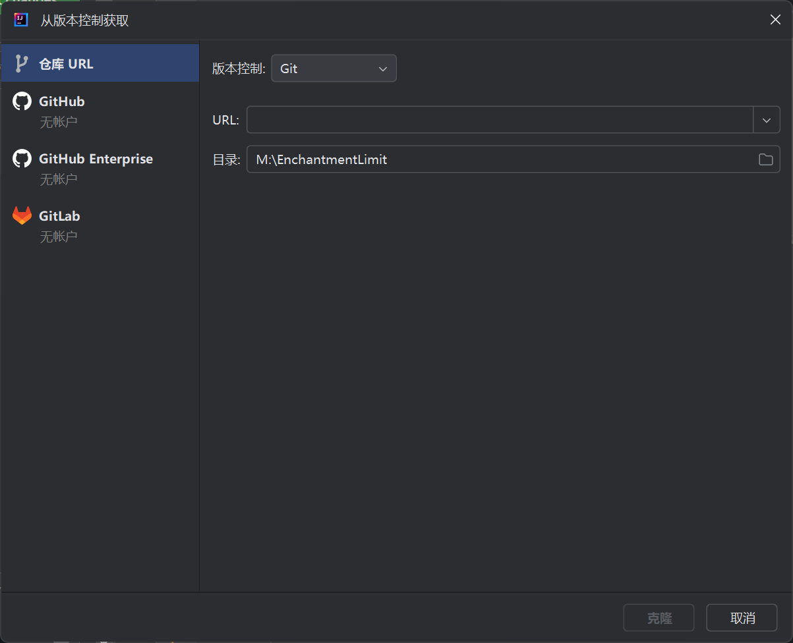
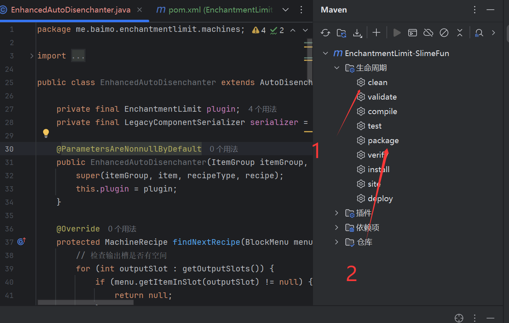
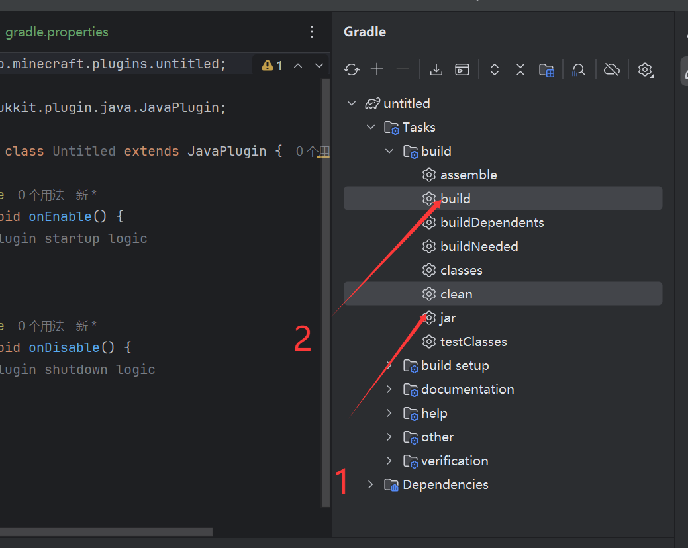
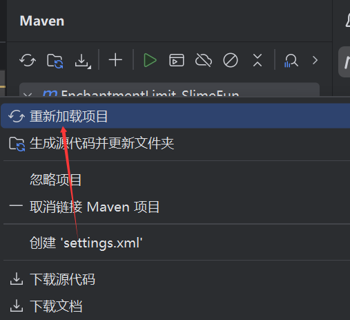

# 使用 IDEA 构建

## 第一步：导入项目
1. 打开 IDEA
2. 选择以下方式之一：
   - 如果是本地项目：点击 "Open"
   - 如果是 GitHub 项目：点击 "Get from VCS"
   
3. 选择或输入项目路径

4. 等待 IDEA 导入完成

## 第二步：构建项目

1. **Maven 项目**：
   1. 打开右侧 Maven 工具窗口（View → Tool Windows → Maven）
   2. 依次点击：
      - `clean`（清理旧文件）
      - `package`（打包）
      
   3. 在 `target` 目录找到生成的 jar 文件

2. **Gradle 项目**：
   1. 打开右侧 Gradle 工具窗口（View → Tool Windows → Gradle）
   2. 依次点击：
      - `clean`（清理旧文件）
      - `build`（构建）
      
   3. 在 `build/libs` 目录找到生成的 jar 文件

> 如果遇到依赖下载慢的问题，可以参考[配置镜像源](./mirror-config.md)文档。

## 常见问题

1. **依赖下载失败**：
   - 检查网络连接
   - 刷新项目（右键项目 → Maven/Gradle → Reload Project）
   

2. **找不到生成的jar**：
   - Maven: 检查 `target` 目录
   - Gradle: 检查 `build/libs` 目录
