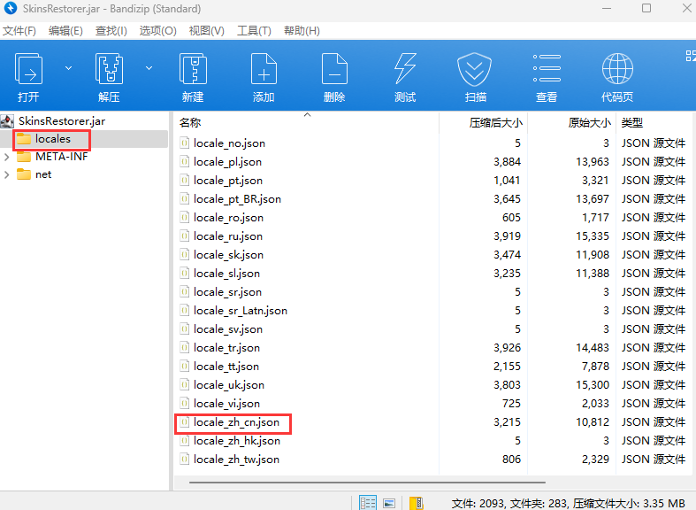

# 配置插件

插件的配置文件一般在 `/plugins/插件名字/` 文件夹中，常见的配置文件一般是 `config.yml` 。

> 插件一般会使用 **Yaml** 作为配置文件格式，建议先学习 [Yaml](/docs-java/advance/YAML/YAML.md) 语法。

我们在开始前所做的准备工作中，推荐你安装任意一款推荐的文档编辑软件：请查看[文本编辑器](https://nitwikit.yizhan.wiki/preparation/text-editor)

如果你是 Windows ，现在让我们双击 .yml 文件就可以开始修改配置文件了！

如果你是 Linux ，并且认为这很难操作，可以通过 SFTP 下载到自己的电脑上编辑。

## 查看插件支持的语言

import Tabs from '@theme/Tabs';
import TabItem from '@theme/TabItem';

<Tabs queryString="plugin-language">
<TabItem value="spigotmc" label="SpigotMC">


</TabItem>

<TabItem value="crowdin" label="Crowdin">

比如 https://www.spigotmc.org/resources/simpleclans.71242 我们可以看到，语言那里给了个 [链接](https://crowdin.com/project/simpleclans)：


看到有 Chinese Simplified、 chinese、 zh_cn、 zh_CN 之类的字眼就行。

</TabItem>

<TabItem value="folder" label="插件文件夹">

插件文件夹中有类似 Language、 lang、 locale 之类的文件夹(或其他东西？)：


请寻找 zhcn、 zh-cn、 zh-CN、 chinese 等字眼：


然后一般要去插件配置文件(多数为 config.yml) 把语言改成这里的文件名 (此处为 zh_cn)。

</TabItem>

<TabItem value="jar" label="拆开 jar 文件">

比如 SkinsRestorer。

如果我们在插件文件夹找不到语言文件夹，可以直接用解压缩软件打开 jar 包：



还有可能写在插件文档里，在项目 README 里，甚至在配置文件的注释里。

碰到这之外的情况就需要你自己摸索了

</TabItem>
</Tabs>

## 汉化插件

<Tabs queryString="plugin-language-cn">
<TabItem value="DIY" label="插件自己动♂">

像 LuckPerms、 EssentialX 等，只要你的服务器和客户端的语言为简体中文，它们会自动设置为中文。

</TabItem>

<TabItem value="config" label="配置文件改语言">

像 HoloMobHealth、GSit 等，你可以在插件配置文件中(一般在 config.yml 中)找到 Language，lang ，locale 等字眼。

然后把语言项改成 zh_CN、 Chinese 等，具体应该写什么这地方。插件配置的注释可能提到

也可以找找 [插件文件夹](https://nitwikit.yizhan.wiki/Java/process/plugin/more/plugin-config?plugin-language=folder) 和 [拆开 jar 文件](https://nitwikit.yizhan.wiki/Java/process/plugin/more/plugin-config?plugin-language=jar)

</TabItem>

<TabItem value="your" label="自行汉化">

有些插件不提供别的语言，只提供一个语言文件 如 lang.yml、 message.yml 。

就需要你自行汉化里面的内容了，去一些论坛翻翻也许能找到别人分享的汉化。

### GPT汉化？

口令参考：

<!--markdownlint-disable line-length-->

```text
请将我给出的以 yml 格式存储的 Minecraft 插件的配置文件汉化，且不改变本身的可执行性，其中被两个 % 包裹的为变量请不要翻译，请翻译时不要带翻译腔，而是要翻译得自然、流畅和地道，使用优美和高雅的表达方式并代入 Minecraft 游戏内进行翻译，翻译后请以 markdown 代码块的格式发送
```

<!--markdownlint-enable line-length-->

备注：本教程并非推荐服主通过 GPT 等 AI 进行机翻，我们不对服主利用 AI 产生文本的行为及其内容负责。

使用 GPT 可能会被视作一种经济但欠缺考虑的行为，若有能力或财力充足，请尽力贡献人工翻译或自行翻译，万不可直接使用机翻，轻则翻译错误，重则使插件读取不了 config 。

</TabItem>

<TabItem value="core" label="内核汉化">

如果你要用的这个插件没有以上所提到的所有情况...

他**可能**把你要改的语言直接写死在代码里了，你要自己去改代码...

比如驿站内核汉化的 [DecentHolograms](/docs-java/process/plugin/other/Holograms/DecentHolograms.md)

</TabItem>
</Tabs>
