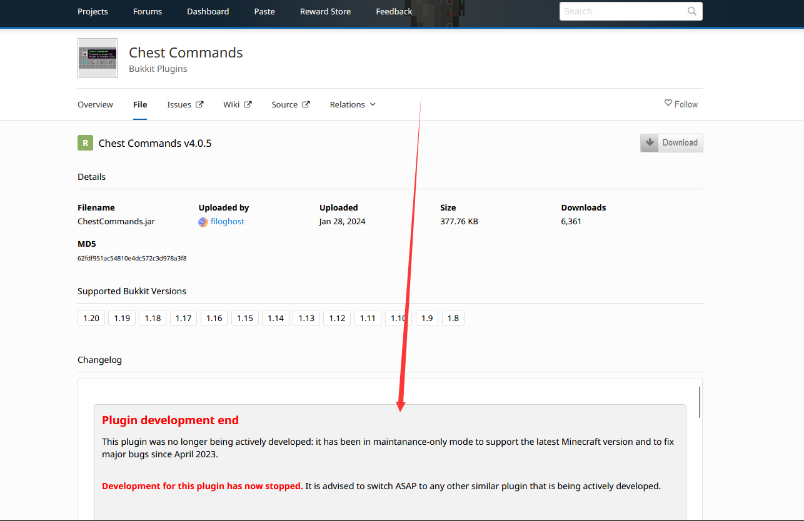
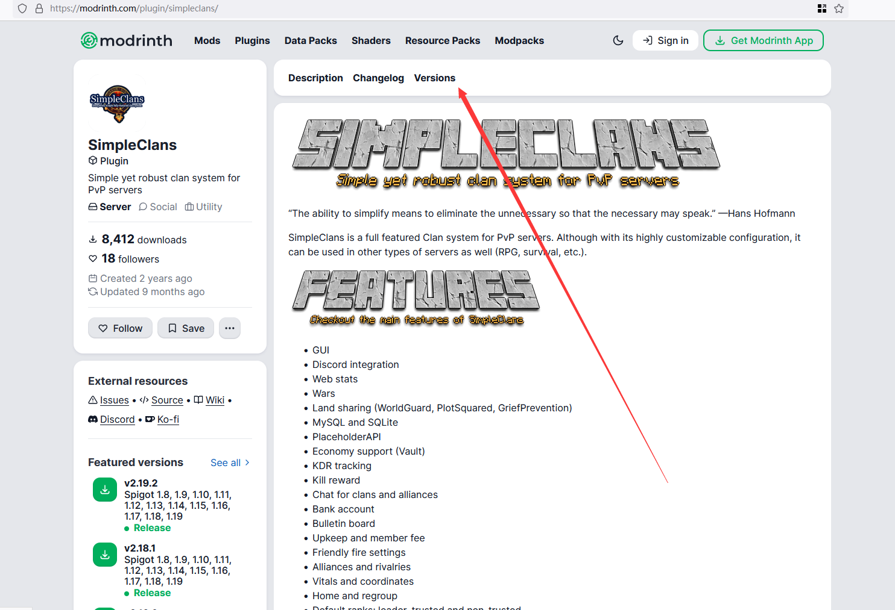
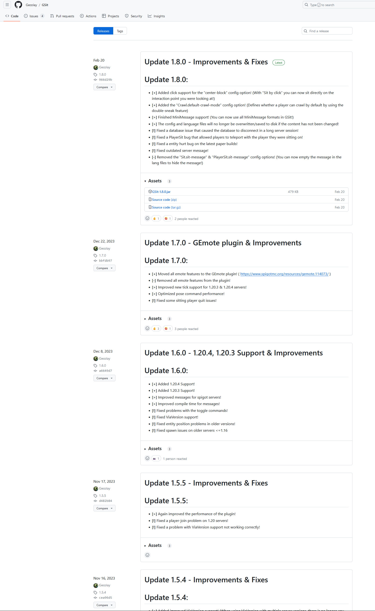
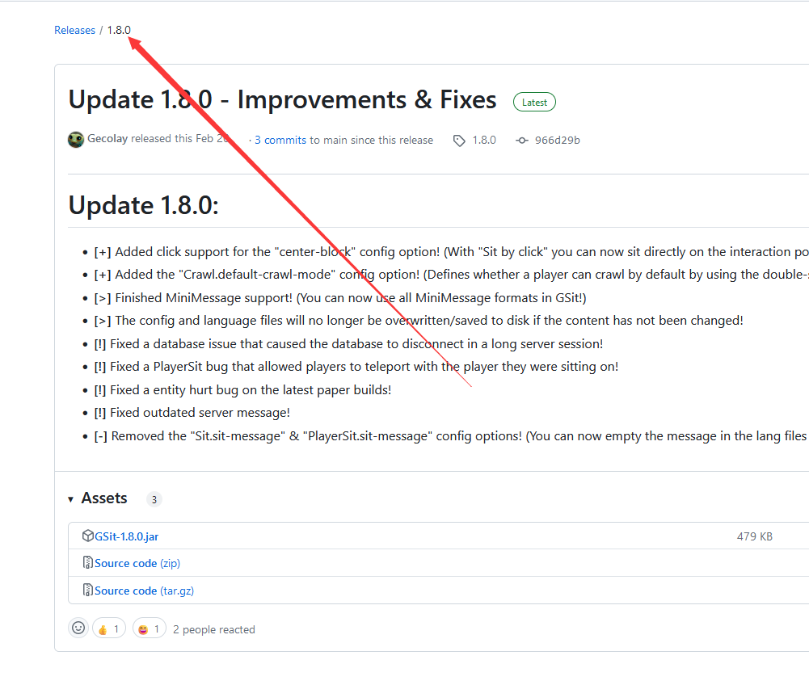

# 插件下载

## 选择插件

很好，相信你已经在 [可能用到的网站](/docs-java/preparation/websites.md) 看到了很多链接，面对成千上万的插件我们应该如何进行选择呢？

我们在此以 spigotmc.org 为例(假设你已经注册成功)，讲解如何选择插件。

<!--markdownlint-disable ol-prefix-->

1. (_可选，推荐_)安装一个 SpigotMC 专用的[搜索引擎](https://fof1092.de/Plugins/SSE/Redirect/)，作为浏览器插件安装即可。

   使用 SpigotSearchEngine(SpigotMC 搜索引擎)后， 你能得到比 SpigotMC 自带的搜索相关性强得多的搜索结果。

2. (_可选_)如果你觉得大量的英语很头大，请打开你的浏览器自带的翻译器，如 Edge/Chrome。

1. 就像逛淘宝一样，根据你的需求将你认为有用的插件收藏起来。
   最好是分门别类放在一起，我们以随机 TP 插件为例，我们在此搜索 RTP ：

    
安装搜索引擎后应该长啥样？

1. 查看这些插件的下载次数、最后更新时间、评价分数、插件特性、语言支持、是否开源、是否付费等。

   如果符合以下的标准，可以尝试下载几个并收藏这些插件 (建议同类型插件选择大概 3 ~ 5 个，最后选出一个综合最好的)。

:::info

对于大多数插件，选择人数较多(同类型插件前 50%)，更新维护更频繁，用户评价多且平均分高，插件特性满足需要(注意不是越多越好)。

支持语言切换甚至直接支持全中文翻译，开源，免费的插件对于大多数服主来说是合理的。

:::

5. 将选好的同类型插件安装到服务器测试一下，是否有 bug ，是否能满足你的需求。

6. 如果你不嫌麻烦，可以在 Excel 中分析插件的优劣并打分，下图比较了当前下载量前 5 的随机 TP 插件。

   每个服务器可根据自己的需求自行评价，下图只是一个抛砖引玉的作用，根据自己的需求选择其中一个即可：

<!--markdownlint-enable ol-prefix-->

**_不要装多个同类型插件，不要把 CMI 和 EssentialX 装在一起，也不要一个服务器装 3 ~ 4 个菜单插件！！！_**

## 下载插件

### 最新版本

TODO

### 开发版本

TODO

### 历史版本

**建议**你用**最新版本**的插件，但如果你因为一些原因必须要用旧版的话...

import Tabs from '@theme/Tabs';
import TabItem from '@theme/TabItem';

<Tabs queryString="download-history-plugin">
<TabItem value="bukkit" label="Bukkit">

点击左侧文字可以查看详细内容：

这里是更新日志：

</TabItem>

<TabItem value="spigotmc" label="SpigotMC">

</TabItem>

<TabItem value="modrinth" label="Modrinth">

</TabItem>

<TabItem value="github" label="GitHub">

在 Releases 中往下翻：

或者这样子：

</TabItem>
</Tabs>
