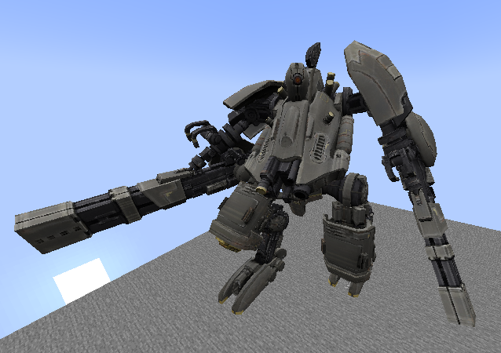
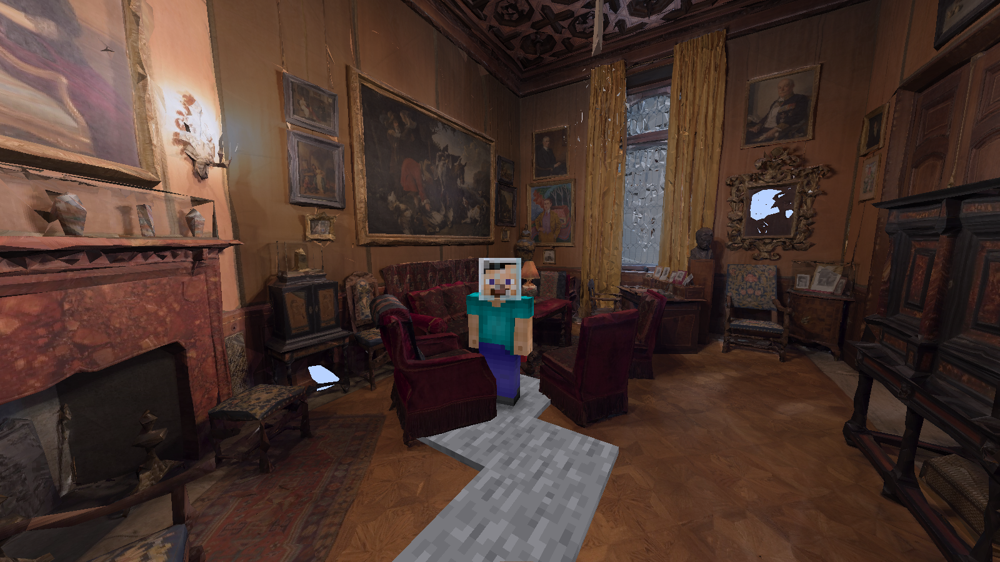
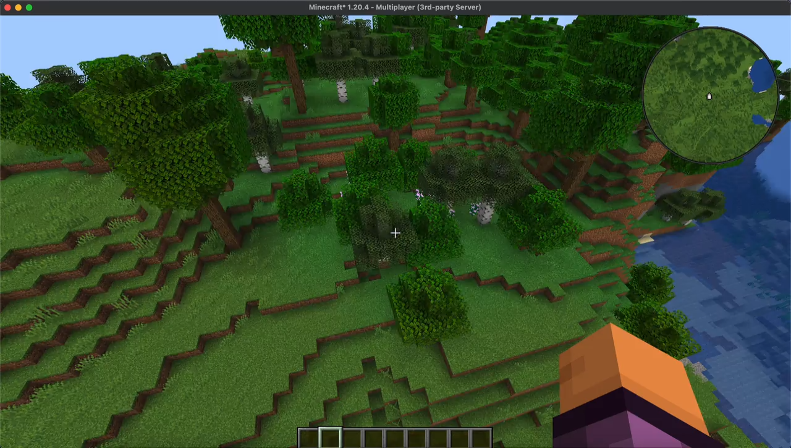

# 杂谈

## 付费>免费/开源？

并非如此！

事实上，大多数付费插件都能找到很好的免费替代，比如开源的 BetterHud 比付费的 HappyHUD(MythicHUD) 好很多。

## 插件能做的事

来自 https://github.com/Godlander/objmc :

来自 https://github.com/toxicity188/BetterHealthBar3 :

来自 https://github.com/JNNGL/VanillaMinimaps :

来自 https://www.spigotmc.org/resources/itemframe-touchscreens-advancedgui.83636/

还有 https://github.com/TheCymaera/minecraft-spider

## 插件不能做的事

例如（无客户端 mod 的情况）：

- 插件不能做自定义新的按键(原版仅能监听 Shift,F,Q 共四种组合)
- 获取玩家视角（第一人称，第二人称，第三人称）
- 不靠资源包或 mod 什么的不能修改计分板的背景
- 不大可能检测和拦截灵魂出窍

总之，一些纯客户端的行为，插件是不能控制的。

## 圈内破事

### miao 系列插件

因为配置简单(没啥功能当然配置简单)而广受小白服主青睐

之前被爆插件有远程执行代码后门来着

详情请见：https://lezi.8aka.org/article/%E5%9C%9F%E7%9A%87%E5%B8%9D%E5%96%B5

### 米饭系列插件

跟 miao 系列插件走差不多的道路

> 只要我的插件有 GUI 界面，不管设计的多傻逼，功能少的有多可怜，那也有人夸好用！

作者剽窃国外作者开源的插件，声称是自己的作品并公开售卖

详情请见：https://lezi.8aka.org/article/%E7%89%88%E4%B8%BB%E7%B1%B3%E9%A5%AD%E4%BC%A0
