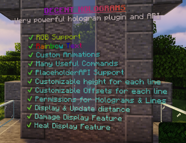
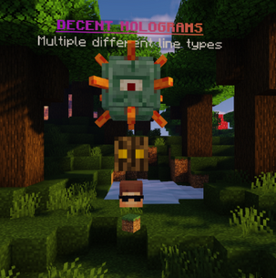
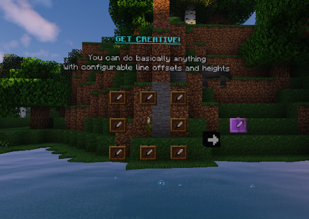
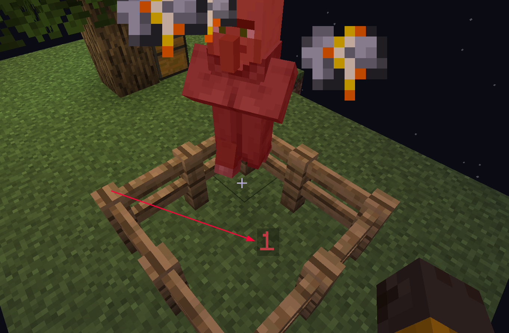
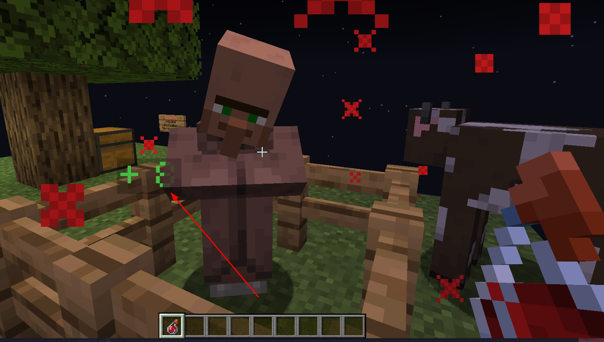

# DecentHolograms

[](https://github.com/DecentSoftware-eu/DecentHolograms/releases)
[](https://www.spigotmc.org/resources/.96927)
[](https://github.com/DecentSoftware-eu/DecentHolograms)
[](https://github.com/DecentSoftware-eu/DecentHolograms/blob/main/LICENSE)

```text
一个轻量级但功能强大的全息图插件，具有许多功能和配置项。
```

## 照骗








### 伤害显示

启用：`/dh feature on healing_display`



### 回血显示

启用：`/dh feature on damage_display`



## 支持

我们（指插件维护方）在 Discord 非常活跃，因此获得支持的最佳方式是加入我们的 Discord 服务器。此外，可以在 GitHub 上或本插件的 Spigot 页面 的 “讨论” 页面上反馈问题

注：国内无法访问 Discord，需要挂梯

## Minecraft 本身限制

- 文本始终转向玩家
- 无法更改文本大小或字体
- 有些实体会发出声音，如 坚守者
- 图标（#ICON：）（即浮空物品）会旋转和上下摆动

这些是 Minecraft 本身限制，插件本身没有办法解决
但搬运者（我）有一点歪门邪道

- AdvancedGUI “文本"固定，不再转向玩家
- [资源包做字体（ia文档）](https://itemsadder.devs.beer/v/chinese/plugin-usage/adding-content/fonts) 使用资源包来改变字体

## 汉化

插件命令帮助写死在代码里了，不能在语言文件汉化

你可以在 MineBBS 或我 fork 的仓库的 GitHub actions 下载内核汉化版本

汉化仓库：https://github.com/postyizhan/DecentHolograms-CN

## 链接

:::info

`SpigotMC` https://www.spigotmc.org/resources/.96927

`Modrinth` https://modrinth.com/plugin/decentholograms

`GitHub` https://github.com/DecentSoftware-eu/DecentHolograms

`MineBBS` https://www.minebbs.com/resources/.9059

`文档(英文)` https://wiki.decentholograms.eu

`文档(中文)` https://snowcutieowo.github.io/DecentHolograms/README.html

:::

## 贡献 
​
欢迎提交 pr ！但对于重大的更改，请先创建一个 issues 来讨论此更改

## 构建
​
你需要使用 JDK 8+, Gradle, Git 和 IDE 或 命令行 二选一

1. 使用 Git 将项目克隆到你的机器上
2. 使用 IDE 或 命令行打开本地克隆项目
3. 执行 `gradle clean shadowJar` 将会开始构建
4. 你可以在 `./build/libs/DecentHolograms-VERSION.jar` 找到构建

## API 

如何在您的项目中引入 DecentHolograms API

```text
用 DecentHolograms 当前版本替换 VERSION (Latest release)
```

<details>
    <summary>maven</summary>

```maven
<repositories>
    <repository>
        <id>jitpack.io</id>
        <url>https://jitpack.io</url>
    </repository>
</repositories>
```

```maven
<dependencies>
    <dependency>
        <groupId>com.github.decentsoftware-eu</groupId>
        <artifactId>decentholograms</artifactId>
        <version>VERSION</version>
        <scope>provided</scope>
    </dependency>
</dependencies>
```
</details>

<details>
    <summary>Gradle</summary>

```Gradle
repositories {
    maven { url 'https://jitpack.io' }
}

dependencies {
    compileOnly 'com.github.decentsoftware-eu:decentholograms:VERSION'
}
```

</details>

## bStats​

[](https://bstats.org/plugin/bukkit/DecentHolograms/12797)
