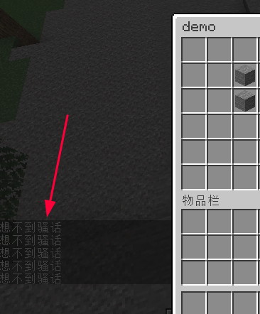

# TrMenu

一个功能强大的菜单插件，国人插件。


## TrMenu v2

早已停更，不推荐使用

:::info

`文档` https://temp-17.gitbook.io/trmenu/v/chinese

`SpigotMC` https://www.spigotmc.org/resources/.83120/

:::

## TrMenu v3

:::info

`文档（新）` https://hhhhhy.gitbook.io/trmenu-v3

`文档（旧）` https://trmenu.trixey.cc/

`如何支持1.8` https://hhhhhy.gitbook.io/trmenu-v3/appendix/v3-guide#datasource.yml-dui-yu-1.8-fu-wu-duan

`GitHub（不推荐，已停止维护）` https://github.com/TrPlugins/TrMenu/tree/stable/v3

`GitHub（推荐，社区维护）` https://github.com/Dreeam-qwq/TrMenu

`vscode插件-trm语法提示` https://marketplace.visualstudio.com/items?itemName=hhhhhy.trmenu-helper

`MineBBS` https://www.minebbs.com/resources/trmenu-bug.9080/

:::

交流群：325014486

## Invero

Invero 俗称 TrMenu v4

详情请见 [Invero](Invero.md)

## 案例

:::warning

请使用 最新的 **TrMenu社区版** 不保证**旧**版本可用性

:::

### 妙妙写法

#### 子图标写true

`condition` 最后的结果为 true 就会显示这个子图标

```yaml
  'A':
    display:
      material: stone
    icons:
      - condition: 'true'
        display:
          name: '我有没有条件啊！我到底有没有条件啊！'
```

所以你可以直接写 true 让他显示这个子图标


#### 子图标写动作

因为 `condition` 会执行里面的kether语句

所以你可以这样子在菜单打开或重新计算子图标的时候跑一遍这些语句

```yaml
  'A':
    display:
      material: stone
    icons:
      - condition: 'tell 想不到骚话'
      - condition: 'tell 想不到骚话'
      - condition: 'tell 想不到骚话'
      - condition: 'tell 想不到骚话'
      - condition: 'tell 想不到骚话'
```



### 玩家信息

这是 TrMenu 的一个默认案例

**右键玩家执行动作**

https://hhhhhy.gitbook.io/trmenu-v3/usage/shortcuts

此处为右键玩家打开名为 Profile 的菜单

找到
```yaml
Right-Click-Player: 'open: Profile'
```

**玩家信息菜单**

https://github.com/Dreeam-qwq/TrMenu/blob/stable/v3/plugin/src/main/resources/menus/Profile.yml

### 蹲下+替换副手打开菜单

或者说 shift+F 打开菜单？

**蹲下+替换副手执行动作**

https://hhhhhy.gitbook.io/trmenu-v3/usage/shortcuts

```yaml
  Sneaking-Offhand:
    - condition: 'perm *trmenu.shortcut'
      execute: 'open: Example'
      deny: 'return'
```

### 每日签到

[查看配置](https://github.com/postyizhan/NitWikit/blob/main/docs-java/process/plugin/other/Menu/demo/trmv3-每日签到.yml)

据作者所说重启服务器会丢数据

不过这些配置主要是用来学习的，不会有人直接cv过去用吧

### 商店

:::tip

你需要安装 [CheckItem](../../Front-Plugin/PlaceHolderAPI/CheckItem.md)

并 [开启give和remove](../../Front-Plugin/PlaceHolderAPI/CheckItem.md#启用give和remove) 和 [更改-boolean](../../Front-Plugin/PlaceHolderAPI/outline.md#更改-boolean)

:::

#### 以物易物

**知识点：**

- TrMenu 文档熟读并背诵
- [kether](/docs-java/advance/kether/basic.md)
- [CheckItem](../../Front-Plugin/PlaceHolderAPI/CheckItem.md)

```yaml
  '写法1':
    display:
      name: '两个钻石换三个绿宝石'
      material: stone
    actions:
      - condition: 'papi %checkitem_mat:diamond,amt:2%'
        actions:
          - 'papi %checkitem_remove_mat:diamond,amt:2%'
          - 'papi %checkitem_give_mat:emerald,amt:3%'
        deny:
          - 'tell inline "物品不够，你有{{papi %checkitem_amount_mat:diamond,amt:2%}}个，还差{{math 2 - papi %checkitem_amount_mat:diamond,amt:2%}}个"'
  '写法2':
    display:
      name: '两个钻石换三个绿宝石'
      material: stone
    actions:
      - if papi %checkitem_mat:diamond,amt:2% then {
          papi %checkitem_remove_mat:diamond,amt:2%
          papi %checkitem_give_mat:emerald,amt:3%
        } else tell inline "物品不够，你有{{papi %checkitem_amount_mat:diamond,amt:2%}}个，还差{{math 2 - papi %checkitem_amount_mat:diamond,amt:2%}}个"
```

#### 购买

```yaml
  '写法1':
    display:
      name: '10块钱买2个钻石'
      material: stone
    actions:
      - condition: 'money 10'
        actions:
          - 'take-money: 10'
          - 'papi %checkitem_give_mat:emerald,amt:3%'
        deny:
          - tell inline "钱不够，你有{{papi %vault_eco_balance%}}块，还差{{math 10 - papi %vault_eco_balance%}}块"
  '写法2':
    display:
      name: '10块钱买2个钻石'
      material: stone
    actions:
      - if money 10 then {
          command inline"money take {{player name}} 10"
          papi %checkitem_give_mat:emerald,amt:3%
        } else tell inline "钱不够，你有{{papi %vault_eco_balance%}}块，还差{{math 10 - papi %vault_eco_balance%}}块"
```

#### 个人限购

**知识点：**

- TrMenu 文档熟读并背诵
- [kether](/docs-java/advance/kether/basic.md)
- [CheckItem](../../Front-Plugin/PlaceHolderAPI/CheckItem.md)
- [妙妙写法](#妙妙写法)
- [\{condition=\}条件](https://hhhhhy.gitbook.io/trmenu-v3/menu/action/option#tiao-jian)

```yaml
  'C':
    display:
      name: '10块钱买2个钻石（限购20个）'
      material: stone
    icons:
      - condition: meta set KEY to 限购数据1
      - condition: data set papi %trmenu_meta_KEY% to 20
    actions:
      - condition: meta set 单价 to 10
      - condition: all [ money papi %trmenu_meta_单价% check data get meta get KEY > 0 ]
        actions:
          # 扣钱
          - 'take-money: %trmenu_meta_单价%'
          # 扣一次限购
          - data set papi %trmenu_meta_KEY% to join [ math data get meta get KEY - 1 ]
          - tell join [ "剩余限购次数：" data get meta get KEY " 剩的钱：" papi %vault_eco_balance% ]
          # 给货
          - papi %checkitem_give_mat:emerald,amt:3%
        deny:
          - tell inline 钱不够，你有{{papi %vault_eco_balance%}}块，还差{{math papi %trmenu_meta_单价% - papi %vault_eco_balance%}}块 {condition=not money meta get 单价}
          - tell inline 限购次数用完了 {condition=check data get meta get KEY == 0}
```

#### 全服限购

上面个人限购的 data 改成 globaldata

自己看文档：https://hhhhhy.gitbook.io/trmenu-v3/menu/action/types#shu-ju-cao-zuo

#### 出售

和上面的购买几乎一样的逻辑，自己去学 CheckItem 然后把 give 改成 remove

#### 个人限售

和上面的个人限售几乎一样的逻辑，自己去学

#### 全服限售

上面的会了这个你就会写了
