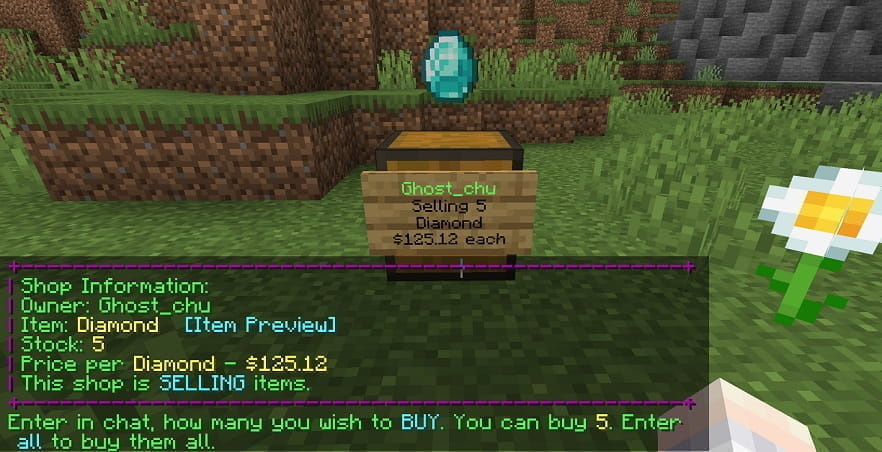

<!--markdownlint-disable line-length-->

一张图秒懂

~~用此插件做系统商店的通常是些新手服主或半吊子人~~

[QuickShop](#quickshop) 原本由 [KaiKikuchi](https://github.com/KaiKikuchi) 维护

弃坑之后 [Ghost-chu](https://github.com/Ghost-chu) fork 接手并做了 [QuickShop-Reremake](#quickshop-reremakeghost-chu)

~~Ghost-chu 大佬放弃维护后曾在某群抱怨这么多人用这个插件，连个 star 都不愿意点~~

[PotatoCraft-Studio](https://github.com/PotatoCraft-Studio) 团队 fork 了 [Ghost-chu](https://github.com/Ghost-chu) 大佬的仓库，维护 [PotatoCraft-Studio](https://github.com/PotatoCraft-Studio) 版本的 [QuickShop-Reremake](#quickshop-reremakepotatocraft-studio)

但是看起来很久没更新了，大概也弃坑了

[PotatoCraft-Studio](https://github.com/PotatoCraft-Studio) 团队的 [QuickShop-Reremake](#quickshop-reremakepotatocraft-studio) 的后续版本 [QuickShop-Hikari](#quickshop-hikari) 目前由 [creatorfromhell](https://github.com/creatorfromhell) 维护

`插件百科` https://mineplugin.org/QuickShop
`QuickShop-Hikari插件百科` https://quickshop-community.github.io/QuickShop-Hikari-Documents/

<!--markdownlint-disable line-length-->

## QuickShop

:::info

`Bukkit` https://dev.bukkit.org/projects/quickshop-notlikeme

`SpigotMC` https://www.spigotmc.org/resources/.18676

`GitHub` https://github.com/KaiKikuchi/QuickShop

:::

停止维护

## QuickShop-Reremake(Ghost-chu/PotatoCraft-Studio)

:::info

`Bukkit` https://dev.bukkit.org/projects/quickshop-reremake

`SpigotMC` https://www.spigotmc.org/resources/.62575

`GitHub` https://github.com/PotatoCraft-Studio/QuickShop-Reremake

:::

停止维护

## QuickShop-Hikari

:::info

`Modrinth` https://modrinth.com/plugin/quickshop-hikari

`SpigotMC` https://www.spigotmc.org/resources/.100125

`GitHub` https://github.com/QuickShop-Community/QuickShop-Hikari

:::

