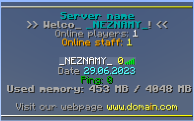
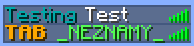

# TAB

[](https://github.com/NEZNAMY/TAB/releases)
[](https://www.spigotmc.org/resources/.57806)
[](https://github.com/NEZNAMY/TAB)
[](https://github.com/NEZNAMY/TAB/blob/main/LICENSE)

```text
TAB 是一个用于在不同位置显示信息的多功能插件，旨在在功能、兼容性和性能方面超越所有类似的插件。
```

此插件拥有自由的配置文件，无论你是只需要最简单的功能，或者制作一些复杂的功能，此插件都能满足你的需求！

默认配置已经包含足够的示例让你理解此插件的配置，另外，此插件拥有全面的 wiki。

## 照骗

### TAB（HEADER FOOTER）



[点我查看文档](https://docs.superiormc.cn/v/tab-wiki/core-features/tab-de-ding-bu-he-di-bu)

### 名称标签（NAMETAGS）

没有图

[点我查看文档](https://docs.superiormc.cn/v/tab-wiki/core-features/ming-cheng-biao-qian)

### 排列（SORTING）


[点我查看文档](https://docs.superiormc.cn/v/tab-wiki/core-features/pai-lie)

### TAB 列表名称样式（TABLIST FORMATTING）​

完全可定制的 TAB 列表格式，支持自定义前缀、名称和后缀



[点我查看文档](https://docs.superiormc.cn/v/tab-wiki/core-features/tab-lie-biao-ming-cheng-yang-shi)

### 黄色数字或血量（PLAYERLIST OBJECTIVE）

此功能允许您在列表中显示某变量数字或血量


[点我查看文档](https://docs.superiormc.cn/v/tab-wiki/core-features/huang-se-shu-zi)

### 名称标签下方（BELOWNAME）​

此功能可以在玩家姓名标签下方显示数字和静态文本


[点我查看文档](https://docs.superiormc.cn/v/tab-wiki/core-features/ming-cheng-biao-qian-xia-fang)

### BOSS条（BOSSBAR）


[点我查看文档](https://docs.superiormc.cn/v/tab-wiki/core-features/boss-tiao)

### 共用玩家列表（GLOBAL PLAYERLIST）​

将全服（BungeeCore 或 Velocity 群组）的玩家展示在同个 TAB 中！

[点我查看文档](https://docs.superiormc.cn/v/tab-wiki/core-features/gong-yong-wan-jia-lie-biao)

### 布局（LAYOUT）

这个功能允许你配置所有 80 个 TAB 列表槽位。目前不支持显示小于 4 列


[点我查看文档](https://docs.superiormc.cn/v/tab-wiki/core-features/bu-ju)

### 计分板（SCOREBOARD）


[点我查看文档](https://docs.superiormc.cn/v/tab-wiki/core-features/ji-fen-ban)

### 各世界玩家列表（PRE WORLD PLAYERLIST）​

仅在 TAB 显示玩家所在世界的玩家

[点我查看文档](https://docs.superiormc.cn/v/tab-wiki/core-features/ge-shi-jie-wan-jia-lie-biao)

## 支持

该插件正被大量服务器使用，这也意味着对我的关注度很高。不幸的是，我再也无法满足需求（搬运者猜测是维护插件和回答用户提问占用时间太多），因为我不想把我的大部分时间都奉献给一个免费的插件。为了提供所有提供服务的最佳质量，提供的服务数量可能会发生改变。以下是潜在服务及其状态的完整列表：

| 服务类型         | 状态 |
| ---------------- | ---- |
| 跟进版本         | ✔   |
| Bug 修复         | ✔   |
| 文档             | ✔   |
| 新功能请求       | ❌  |
| Customer support | ✔   |
| 免费用户支持     | ❌* |
| 优化             | ✔   |


1. 添加新的示例、指南和其他人们询问的有用信息。
2. 为付费用户提供无限制的插件帮助。
3. 世界上每个人都可以无限制地使用我的空闲时间。（？）
4.  在不损失任何功能的情况下提高插件的性能。

* 你可以加入这个大好人的 [community discord](https://discord.gg/YPqXt63YQj) 来得到其他好心人的支持
注：discord在国内不能访问，需要挂梯

## API

https://github.com/NEZNAMY/TAB/wiki/Developer-API

## 链接

:::info

`SpigotMC` https://www.spigotmc.org/resources/.57806

`GitHub` https://github.com/NEZNAMY/TAB

`Modrinth` https://modrinth.com/plugin/tab-was-taken

`文档(英文)` https://github.com/NEZNAMY/TAB/wiki

`文档(中文)` https://docs.superiormc.cn/v/tab-wiki

`插件百科` https://mineplugin.org/Tab

:::

## 汉化

替换插件文件夹中的 `message.yml` 接着 `/tab reload`

<details>
    <summary>mmessage.yml</summary>

```YAML
announce-command-usage: |-
  用法: /tab announce <种类> <名称> <长度>
  当前支持种类: &lbar, scoreboard
bossbar-feature-not-enabled: '&c想使用此指令，必须先开启bossbar功能'
bossbar-announce-command-usage: '用法: /tab announce bar <bar name> <length>'
bossbar-not-found: '&c拥有此名称的bossbar未找到 "%name%"'
bossbar-already-announced: '&c这条bossbar已被广播'
group-data-removed: '&3[TAB] 组 &e%group% &3中的全部数据已清除'
group-value-assigned: '&3[TAB] %property% ''&r%value%&r&3'' 已被添加至组 &e%group%'
group-value-removed: '&3[TAB] %property% 已被从组 &e%group% &3中移除'
user-data-removed: '&3[TAB] 玩家 &e%player% &3的全部数据已清除'
user-value-assigned: '&3[TAB] %property% ''&r%value%&r&3'' 已被添加至玩家 &e%player%'
user-value-removed: '&3[TAB] %property% 已被从玩家 &e%player% &3中移除'
parse-command-usage: '用法: /tab parse <玩家> <placeholder>'
send-command-usage: |-
  用法: /tab send <种类> <玩家> <bar name> <length>
  当前支持种类: &lbar
send-bar-command-usage: '用法: /tab send bar <玩家> <bar name> <length>'
team-feature-required: '&4想使用此指令，必须先开启计分板功能'
collision-command-ussage: '用法: /tab setcollision <玩家> <true/false>'
no-permission: '&c你没有权限'
command-only-from-game: '&c只能在游戏里执行此指令'
player-not-online: '&c此玩家不存在或不在线 "%player%"'
unlimited-nametag-mode-not-enabled: '&c[TAB] 若要实现此功能，你必须在config中启用 unlimited-nametag-mode '
invalid-number: '"%input%" 不是一个合法数字'
scoreboard-feature-not-enabled: '&4想使用此指令，必须先开启计分板功能'
scoreboard-announce-command-usage: '用法: /tab announce scoreboard <scoreboard name>
  <length>'
scoreboard-not-found: '&c拥有此名称的计分板未找到 "%name%"'
nametag-preview-on: '&7预览模式 &a开启&7.'
nametag-preview-of: '&7预览模式 &3关闭&7.'
reload-success: '&3[TAB] 插件已重载 汉化 by 秋风残叶'
reload-fail-file: '&3[TAB] &4插件重载失败，配置文件 %file% 配置不正确，请查看控制台获得更多信息'
scoreboard-toggle-on: '&2计分板开启'
scoreboard-toggle-off: '&7计分板关闭'
bossbar-toggle-on: '&2Bossbar 当前可见'
bossbar-toggle-off: '&7Bossbar 当前不可见'
scoreboard-show-usage: '用法: /tab scoreboard show <scoreboard> [player]'
bossbar-not-marked-as-announcement: '&c现在bossbar将作为公告栏常驻 (若有条件，将显示内容)'
bossbar-announcement-success: '&a已将bossbar内容 &6%bossbar% &a向全服广播 %length% 秒'
bossbar-send-success: '&a已将bossbar内容 &6%bossbar% &a向玩家 &6%player% &a广播 %length% 秒'
armorstands-disabled-cannot-use-preview: '&c盔甲架已禁用, 将无法使用预览功能'
help-menu:
- '&m                                                                                '
- ' &8>> &3&l/tab reload'
- '      - &7重载插件'
- ' &8>> &3&l/tab &9group&3/&9player &3<name> &9<property> &3<value...>'
- '      - &7请输入 &8/tab group/player &7查看配置方法'
- ' &8>> &3&l/tab ntpreview'
- '      - &7显示自己的名称前后缀'
- ' &8>> &3&l/tab announce bar &3<name> &9<seconds>'
- '      - &7向全服广播bossbar消息'
- ' &8>> &3&l/tab parse <player> <placeholder> '
- '      - &7测试某个变量是否可用'
- ' &8>> &3&l/tab debug [player]'
- '      - &7显示关于玩家的debug消息'
- ' &8>> &3&l/tab cpu'
- '      - &7显示插件的CPU占用'
- ' &8>> &3&l/tab group/player <name> remove'
- '      - &7清除关于玩家/组的全部配置'
- '&m                                                                                '
mysql-help-menu:
- '&6/tab mysql upload - 从文件上传数据至 mysql'
- '&6/tab mysql download - 从 mysql 下载数据至文件'
mysql-fail-not-enabled: '&c无法从MySQL传输数据, 因为MySQL已禁用'
mysql-fail-error: MySQL 数据下载出现错误，请查看控制台获得更多信息
mysql-download-success: '&aMySQL 数据下载成功'
mysql-upload-success: '&aMySQL 数据上传成功'
nametag-help-menu:
- /tab nametag preview - 切换盔甲架预览模式
- /tab nametag toggle - 切换所有玩家的名称前后缀显示（对于指令使用者来说）
nametag-feature-not-enabled: '&c此指令需要先开启名称前后缀功能'
nametags-hidden: '&a所有玩家的名称前后缀对于你不可见'
nametags-shown: '&a所有玩家的名称前后缀对于你可见'
collision-command-usage: 'Usage: /tab setcollision <player> <true/false>'
scoreboard-help-menu:
- /tab scoreboard [on/off/toggle] [player] [options]
- /tab scoreboard show <name> [player]
- /tab scoreboard announce <name> <length>
```

</details>

## Bstats

[](https://bstats.org/signatures/bukkit/TAB%20Reborn.svg)
