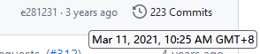

# GriefDefender

:::info

`SpigotMC` https://www.spigotmc.org/resources/.68900/

`GitHub` https://github.com/bloodmc/GriefDefender

`文档（英文）`https://docs.griefdefender.com/

`文档（中文）`https://docs.griefdefender.com/zh/

:::

## 开源?

它开源的代码只到2021年，往隔壁 Residence 旁边一站简直是卧龙凤雏
