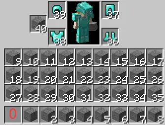

# CheckItem

## 有关 CheckItem 的相关链接

:::info

`eCloud` https://api.extendedclip.com/expansions/checkitem/

`Placeholder List` https://wiki.placeholderapi.com/users/placeholder-list/#checkitem

`GitHub` https://github.com/PlaceholderAPI/CheckItem-Expansion

:::

## 安装此扩展

```text
/papi ecloud download CheckItem
/papi reload
```

## 教程


```text
/papi parse me %checkitem_remove_diamond%
```

在 [启用give和remove](#启用give和remove) 后，跑一下图中的变量会收取玩家所有的钻石

变量中 **remove** 的位置在作者项目的 README 中，并没有名字，其实这个地方决定了这个变量的效果

如果没有 **remove** 那么这个变量就会判断玩家是否拥有这个物品


这里返回了 yes

[如何返回 true/false ？](/docs-java/process/plugin/Front-Plugin/PlaceHolderAPI/outline.md#更改-boolean)

例如：

- give 给予物品      %checkitem_give_mat:diamond%    // 给予玩家一个钻石
- remove 收取物品    %checkitem_remove_mat:diamond%  // 收取玩家背包中所有的钻石
- amount 查看数量    %checkitem_amount_mat:diamond%  // 查看玩家背包中的钻石数量
- getinfo 物品信息   下面会讲到

你应该注意到了 `mat:diamond` ，因为我写了diamond所以这些变量的功能是针对钻石的

 > mat是 material 的缩写

像 `mat` 被称为 **修饰符(modifier)**

用来更详细的指明你需要的操作

例如：`%checkitem_remove_mat:diamond,amt:10%`

作用是收取10个钻石

> amt是 amount 的缩写

:::note

不同修饰符使用英文逗号“，”来连接

如同上面的 `%checkitem_remove_mat:diamond,amt:10%`

同时使用了 mat 和 amt 两个修饰符

:::

### 修饰符

可用的修饰符有：

- namecontains      // 名字中包含
- namestartswith
- nameequals
- mat               // 物品材质
- amt               // 物品数量
- data              // 物品的data
- custommodeldata   // 物品的CMD值
- lorecontains      // lore中包含
- loreequals
- matcontains
- enchantments      // 附魔
- enchanted
- potiontype
- potionextended
- potionupgraded
- strict
- inhand
- inslot
- nbtstrings        // nbt
- nbtints

### getinfo

用来获取玩家指定背包位置的物品信息

```text
%checkitem_getinfo:<槽位>_<修饰符1>,<修饰符2>,<...>%
```

特别的，\<槽位\> 可以使用 `mainhand`（手持物品） 和 `offhand`（副手物品）

以及，**修饰符** 的 `:` 号也是需要写的，不过 `:` 之后写不写都一样

背包槽位可参考下图：



下方是使用案例


### 例子：收取ia物品

收取指定ia物品的指定数量

```text
%checkitem_remove_nbtstrings:itemsadder..id..data=ia物品ID,amt:数量%
```

使用了两个修饰符

- nbtstrings
- amt

其他物品库多数也会像ia一样给物品打上自己的nbt标签,照着改改就好

## 启用give和remove

```yaml
expansions:
  checkitem:
    give_enabled: false
    remove_enabled: false
```

将两个`false`改为`true` 接着 `/papi reload`
