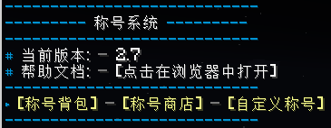

# MiniPlayerTitle


[](https://github.com/DeerGiteaMirror/MiniPlayerTitle)
[](https://github.com/DeerGiteaMirror/MiniPlayerTitle/blob/main/LICENSE)

```text
一个简化版的称号插件
```

[PlayerTitle](https://ricedoc.handyplus.cn/wiki/PlayerTitle/) 青春版

## 说明

本插件免费！

- 本插件为 [PlayerTitle](https://ricedoc.handyplus.cn/wiki/PlayerTitle/) 的简易版，基本实现了其大部分功能
- 由于历史原因 PlayerTitle 使用玩家名称而非 UUID 作为数据库主键，因此玩家改名后称号会丢失，本插件使用 UUID 作为主键，不会出现该问题



## 功能介绍

- 本插件支持 PlayerTitle 的 [新版RGB颜色格式](https://ricedoc.handyplus.cn/wiki/PlayerTitle/rgb/#新版本格式) （详情见下文）
- 支持 PostgresSQL 和 Sqlite 数据库
- 本插件使用 **TUI** 作为简易的交互方式，非 PlayerTitle 的箱子UI
- 支持设置称号**限量销售、限时销售**
- 支持玩家使用称号币自定义称号
- 支持外部经济系统（需要 Vault 前置支持）（3.0.6+）
- 支持 PlaceholderAPI (4.0.0+)

## 支持版本

- 1.20.1+ (Bukkit、Spigot、Paper、Folia)

## 建议与反馈

Mail: [zhangyuheng@lunadeer.cn](mailto:zhangyuheng@lunadeer.cn)

QQ群：309428300

## 链接

:::info

`Hangar` https://hangar.papermc.io/zhangyuheng/MiniPlayerTitle

`MineBBS` https://www.minebbs.com/resources/.7930

`文档` https://ssl.lunadeer.cn:14448/doc/2

`GitHub` https://github.com/DeerGiteaMirror/MiniPlayerTitle

:::

## Stats

[](https://bstats.org/plugin/bukkit/MiniPlayerTitle/21444)
