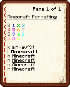
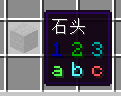
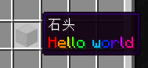

# 颜色代码

改变你服务器中信息的颜色！

## 格式化代码

**格式化代码(Formatting code)**，又称**颜色代码(Color code)**，能使在游戏中加入含颜色和格式信息。

在 Minecraft 中，可以以分节符号(`§`)产生带色文字。



你也可以用 [颜色代码生成器](https://mcg.tuanzi.ink/) 来生成它。

:::note

通常在游戏客户端中，你不能打出 `§` 这个符号。需要使用 `\u00A7` 或者 `\u00a7`

在配置文件中，你可以直接复制粘贴这个符号而不用自己输入。

你也可以在按住 `Alt` 键的同时，**小键盘** **按顺序** 输入 `167` 以输出 `§` 符号

_(注意:  使用新版时字符对应错误，请使用旧版)_

:::

:::tip

为了方便，多数插件的配置中支持使用 `&` 来代表 `§` 。

比如下面这个 TrMenu 菜单例子：

```yaml
Icons:
  test:
    display:
      material: stone
      lore:
        - '&11 &22 &33'
        - '&aa &bb &cc'
```



:::

如果你想要更绚丽的颜色和更丰富的功能(比如点击文本执行命令)。

可以去看 [MiniMessage](#minimessage) 部分。

## MiniMessage

MiniMessage 旨在用简单字符串表示聊天组件，便于用户学习和开发人员扩展。

MiniMessage 的实质是一个叫 Adventure 的库，这是它的 [文档](https://docs.advntr.dev/getting-started.html)。

### 支持列表

目前，一些平台已经支持原生使用 Adventure 来扩展字符串，以下是内置此库的列表：

| 支持平台     | 支持版本                               | 备注                                                                   |
|----------|------------------------------------|----------------------------------------------------------------------|
| Sponge   | Sponge 8 (1.16.5)                  | /                                                                    |
| Velocity | 1.1.0 build 158                    | 仅支持消息、操作栏标题、boss栏和标题                                                 |
| Paper    | 1.16.5 build 473                   | /                                                                    |
| Minestom | Build 7494725                      | 内容有点杂，详见[minestom wiki](https://wiki.minestom.net/feature/adventure) |
| Fabric   | `adventure-platform-fabric` 5.3.0* | 虽然不是一个东西(?)，但是体验是一样的                                                 |

_详情可以参阅 [Adventure 本机支持](https://docs.advntr.dev/platform/native.html)_

:::note

平台原生支持 ≠ 使用此平台开发的模组/插件支持！！！

举个例子，仔细观察上述列表，你会发现bukkit并没有支持 MiniMessage ，所以你会发现大部分基于 Bukkit 开发的插件没有 MiniMessage 这一功能(如 EssentialsX)，
_除非他们自身引入了 Adventure 库(如PlaceholderAPI)。_

而基于 Paper 开发的大部分插件都引入了这一功能，所以不要发现一个新奇玩意就到处瞎套。

:::

### 如何使用

:::warning

本篇不讲述诸如 TAB 等插件或模组自行实现的类似 MiniMessage 效果的使用。

:::

[在线编辑](https://mcg.tuanzi.ink)

用一个 TrMenu 菜单配置展示下：

```yaml
Icons:
  test:
    display:
      material: stone
      lore:
        - '<rainbow>Hello world'
```



记住 MiniMessage 语言使用标签，也就是说你所做的一切都将使用标签进行定义。

对于 MiniMessage ，你必须要有一个开始标签 `<yellow>`，在非严格模式下，你可以省略结束标签 `</yellow>` ，如下：

```xml
<yellow>Hello <blue>World</blue>!
```

在非严格模式下，所有标记名称**都不区分大小写**，以减少冲突的可能性(懒癌晚期患者狂喜)，但美观和符合规定起见，请使用小写字母编写以便减少被他人嘲讽的几率：

```xml
<YelLOw>Hello World!
```

此外，这里有一个[测试网站](https://webui.advntr.dev/)，他可以使得你无需启动 Minecraft 便可以预览实际效果。

关于实际使用格式详见 [标准标签](https://docs.advntr.dev/minimessage/format.html#standard-tags)。

### 参考

- https://zh.minecraft.wiki/w/%E6%A0%BC%E5%BC%8F%E5%8C%96%E4%BB%A3%E7%A0%81
- https://docs.advntr.dev/minimessage/format.html
- https://docs.advntr.dev/platform/native.html
