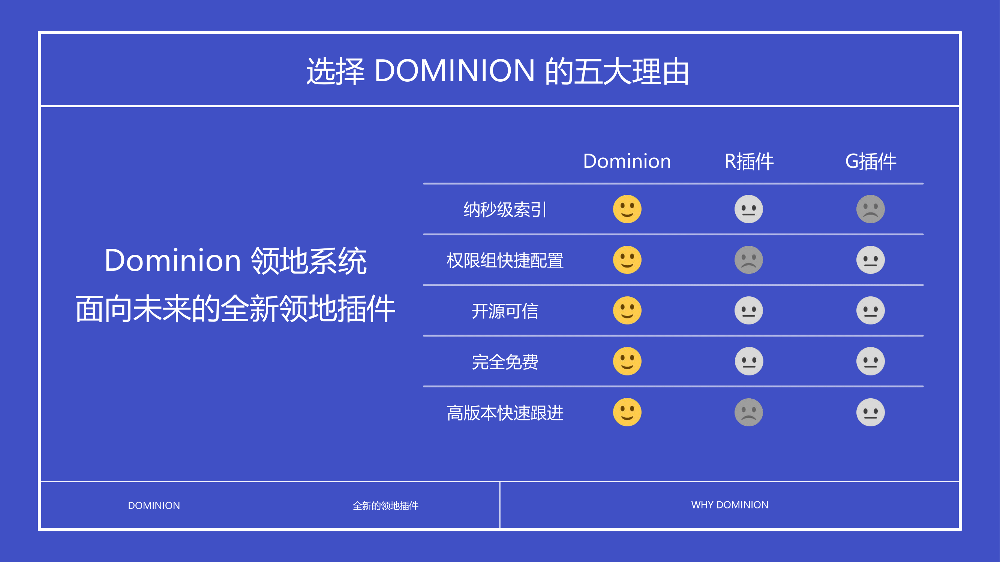

# Dominion

:::info

`SpigotMC` https://www.minebbs.com/resources/.7933/

`Hangar` https://hangar.papermc.io/zhangyuheng/Dominion

`GitHub` https://github.com/ColdeZhang/Dominion

`MineBBS` https://www.minebbs.com/resources/.7933/

`文档` https://dominion.lunadeer.cn/

:::

国人 鹿鸣 大佬开发的完全开源、免费，专为高版本开发，面向未来的全新领地保护插件。
关于插件的功能特性，具体可以查看 [功能介绍](https://github.com/ColdeZhang/Dominion/blob/master/intro/intro_zh-cn.md)。

## 版本

- 仅支持 1.20.1+ (Bukkit、Spigot、Paper、Folia) **不支持 1.20 以下的服务端（如果你是 1.20 以下的可以撤了）**
- 需要使用 Java21 运行你的服务端
- 虽然这个插件支持 Spigot，但是作者强烈建议使用 Paper 或其分支核心（如 Purpur）以获得更好的性能体验。

## 优点

1. 版本更新快（几乎是遇到一个 bug 修一个然后发一个版本），服务态度好（前提你是正常用户不是捣乱的），作者温柔又善良（嘻嘻）
2. 完全开源、免费，专为高版本开发。
3. 支持导入 [Residence](./Residence.md) 插件的绝大多数数据。

## 缺点

1. 不支持 1.20 以下的服务器（用的是新版逻辑写的），没了就这个不好（也可能是作者懒得适配低版本）！
2. 版本更新快（是的，既是优点也是缺点），因为作者仍然将插件标记为 beta 状态，因此版本更新频繁

## 作者的整活儿

